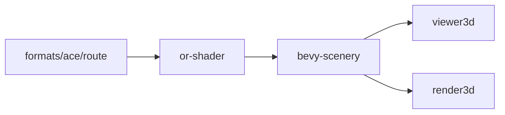

# Bevy — arquitectura 3D

Presentación 3D separada del núcleo headless. Pin: **Bevy 0.19** (`[workspace.dependencies]`).

Features de ventana: `x11` + `wayland`. En sesiones Wayland, sin `wayland` winit cae a XWayland y RADV suele fallar con `Surface::configure → Invalid surface`.

Present mode del viewer: default `AutoVsync` (`Fifo`). Override: `OPENRAILSRS_PRESENT_MODE=auto_vsync|auto_no_vsync|fifo|mailbox|immediate`. En híbridas AMD+NVIDIA rotas, ver troubleshooting en [`VIEWER3D.md`](VIEWER3D.md).

## Crates

| Crate | Rol |
|-------|-----|
| `openrailsrs-or-shader` | Clasificación shaders MSTS (sin Bevy) |
| `openrailsrs-bevy-scenery` | Materiales OR/WGSL, ACE, spawn, VSM, `MstsAssetPlugin` |
| `openrailsrs-viewer3d` | App jugable (`--live`, cabina, HUD) |
| `openrailsrs-render3d` | Validación visual OR (tiles + VSM) |



**Reglas:** headless no depende de Bevy; `bevy-scenery` no depende de las apps; WGSL solo en `bevy-scenery/assets/shaders/`.

## Apps

| | **viewer3d** | **render3d** |
|---|---|---|
| Objetivo | Sim jugable | Paridad visual / tile lab |
| Arranque | Ventana → parse ruta en background (#55) | `LoadStage::ParsingTiles` async |
| VSM | Opcional | Completo (`OPENRAILSRS_OR_VSM`) |

```bash
# Jugable Chiltern
cargo run --release -p openrailsrs-viewer3d -- \
  --live --route-root "$CHILTERN_ROUTE" examples/chiltern/scenario.toml

# Validación por tiles
cargo run -p openrailsrs-render3d -- \
  --route "$CHILTERN_ROUTE" --tile-x -6084 --tile-z 14923 --radius 2
```

Scripts: `./scripts/run_render3d_*.sh`. Controles render3d: WASD/QE · RMB · F3 HUD · F4–F8 VSM.

| Env | Valores | Default |
|-----|---------|---------|
| `OPENRAILSRS_OR_VSM` | `pcf+or` / `approx` / `exact` | `pcf+or` |
| `OPENRAILSRS_OR_SHADERS` | `0` / `1` | `1` |

## Fuera de bevy-scenery

Sim live, cabina CVF, floating origin, `--run-corridor`, parse `.act` (local a render3d).

Ver también: [`VIEWER3D.md`](VIEWER3D.md) · [`VIEWER3D_TESTING.md`](VIEWER3D_TESTING.md) · [`BEVY_TRANSFORMS.md`](BEVY_TRANSFORMS.md) (DirectX/MSTS → `Transform` / `Mat4`).
