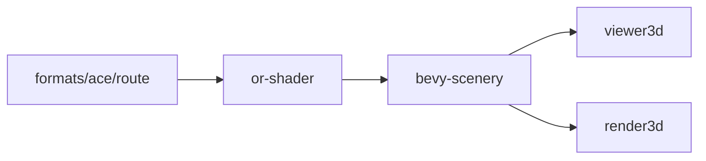

# Bevy — arquitectura 3D

Presentación 3D separada del núcleo headless. Versión **Bevy 0.19.1** (`Cargo.lock`), con Rust mínimo 1.95 por el requisito de Bevy.

La compatibilidad conserva el contenido, los controles y el comportamiento
ferroviario de la referencia. Las mejoras de Bevy se mantienen cuando benefician
la partida: iluminación física, tonemapping, instancias GPU, origen flotante y
cámara exterior sobre el terreno. Cada diferencia intencional se documenta;
los oráculos siguen detectando errores de importación, posición y movimiento.

La física interactiva se ejecuta en `FixedUpdate` con reloj Bevy de 60 Hz y
cuantos físicos de hasta 0,05 s. La representación, cámaras, cabina y HUD se
actualizan en `Update`. `LiveDriveSession` y la máquina de estados de servicio
son Rust independiente de Bevy; `play-service` usa exactamente la misma
sesión y el mismo conductor automático. El test de recorrido completo
compara 30 y 144 FPS sin cambiar las llegadas ni las posiciones.

`DrivingHudPlugin` separa la presentación de conducción del núcleo. Utiliza
`Text`, `FontSource`, recursos de visibilidad y consultas Bevy disjuntas,
actualizando textos sólo cuando cambian y como máximo a 20 Hz. La fuente
DejaVu Sans Mono está incluida con su licencia para representar el español.
Los paneles separan velocidad, presiones, reloj del servicio, estación y señal;
`F6` muestra la ayuda sin ocupar permanentemente la vista de la cabina.
Los vectores TDB conservan posición, elevación, tangente y sentido de marcha,
incluyendo las aristas inversas `eNNN_r` y los offsets de andén.
Los vértices MSTS ya invierten Z al convertirse a Bevy: la base del coche
rota −90° sobre Y para que el frente de la cabina siga el +X del recorrido.
La prueba de cámara compara esa vista contra la dirección real de marcha.

Las ruedas usan la distancia de presentación de la misma sesión que coloca
las carrocerías, en lugar de integrar un reloj de animación independiente.
Pausa, reinicio y multiplicador de tiempo mantienen ambos movimientos juntos.
Las partes comparten el `ShapeFile` inmutable mediante `Arc`; las poses de
puertas y pantógrafos sólo se recalculan cuando cambia su clave.

El humo y vapor usan [bevy_hanabi 0.19.0](https://docs.rs/bevy_hanabi/0.19.0/bevy_hanabi/),
compatible con Bevy 0.19. Los emisores ENG, estado del motor/caldera y velocidad
de cada coche alimentan propiedades por emisor; Hanabi conserva posiciones,
velocidades y envejecimiento en buffers GPU. La alternativa CPU utiliza la
misma emisión y solución analítica de arrastre. No se leen partículas de GPU
ni se suben sus vértices cada cuadro en modo GPU.

`Time<EffectSimulation>` recibe los avances de `LiveDriveSession`, después de
`FixedUpdate` y antes de `EffectSystems::TickSpawners`. La emisión manual se
asigna después de ese sistema. Las instancias usan `SimulationSpace::Local`
en raíces independientes del tren: el origen flotante desplaza sus raíces,
y los nuevos emisores se convierten a ese marco. La malla CPU ya contiene
posiciones desplazadas y conserva su transformación identidad. Reiniciar o
cambiar de modo elimina las instancias antiguas y reutiliza assets acotados.

Auto usa GPU con cómputo y adaptador hardware; bajo presión reduce el detalle
y reparte el presupuesto con CPU. CPU, GPU y Mixto comparten un máximo de
512 partículas, reducido a 256/128 ante cuadros lentos sostenidos. Más de
32 emisores originales o falta de cómputo compatible usan la malla CPU.
Los reportes distinguen capacidad GPU y solicitudes de emisión de partículas
CPU vivas: no presentan esas solicitudes como un conteo real de partículas GPU.
Lluvia y nieve también usan Hanabi en GPU: semillas persistentes, movimiento
analítico y cuotas visibles independientes de la capacidad reservada. El
respaldo CPU conserva el mismo campo, siluetas y mapa de techos. Sus instancias
usan `SimulationSpace::Global`; los vértices ya se calculan en el marco del
visor y se excluyen del desplazamiento de raíces del origen flotante.

Los materiales sólo exponen propiedades de Hanabi a vértices en 0.19.0. La
iluminación y extinción se calculan allí; las coordenadas del mapa de techos
se conservan en un atributo por partícula para el fragmento. No se modifica
la dependencia para ampliar la visibilidad de sus bindings.

La suspensión es una capa de presentación tras colocar el coche en la vía.
El resorte críticamente amortiguado usa el reloj ferroviario. Ruedas, bogies y pantógrafos
compensan la pose de la carrocería; su transform base se restaura antes de la
animación para evitar deriva durante pausas. No altera fuerzas ni resultados
de los oráculos físicos. El ajuste predeterminado es Suave y puede apagarse.

El humo usa pruebas de segmento contra límites opacos próximos: hasta ocho
cajas por emisor GPU y una lista compartida acotada para CPU. Las instancias
de edificios se consideran individualmente, con los límites de su malla, no
con la caja agregada del grupo. Vidrios y tarjetas de follaje no forman muros.
La caja del coche emisor no bloquea su propio escape al salir de la chimenea.
El CPU consulta el terreno por partícula; GPU usa el suelo local del emisor.
Estas aproximaciones evitan atravesar techos sin sustituir una colisión por
triángulos o un modelo de ventilación de túneles.

El sol toma ubicación geográfica MSTS, estación del año y reloj de la partida;
el lector de `.env` respeta los horarios del satélite solar de la ruta.
La ecuación se comprueba contra las DLL originales 1.6.1 y se evalúa cada
segundo simulado. Se evalúa directamente para la hora de la partida, mientras
el cielo nativo interpola una tabla de muestras cada 20 minutos. Se conserva
esa mejora junto con las sombras y exposición de Bevy.

Los catálogos combinan GLOBAL, la variante OpenRails y las secciones dinámicas
del `tsection.dat` de la ruta. Las secciones cortas conservan su longitud
física; los arcos avanzan según la tangente del Traveller de Open Rails.
Los tiles de terreno con nombre hash se colocan con las coordenadas de su
bundle, evitando que varias elevaciones se superpongan en el tile cero.
La prueba opcional con Content original verifica las tres estaciones contra
los extremos de andén del TDB con tolerancia de 3 m, incluyendo la cuantización
de coordenadas, y comprueba que la formación completa cabe sobre la vía nativa.

```bash
OPENRAILSRS_NATIVE_ROUTE="$CHILTERN_ROUTE" ./check.sh
```

Features de ventana: `x11` + `wayland`. En sesiones Wayland, sin `wayland` winit cae a XWayland y RADV suele fallar con `Surface::configure → Invalid surface`.

Present mode del viewer: default `AutoVsync` (`Fifo`). Override: `OPENRAILSRS_PRESENT_MODE=auto_vsync|auto_no_vsync|fifo|mailbox|immediate`. En híbridas AMD+NVIDIA rotas, ver troubleshooting en [`VIEWER3D.md`](VIEWER3D.md).

## Crates

| Crate | Rol |
|-------|-----|
| `openrailsrs-or-shader` | Clasificación shaders MSTS (sin Bevy) |
| `openrailsrs-bevy-scenery` | Materiales OR/WGSL, ACE, spawn, VSM, `MstsAssetPlugin` |
| `openrailsrs-viewer3d` | App jugable (`--live`, cabina, HUD) |
| `openrailsrs-render3d` | Validación visual OR (tiles + VSM) |


```mermaid
flowchart LR
  formats[formats/ace/route] --> or_shader[or-shader]
  or_shader --> scenery[bevy-scenery]
  scenery --> viewer[viewer3d]
  scenery --> render[render3d]
```

**Reglas:** headless no depende de Bevy; `bevy-scenery` no depende de las apps; WGSL del proyecto en `bevy-scenery/assets/shaders/`. Hanabi genera sus propios shaders a partir de modificadores y expresiones tipadas.

## Apps

| | **viewer3d** | **render3d** |
|---|---|---|
| Objetivo | Sim jugable | Paridad visual / tile lab |
| Arranque | Ventana → parse ruta en background (#55) | `LoadStage::ParsingTiles` async |
| VSM | Opcional | Completo (`OPENRAILSRS_OR_VSM`) |

```bash
# Jugable Chiltern: tres estaciones, cabina y exterior
./scripts/run_chiltern_service.sh

# Validación por tiles
cargo run -p openrailsrs-render3d -- \
  --route "$CHILTERN_ROUTE" --tile-x -6084 --tile-z 14923 --radius 2
```

Scripts: `./scripts/run_render3d_*.sh`. Controles render3d: WASD/QE · RMB · F3 HUD · F4–F8 VSM.

| Env | Valores | Default |
|-----|---------|---------|
| `OPENRAILSRS_OR_VSM` | `pcf+or` / `approx` / `exact` | `pcf+or` |
| `OPENRAILSRS_OR_SHADERS` | `0` / `1` | `1` |

## Fuera de bevy-scenery

Sim live, cabina CVF, floating origin, `--run-corridor`, parse `.act` (local a render3d).

Ver también: [`VIEWER3D.md`](VIEWER3D.md) · [`VIEWER3D_TESTING.md`](VIEWER3D_TESTING.md) · [`BEVY_TRANSFORMS.md`](BEVY_TRANSFORMS.md) (DirectX/MSTS → `Transform` / `Mat4`).
