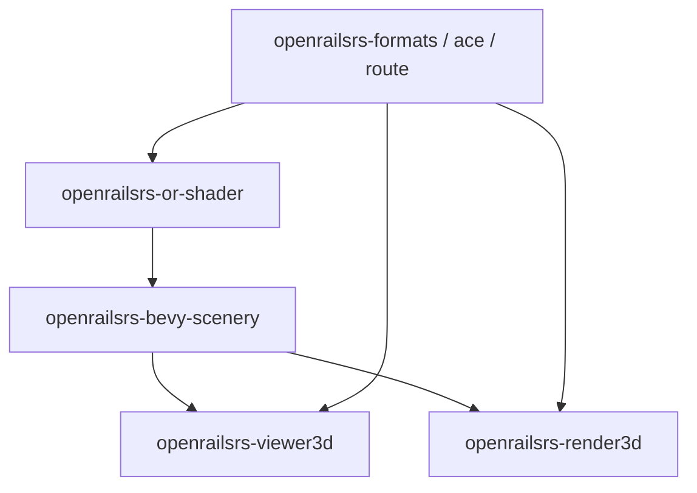

# Arquitectura Bevy — openrailsrs

Capa de presentación 3D (Bevy) separada del núcleo headless (`sim`, `formats`, `route`, …).

Relacionado: [`BEVY_MIGRATION_0_19.md`](BEVY_MIGRATION_0_19.md) · [`RENDER3D.md`](RENDER3D.md) · [`OPEN_RAILS_VIEWER_3D.md`](OPEN_RAILS_VIEWER_3D.md)

---

## Crates

| Crate | Bevy | Rol |
|-------|------|-----|
| **`openrailsrs-or-shader`** | No | Clasificación shaders MSTS/OR, coordenadas MSTS→render |
| **`openrailsrs-bevy-scenery`** | Sí | Materiales OR WGSL, texturas ACE, `MstsAssetPlugin` (#48), spawn WORLD/terreno, VSM |
| **`openrailsrs-viewer3d`** | Sí | App jugable: live, cabina, HUD, cámara, floating origin |
| **`openrailsrs-render3d`** | Sí | Validación visual OR: loading por tiles, stream, debug VSM |

---

## Plugins

| Plugin | Crate | Registra |
|--------|-------|----------|
| `OrSceneryPlugins` | bevy-scenery | `MstsAssetPlugin` + `MaterialPlugin` terreno/scenery/cab, assets shaders |
| `OrVsmPlugins` | bevy-scenery (feature `vsm`) | Pass momentos VSM, cascadas OR |
| `ScenerySpawnPlugin` | bevy-scenery | `#52` sets Catalog→Ready, budgets, ciclo anti-doble-spawn, `ScenerySpawnProgress`; FSM local en cada app |
| `ViewerPlugin` | viewer3d | Gameplay, cabina, cámara, sim live |
| `Render3dPlugin` | render3d | Loading `AppState`, fly cam, HUD debug |

---

## Límites (qué NO va en bevy-scenery)

- Simulación ferroviaria (`live`, `sim`, replay CSV)
- Cabina CVF runtime (`cab_cvf`, input throttle)
- Floating origin y modos de launch (`--run-corridor`, track dev)
- Activity / `.act` parsing (render3d local)

---

## Versión Bevy

**0.19** (pin en `[workspace.dependencies]`). Migración: [`BEVY_MIGRATION_0_19.md`](BEVY_MIGRATION_0_19.md).

- **viewer3d:** `bevy_gizmos`, `bevy_ui_render`
- **render3d:** `bevy_text`, `bevy_state`, `multi_threaded`

---

## Reglas de dependencia

1. Ningún crate headless depende de Bevy.
2. `or-shader` no depende de Bevy.
3. `bevy-scenery` no depende de `viewer3d` ni `render3d`.
4. Shaders WGSL viven solo en `bevy-scenery/assets/shaders/`.
