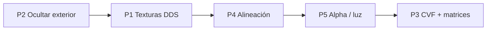

# Cabina 3D MSTS (`CABVIEW3D`) — estado y próximos pasos

Documento de referencia para la vista de conductor en **`openrailsrs-viewer3d --live`**, centrado en el consist Pullman de Chiltern (`RF_Blue_Pullman`).

Relacionado:

- Roadmap general jugable: [`SIMULACION_3D_ROADMAP.md`](SIMULACION_3D_ROADMAP.md) (Fase C)
- **Sesión depuración CVF 2026-06-19:** [`CABVIEW3D_SESSION_2026-06-19.md`](CABVIEW3D_SESSION_2026-06-19.md)
- Arquitectura viewer / OR: [`OPEN_RAILS_VIEWER_3D.md`](OPEN_RAILS_VIEWER_3D.md)
- Setup Chiltern + Content OR: [`CHILTERN_OR_SETUP.md`](CHILTERN_OR_SETUP.md), [`examples/chiltern/README.md`](../examples/chiltern/README.md)

---

## 1. Objetivo

Reproducir en openrailsrs la cabina 3D de Open Rails / MSTS:

- Interior mesh desde `CABVIEW3D/*.s` (p. ej. `PULLMAN_GR.s`)
- Texturas `.ace` (o equivalentes) en la misma carpeta
- Mandos animados vía `.cvf` (fase posterior)
- Cámara en `ORTS3DCabHeadPos` / `StartDirection` del `.eng` del vehículo líder
- Ocultar el exterior del tren en vista conductor; panel instrumental HUD (tecla **C**)

Referencia OR: `ThreeDimentionCabViewer`, `ThreeDimCabCamera`, grupo `RenderPrimitiveGroup::Cab`.

---

## 2. Estado actual (2026-06)

### 2.1 Qué funciona

| Componente | Estado | Código / notas |
|------------|--------|----------------|
| Modo conductor (**C** / **V**) | ✅ | `camera.rs` — `DriverCam`; **C** alterna cabina/chase en `--run-corridor` |
| Panel instrumental | ✅ | `cab_panel.rs` — THR/BRK, RPM, límite |
| Resolución cab `.s` + `.cvf` | ✅ | `cab_view.rs` → `PULLMAN_GR.s` + `PULLMAN_GR.cvf` |
| Texturas 39/39 | ✅ | `.ace` + fallback `.dds` (cristales prim 11/12) |
| Shader OR cabina (`or_cab.wgsl`) | ✅ | TexDiff plano (sin sol exterior por defecto) |
| Iluminación interior | ✅ | `OPENRAILSRS_CAB_SUN=0` (default), albedo 1.0, sin brighten |
| CVF palancas (throttle/freno) | 🔶 parcial | `cab_cvf.rs` — ↑/↓ live; **bug abierto**: pieza animada flota lejos del pupitre (ver sesión 2026-06-19) |
| RenderLayers L0+L2 | ✅ | `cab_render.rs` — mundo + cabina; exterior en L1 oculto |
| Cielo en ventanas (`--run-corridor`) | ✅ | `sky.rs` + domo en `RunCorridor` |
| Diagnóstico cab | ✅ | `cab_diag.rs` — `OPENRAILSRS_CAB_DEBUG=uv\|albedo\|vcolor` |
| Tests Pullman | ✅ | UV, ventanas DDS, CVF matrices, ≥39 texturas |
| Modo Full (terreno + WORLD, sin `--run-corridor`) | 🔶 | [`FULL_SCENERY_LIVE_CHILTERN.md`](FULL_SCENERY_LIVE_CHILTERN.md) — cabina + tren alineados tras fix floating origin XZ (2026-06-19); ventanas/paisaje dependen de spawn ~30 s |
| Floating origin view space | ✅ | `floating_origin.rs` — shift solo XZ; spawn WORLD/terreno con `view_transform`; jerarquía tren excluida del rebase |

### 2.2 Variables de entorno (cabina)

| Variable | Default | Efecto |
|----------|---------|--------|
| `OPENRAILSRS_CAB_ALBEDO` | `1.0` | Multiplicador tint OR (1 = ACE crudo) |
| `OPENRAILSRS_CAB_BRIGHTEN` | off | `1` = levantar `.ace` oscuros (legacy) |
| `OPENRAILSRS_CAB_SUN` | off | `1` = sol direccional + sombras en TexDiff |
| `OPENRAILSRS_CAB_MIN_BRIGHT` | `0` (sin sol) | Piso de brillo shader (0.72 si `CAB_SUN=1`) |
| `OPENRAILSRS_CAB_DEBUG` | off | `albedo`, `uv`, `vcolor` |

### 2.3 Arranque (bash / fish)

**Corredor mínimo** (depurar cabina/CVF):

```fish
set -gx CHILTERN_ROUTE "$HOME/Documentos/Open Rails/Content/Chiltern/ROUTES/Chiltern"
cd ~/repos/propios/ProyectoOpenRails/openrailsrs
cargo run --release -p openrailsrs-viewer3d -- \
    --run-corridor --live --route-root "$CHILTERN_ROUTE" examples/chiltern/scenario.toml
```

**Modo Full** (terreno + WORLD): mismo comando **sin** `--run-corridor` — ver [`FULL_SCENERY_LIVE_CHILTERN.md`](FULL_SCENERY_LIVE_CHILTERN.md).

Teclas en cabina: **C** cabina/chase · **↑/↓** throttle/freno · **H** bocina · **Home** centrar vista.

Log esperado al entrar en cabina:

```
cab diag — env albedo=1.00 brighten=false sun=false …
cab interior from …/PULLMAN_GR.s (39 part(s), 39 textured, 39 OR shader …)
cab CVF … — N matrix bindings (M levers)
```

Assets:

- Cabina: `Content/Chiltern/TRAINS/TRAINSET/RF_Blue_Pullman/Cabview3d/PULLMAN_GR.s`
- Exterior stub repo: `examples/chiltern/trains/RF_Blue_Pullman/SHAPES/RF_WP_DMBSA.s`

### 2.4 Pendiente / bug abierto (2026-06-19)

- **Animación regulador (THROTTLE M8):** geometría sigue desplazándose muy alto al subir `thr`; rebase bone-local aplicado pero no resuelve del todo — ver [`CABVIEW3D_SESSION_2026-06-19.md`](CABVIEW3D_SESSION_2026-06-19.md) § estado al cierre.
- **Modo Full — ventanas azules / paisaje:** layer 0 puede estar vacío hasta terminar spawn WORLD; 345 `.s` TrackObj sin resolver en log.
- Freno (`Brake_wheel`): malla a ~1.3 m del pivote CVF — sin enlace hasta localizar hueso/malla correctos.
- Asiento con tinte cálido del ACE (`seat.ace` rgb≈25,18,13) — ajuste artístico opcional
- Modo noche `CABVIEW3D/NIGHT/` + `.SD`
- Instrumentos multi-state (aguja velocímetro desde telemetría fina)

---

## 3. Próximos pasos posibles (priorizados)

### P1 — Texturas `.dds` para cristales ✅ (2026-06)

Implementado: fallback `.dds`, decode DXT3→RGBA para blend, `BlendATexDiff` → FullBright en OR shader. Log: `39 textured`.

---

### P1 (legacy notes)

<details>
<summary>Detalle original P1</summary>

**Problema:** `Window_front.ace` / `Window_front4.ace` no existen; el trainset trae `.dds`.
</details>

---

### P2 — Ocultar exterior del consist de forma fiable (esfuerzo bajo)

**Problema:** el casco exterior del tren (u otros meshes del consist de 8 coches) podría seguir dibujándose delante de la cámara → arco negro.

**Acciones:**

1. Verificar cada frame que **todos** los `LiveTrainBody` tienen `Visibility::Hidden` en `DriverCam`
2. Ocultar también meshes bajo `LiveTrainMarker` que no lleven `CabInteriorMarker` (recorrido de jerarquía)
3. Log de diagnóstico (una vez al entrar en cabina): `N exterior hidden, M cab parts visible`
4. Opcional: capa de render (`RenderLayers`) — exterior vs cabina

**Criterio de hecho:** en modo **V**, ningún mesh del consist visible salvo `cab:interior:*`; mundo exterior sí visible por ventana.

**Archivos:** `live.rs`, `cab_view.rs`, tests en `app_live.rs`.

---

### P3 — Parser `.cvf` y matrices de sub-objetos (esfuerzo alto, paridad OR) 🔶 piloto

**Problema:** Open Rails aplica animaciones y matrices de `PULLMAN_GR.cvf` y jerarquía del `.s` (`MatrixVisible`, sub-objetos). Nosotros spawnamos cada `prim_state` en identidad local sin animación.

**Piloto ✅ (2026-06):** parser tipado mínimo en `openrailsrs-formats/src/typed/cvf.rs` — `CabViewFile`, `CabControl`, `ControlType`; dispatch `.cvf`; `openrailsrs inspect archivo.cvf`. Referencias: OpenBVE [`CvfParser.cs`](../../OpenBVE/source/Plugins/Train.MsTs/Panel/CvfParser.cs) + [`PanelSubject.cs`](../../OpenBVE/source/Plugins/Train.MsTs/Panel/Enums/PanelSubject.cs); OR [`CabViewFile.cs`](../../openrails/Source/Orts.Formats.Msts/CabViewFile.cs). Ver [`OPENBVE_REFERENCE.md`](OPENBVE_REFERENCE.md) §7.

**Acciones pendientes:**

1. ~~Parser mínimo de `.cvf`~~ ✅
2. Aplicar matrices nombradas del `.s` (`ShapeFile::matrices`) al spawn/update de partes cabina
3. Sincronizar mandos con telemetría live — ✅ `cab_cvf.rs` (levers + multi-state; bake sin hoja en matrices animadas)
4. Referencia OR: `ThreeDimentionCabViewer`, `MatrixVisibleTargetNode`

**Criterio de hecho (fase completa):** palancas/agujas visibles; al menos un mando responde al throttle en live.

**Archivos:** `openrailsrs-formats/src/typed/cvf.rs` (piloto); próximo: `openrailsrs-viewer3d/src/cab_cvf.rs`.

---

### P4 — Alineación cámara ↔ cabina ↔ exterior (esfuerzo medio) ✅ (2026-05)

**Problema:** `ORTS3DCabHeadPos` está en espacio del `.eng` del exterior; la cabina es otro `.s` (`PULLMAN_GR.s`). Deben compartir el mismo origen MSTS al colgar del vagón líder.

**Implementado:**

1. Vagón líder: marco cabina sin escala (`cab_shape_placement_transform`) + hijo `exterior_scale` con length-fit
2. `ORTS3DCabHeadPos` transformado sin escalar (metros MSTS del `.eng`)
3. `resolve_vehicle_shape_path` prefiere shape exterior de OR Content sobre stub Chiltern
4. Tests `orts_head_inside_cab_aabb` / `orts_head_inside_cab_train_space`; log de alineación al cargar cabina

**Criterio de hecho:** cámara dentro del volumen cabina; techo/parabrisas a distancias coherentes (~0.5–1.5 m).

**Archivos:** `live.rs`, `shapes.rs`, `cab_view.rs`.

---

### P5 — Mejoras visuales cabina (esfuerzo bajo–medio)

| Mejora | Descripción |
|--------|-------------|
| **Iluminación interior** | ✅ Plano OR sin sol (`CAB_SUN=0`); ver §2.2 |
| **Alpha / shaders MSTS** | ✅ OR cab shader + ventanas `.dds` blend |
| **Modo noche** | `CABVIEW3D/NIGHT/` + `PULLMAN_GR.SD` (`ESD_Alternative_Texture`) |
| **Near clip** | Ajustar `DRIVER_NEAR_CLIP_M` para evitar clipping del tablero |
| **Render order** | Cabina después del mundo exterior (grupo `Interior` como OR) |

---

### P6 — Cabview 2D fallback (esfuerzo medio)

Si la cabina 3D sigue problemática, OR también soporta `CabView/` 2D (sprites `.ace` + `.cvf`). Menor fidelidad pero útil para instrumental completo.

**Acciones:** parser de `CabViewFile` en `.cvf`; quads en overlay Bevy UI o billboards 3D.

---

## 4. Cómo verificar cada paso

```bash
# Build release (Chiltern grande necesita release)
CHILTERN_ROUTE="$HOME/Documentos/Open Rails/Content/Chiltern/ROUTES/Chiltern"
cargo run --release -p openrailsrs-viewer3d -- \
  --run-corridor --live --route-root "$CHILTERN_ROUTE" examples/chiltern/scenario.toml

# Teclas
# V  — alternar chase / cabina / off
# C  — panel instrumental
# W/S — throttle/freno (en orbit)
```

**Log esperado al entrar en cabina (V):**

```
openrailsrs-viewer3d: cab interior from .../PULLMAN_GR.s (39 part(s), N textured, lead-car attached)
```

| N | Interpretación |
|---|----------------|
| 39 | Todas las texturas `.ace`/`.dds` resueltas |
| 37 | Faltan cristales (P1 pendiente) |
| 0 | Fallo paths; revisar `OPENRAILSRS_MSTS_CONTENT` |

**Tests automáticos:**

```bash
cargo test -p openrailsrs-viewer3d cab_view
cargo test -p openrailsrs-viewer3d pullman
cargo test -p openrailsrs-viewer3d app_live::tests::update_driver_train_visibility
```

---

## 5. Mapa de código

| Archivo | Responsabilidad |
|---------|-----------------|
| `crates/openrailsrs-viewer3d/src/cab_view.rs` | Resolución `CABVIEW3D`, spawn cabina, ORTS parser, `sync_cab_interior` |
| `crates/openrailsrs-viewer3d/src/live.rs` | Consist live, `CabLeadVehicle`, visibilidad exterior, `LiveDriverCab` |
| `crates/openrailsrs-viewer3d/src/camera.rs` | `DriverCam`, `ORTS3DCabHeadPos`, FOV/clip/ambient |
| `crates/openrailsrs-viewer3d/src/cab_panel.rs` | HUD instrumental (tecla C) |
| `crates/openrailsrs-viewer3d/src/shapes.rs` | Mesh `.s`, texturas `.ace`, `vehicle_shape_local_transform` |
| `examples/chiltern/trains/RF_Blue_Pullman/RF_WP_DMBSA.eng` | Stub ORTS cab head (repo) |
| OR Content `.../Cabview3d/PULLMAN_GR.{s,cvf,ace}` | Asset cabina real |

---

## 6. Orden sugerido de implementación



1. **P2** — descartar casco exterior como causa del arco negro (rápido, alto impacto visual)
2. **P1** — parabrisas texturizados (completa 39/39)
3. **P4** — cámara dentro del volumen cabina
4. **P5** — pulido alpha/iluminación
5. **P3** — paridad OR mandos animados (C1 del roadmap general)

---

## 7. Historial

| Fecha | Cambio |
|-------|--------|
| 2026-05 | P4: marco cabina unit-scale, OR content shapes, tests alineación ORTS/cab AABB |
| 2026-05 | Documento inicial: estado Pullman Chiltern, 37/39 texturas, pasos P1–P6 |

Actualizar este archivo al cerrar cada paso (marcar ✅ en §3 y ajustar §2).
