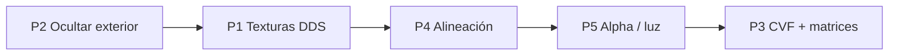

# Cabina 3D MSTS (`CABVIEW3D`) — estado y próximos pasos

Documento de referencia para la vista de conductor en **`openrailsrs-viewer3d --live`**, centrado en el consist Pullman de Chiltern (`RF_Blue_Pullman`).

Relacionado:

- Roadmap general jugable: [`SIMULACION_3D_ROADMAP.md`](SIMULACION_3D_ROADMAP.md) (Fase C)
- Arquitectura viewer / OR: [`OPEN_RAILS_VIEWER_3D.md`](OPEN_RAILS_VIEWER_3D.md)
- Setup Chiltern + Content OR: [`CHILTERN_OR_SETUP.md`](CHILTERN_OR_SETUP.md), [`examples/chiltern/README.md`](../examples/chiltern/README.md)

---

## 1. Objetivo

Reproducir en openrailsrs la cabina 3D de Open Rails / MSTS:

- Interior mesh desde `CABVIEW3D/*.s` (p. ej. `PULLMAN_GR.s`)
- Texturas `.ace` (o equivalentes) en la misma carpeta
- Mandos animados vía `.cvf` (fase posterior)
- Cámara en `ORTS3DCabHeadPos` / `StartDirection` del `.eng` del vehículo líder
- Ocultar el exterior del tren en vista conductor; panel instrumental HUD (tecla **C**)

Referencia OR: `ThreeDimentionCabViewer`, `ThreeDimCabCamera`, grupo `RenderPrimitiveGroup::Cab`.

---

## 2. Estado actual (2026-05)

### 2.1 Qué funciona

| Componente | Estado | Código / notas |
|------------|--------|----------------|
| Modo conductor (**V**) | ✅ | `camera.rs` — `CameraFollowMode::DriverCam` |
| Panel instrumental (**C**) | ✅ | `cab_panel.rs` — THR/BRK, RPM, límite, badge «MODO CABINA» |
| Resolución cab `.s` | ✅ | `cab_view.rs` — `CABVIEW3D/`, prioriza par `.cvf` → `PULLMAN_GR.s` |
| Carga mesh cabina | ✅ | 39 `prim_state` desde OR Content |
| Texturas `.ace` | 🔶 37/39 | Log: `37 textured, lead-car attached` |
| Posición cámara ORTS | ✅ | `ORTS3DCabHeadPos` + `StartDirection` en `RF_WP_DMBSA.eng` |
| Ocultar exterior (LiveTrainBody) | 🔶 | `live.rs` — `update_driver_train_visibility` |
| Cabina hija del vagón líder | ✅ | `CabLeadVehicle` + marco unit-scale + `exterior_scale` hijo |
| Materiales interior unlit | ✅ | `cab_interior_material()` en `cab_view.rs` |
| Tests | ✅ | Resolución paths, ORTS head pos, carga Pullman, ≥30 texturas |

### 2.2 Síntoma visual pendiente

En Chiltern `--live` con **V** (modo cabina), la captura típica muestra:

- **Arco negro** ocupando la mitad superior del viewport
- **Mundo visible** en la parte inferior (terreno, vía, edificios)
- **Sin interior texturizado** reconocible (mandos, techo, ventana)
- Fila de **formas cilíndricas/grises** en el horizonte (posible bogies/vagones del consist u objetos de vía)

El log confirma que la cabina **sí se carga**; el fallo es de **presentación** (alineación, ocultación del exterior y/o materiales), no de ausencia del asset.

### 2.3 Texturas que faltan (2/39)

| `prim_state` | Textura pedida por el `.s` | En Content del usuario |
|--------------|---------------------------|-------------------------|
| 11 | `Window_front4.ace` | Solo `Window_front4.dds` |
| 12 | `Window_front.ace` | Solo `Window_front.dds` (+ `.pdn`) |

El visor solo decodifica **`.ace`** (`openrailsrs-ace`). Esas piezas usan material gris de respaldo; **no explican** un arco negro uniforme (serían gris claro).

### 2.4 Variables de entorno y paths

```bash
# Content MSTS/OR (cabina 3D real)
export OPENRAILSRS_MSTS_CONTENT="$HOME/Documentos/Open Rails/Content"

# Arranque típico
CHILTERN_ROUTE="$HOME/Documentos/Open Rails/Content/Chiltern/ROUTES/Chiltern"
cargo run --release -p openrailsrs-viewer3d -- \
  --run-corridor --live --route-root "$CHILTERN_ROUTE" examples/chiltern/scenario.toml
```

Cabina resuelta desde:

`Content/Chiltern/TRAINS/TRAINSET/RF_Blue_Pullman/Cabview3d/PULLMAN_GR.s`

Exterior del tren (stub en repo):

`examples/chiltern/trains/RF_Blue_Pullman/SHAPES/RF_WP_DMBSA.s`

---

## 3. Próximos pasos posibles (priorizados)

### P1 — Texturas `.dds` para cristales (esfuerzo bajo–medio)

**Problema:** `Window_front.ace` / `Window_front4.ace` no existen; el trainset trae `.dds`.

**Acciones:**

1. En `shapes.rs` → `resolve_texture_path`: si no hay `.ace`, probar mismo stem con `.dds`
2. Decodificar DDS a `bevy::prelude::Image` (p. ej. crate `image` con feature `dds`, o conversión offline)
3. Test: `Window_front.dds` resuelve y `has_texture == true` para prim 11/12

**Criterio de hecho:** log `39 textured`; parabrisas con transparencia aproximada (alpha blend o mask).

**Alternativa rápida:** convertir una vez con herramientas OR/MSTS a `.ace` y copiarlas a `Cabview3d/`.

---

### P2 — Ocultar exterior del consist de forma fiable (esfuerzo bajo)

**Problema:** el casco exterior del tren (u otros meshes del consist de 8 coches) podría seguir dibujándose delante de la cámara → arco negro.

**Acciones:**

1. Verificar cada frame que **todos** los `LiveTrainBody` tienen `Visibility::Hidden` en `DriverCam`
2. Ocultar también meshes bajo `LiveTrainMarker` que no lleven `CabInteriorMarker` (recorrido de jerarquía)
3. Log de diagnóstico (una vez al entrar en cabina): `N exterior hidden, M cab parts visible`
4. Opcional: capa de render (`RenderLayers`) — exterior vs cabina

**Criterio de hecho:** en modo **V**, ningún mesh del consist visible salvo `cab:interior:*`; mundo exterior sí visible por ventana.

**Archivos:** `live.rs`, `cab_view.rs`, tests en `app_live.rs`.

---

### P3 — Parser `.cvf` y matrices de sub-objetos (esfuerzo alto, paridad OR)

**Problema:** Open Rails aplica animaciones y matrices de `PULLMAN_GR.cvf` y jerarquía del `.s` (`MatrixVisible`, sub-objetos). Nosotros spawnamos cada `prim_state` en identidad local sin animación.

**Acciones:**

1. Parser mínimo de `.cvf` (posiciones de mandos, estados TwoState/TriState/Dial)
2. Aplicar matrices nombradas del `.s` (`ShapeFile::matrices`) al spawn/update de partes cabina
3. Sincronizar mandos con telemetría live (`throttle`, `brake`, `velocity`, señales)
4. Referencia OR: `ThreeDimentionCabViewer`, `MatrixVisibleTargetNode`

**Criterio de hecho:** palancas/agujas visibles; al menos un mando responde al throttle en live.

**Archivos nuevos sugeridos:** `cab_cvf.rs` o módulo en `openrailsrs-formats`.

---

### P4 — Alineación cámara ↔ cabina ↔ exterior (esfuerzo medio) ✅ (2026-05)

**Problema:** `ORTS3DCabHeadPos` está en espacio del `.eng` del exterior; la cabina es otro `.s` (`PULLMAN_GR.s`). Deben compartir el mismo origen MSTS al colgar del vagón líder.

**Implementado:**

1. Vagón líder: marco cabina sin escala (`cab_shape_placement_transform`) + hijo `exterior_scale` con length-fit
2. `ORTS3DCabHeadPos` transformado sin escalar (metros MSTS del `.eng`)
3. `resolve_vehicle_shape_path` prefiere shape exterior de OR Content sobre stub Chiltern
4. Tests `orts_head_inside_cab_aabb` / `orts_head_inside_cab_train_space`; log de alineación al cargar cabina

**Criterio de hecho:** cámara dentro del volumen cabina; techo/parabrisas a distancias coherentes (~0.5–1.5 m).

**Archivos:** `live.rs`, `shapes.rs`, `cab_view.rs`.

---

### P5 — Mejoras visuales cabina (esfuerzo bajo–medio)

| Mejora | Descripción |
|--------|-------------|
| **Iluminación interior** | Luz puntual + ambiente en driver view (parcialmente hecho: `AmbientLight` 800 en cabina) |
| **Alpha / shaders MSTS** | Respetar `shader_names` y alpha test de `prim_state` (cristales, recortes) |
| **Modo noche** | `CABVIEW3D/NIGHT/` + `PULLMAN_GR.SD` (`ESD_Alternative_Texture`) |
| **Near clip** | Ajustar `DRIVER_NEAR_CLIP_M` para evitar clipping del tablero |
| **Render order** | Cabina después del mundo exterior (grupo `Interior` como OR) |

---

### P6 — Cabview 2D fallback (esfuerzo medio)

Si la cabina 3D sigue problemática, OR también soporta `CabView/` 2D (sprites `.ace` + `.cvf`). Menor fidelidad pero útil para instrumental completo.

**Acciones:** parser de `CabViewFile` en `.cvf`; quads en overlay Bevy UI o billboards 3D.

---

## 4. Cómo verificar cada paso

```bash
# Build release (Chiltern grande necesita release)
CHILTERN_ROUTE="$HOME/Documentos/Open Rails/Content/Chiltern/ROUTES/Chiltern"
cargo run --release -p openrailsrs-viewer3d -- \
  --run-corridor --live --route-root "$CHILTERN_ROUTE" examples/chiltern/scenario.toml

# Teclas
# V  — alternar chase / cabina / off
# C  — panel instrumental
# W/S — throttle/freno (en orbit)
```

**Log esperado al entrar en cabina (V):**

```
openrailsrs-viewer3d: cab interior from .../PULLMAN_GR.s (39 part(s), N textured, lead-car attached)
```

| N | Interpretación |
|---|----------------|
| 39 | Todas las texturas `.ace`/`.dds` resueltas |
| 37 | Faltan cristales (P1 pendiente) |
| 0 | Fallo paths; revisar `OPENRAILSRS_MSTS_CONTENT` |

**Tests automáticos:**

```bash
cargo test -p openrailsrs-viewer3d cab_view
cargo test -p openrailsrs-viewer3d pullman
cargo test -p openrailsrs-viewer3d app_live::tests::update_driver_train_visibility
```

---

## 5. Mapa de código

| Archivo | Responsabilidad |
|---------|-----------------|
| `crates/openrailsrs-viewer3d/src/cab_view.rs` | Resolución `CABVIEW3D`, spawn cabina, ORTS parser, `sync_cab_interior` |
| `crates/openrailsrs-viewer3d/src/live.rs` | Consist live, `CabLeadVehicle`, visibilidad exterior, `LiveDriverCab` |
| `crates/openrailsrs-viewer3d/src/camera.rs` | `DriverCam`, `ORTS3DCabHeadPos`, FOV/clip/ambient |
| `crates/openrailsrs-viewer3d/src/cab_panel.rs` | HUD instrumental (tecla C) |
| `crates/openrailsrs-viewer3d/src/shapes.rs` | Mesh `.s`, texturas `.ace`, `vehicle_shape_local_transform` |
| `examples/chiltern/trains/RF_Blue_Pullman/RF_WP_DMBSA.eng` | Stub ORTS cab head (repo) |
| OR Content `.../Cabview3d/PULLMAN_GR.{s,cvf,ace}` | Asset cabina real |

---

## 6. Orden sugerido de implementación



1. **P2** — descartar casco exterior como causa del arco negro (rápido, alto impacto visual)
2. **P1** — parabrisas texturizados (completa 39/39)
3. **P4** — cámara dentro del volumen cabina
4. **P5** — pulido alpha/iluminación
5. **P3** — paridad OR mandos animados (C1 del roadmap general)

---

## 7. Historial

| Fecha | Cambio |
|-------|--------|
| 2026-05 | P4: marco cabina unit-scale, OR content shapes, tests alineación ORTS/cab AABB |
| 2026-05 | Documento inicial: estado Pullman Chiltern, 37/39 texturas, pasos P1–P6 |

Actualizar este archivo al cerrar cada paso (marcar ✅ en §3 y ajustar §2).
