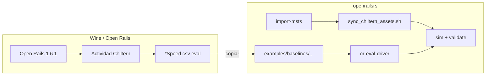

# Chiltern — Open Rails (Wine) + simulación openrailsrs

Guía end-to-end para reproducir la validación **Chiltern / Birmingham Pullman** en Linux:

1. Instalar **Open Rails 1.6.1** bajo Wine.
2. Instalar el contenido MSTS **Chiltern**.
3. Capturar un baseline OR (`*Speed.csv`).
4. Importar la ruta en **openrailsrs**, sincronizar física diesel y correr la sim.

Documentación relacionada:

- Comparación de trazas: [`OR_TRACE_COMPARISON.md`](OR_TRACE_COMPARISON.md)
- Escenario en el repo: [`examples/chiltern/README.md`](../examples/chiltern/README.md)
- Baselines versionados: [`examples/baselines/chiltern_birmingham/README.md`](../examples/baselines/chiltern_birmingham/README.md)

---

## Requisitos

| Componente | Versión / notas |
|------------|-----------------|
| Linux x86_64 | Probado en Ubuntu |
| Wine | 64-bit (`wine64`, `winetricks`) |
| .NET Framework | 4.7.2 vía winetricks (OR 1.6.x lo necesita) |
| Open Rails | [1.6.1](https://github.com/openrails/openrails/releases/tag/1.6.1) |
| Contenido MSTS | Ruta **Chiltern** + trainset **RF_Blue_Pullman** |
| openrailsrs | Rust estable; CLI desde el repo |

Open Rails **no trae rutas ni trenes**. Hay que instalar el contenido MSTS por separado (comprado, regalo o copia propia).

---

## 1. Wine + Open Rails 1.6.1

### Paquetes del sistema

```bash
sudo apt-get install wget wine winetricks
```

En Ubuntu, `wineserver` no siempre está en el `PATH`. Añadilo antes de `winetricks`:

```bash
export WINEPREFIX="/home/TU_USUARIO/wine64-OpenRails"   # ruta ABSOLUTA (Wine no expande ~)
export WINEARCH=win64
export PATH="/usr/lib/x86_64-linux-gnu/wine:$PATH"

mkdir -p "$WINEPREFIX"
wine wineboot --init
```

### Dependencias Windows en el prefix

```bash
winetricks -q corefonts
winetricks -q dotnet472    # 15–40 min; ventanas de instalador de Microsoft
winetricks -q dxvk         # opcional pero recomendado para 3D
```

`dotnet472` encadena varios instaladores (462 → 461 → 46 → NDP472). Mensajes `fixme:` / `err:environ` son habituales; dejá correr hasta que termine.

### Instalar Open Rails

```bash
wget -O ~/Open.Rails.1.6.1.Setup.exe \
  https://github.com/openrails/openrails/releases/download/1.6.1/Open.Rails.1.6.1.Setup.exe

wine ~/Open.Rails.1.6.1.Setup.exe
```

Instalación típica:

```text
C:\Program Files (x86)\Open Rails\OpenRails.exe
```

En el prefix Wine:

```text
$WINEPREFIX/drive_c/Program Files (x86)/Open Rails/OpenRails.exe
```

### Alias útil (opcional)

```bash
# ~/.bashrc o script local
export WINEPREFIX="/home/TU_USUARIO/wine64-OpenRails"
export WINEARCH=win64
export PATH="/usr/lib/x86_64-linux-gnu/wine:$PATH"

alias openrails='wine "$WINEPREFIX/drive_c/Program Files (x86)/Open Rails/OpenRails.exe"'
```

---

## 2. Contenido MSTS Chiltern

Open Rails lee la misma jerarquía que MSTS. Colocá la ruta y el trainset donde OR los espera.

### Rutas habituales

| Qué | Ruta típica (Linux) |
|-----|---------------------|
| Carpeta global MSTS/OR | `~/Documentos/Open Rails/Content/` |
| Ruta Chiltern | `~/Documentos/Open Rails/Content/Chiltern/ROUTES/Chiltern/` |
| Trainset Pullman | `~/Documentos/Open Rails/Content/Chiltern/TRAINS/TRAINSET/RF_Blue_Pullman/` |

También podés usar el menú de OR (**Options → Folders**) para apuntar a tu carpeta de contenido.

### Actividad de referencia

| Campo | Valor |
|-------|--------|
| Actividad | `RS_Let's go to Birmingham` |
| Archivo | `ACTIVITIES/RS_Let's go to Birmingham.act` |
| Consist | Birmingham Pullman (`RF_Blue_Pullman`) |
| Inicio | Paddington Pfm 6 |

Comprobá en OR que la actividad carga sin errores de assets faltantes antes de capturar el baseline.

---

## 3. Configurar Open Rails para el baseline

Para **`compare-or`** y **`or-eval-driver`** usá el CSV de **Evaluación** (train speed), no el dump de rendimiento/física.

### Opciones recomendadas

En **Options → Evaluation** (Evaluación):

- Activar registro de **velocidad del tren** (*Train speed logging*).
- Intervalo ~1 s si está disponible.

En **Options → Data Logger** (Registrador de datos):

- **Performance / Physics / Steam = desactivados** en Wine (ver abajo).
- Si usás el logger clásico: intervalo ≥ 100 ms; *Start logging with simulation start* o **F12** al arrancar.

### Trampa conocida en Wine

Si activás **Registro de datos de rendimiento** (Performance), OR puede abortar con:

```text
pdh.dll.PdhFormatFromRawValue
```

Desactivá ese registro. El baseline de evaluación no lo necesita.

---

## 4. Correr la actividad y capturar el CSV

1. Abrí Open Rails (`openrails` o `wine OpenRails.exe`).
2. Cargá la ruta **Chiltern** y la actividad **RS_Let's go to Birmingham**.
3. Arrancá la simulación con los mismos controles que quieras comparar (p. ej. ~80 % throttle al inicio).
4. Dejá correr ~61 s de tiempo simulado (ventana de evaluación del baseline del repo).
5. Copiá el CSV generado al repo.

### Dónde escribe OR

| Tipo | Ubicación Wine (ejemplo) |
|------|---------------------------|
| Evaluación `*Speed.csv` | `%APPDATA%` → `Open Rails_<Actividad>Speed.csv` |
| Log / dump Escritorio | `drive_c/users/TU_USUARIO/Desktop/OpenRailsLog.txt`, `OpenRailsDump.csv` |

Rutas concretas en este entorno de desarrollo:

```text
# Evaluación (usar con compare-or / or-eval-driver)
/home/cristian/wine64-OpenRails/drive_c/users/cristian/AppData/Roaming/Open Rails_RS_Let's go to BirminghamSpeed.csv

# Escritorio Wine
/home/cristian/wine64-OpenRails/drive_c/users/cristian/Desktop/
```

### Versionar en el repo

```bash
cp "$WINEPREFIX/drive_c/users/TU_USUARIO/AppData/Roaming/Open Rails_RS_Let's go to BirminghamSpeed.csv" \
  examples/baselines/chiltern_birmingham/or_evaluation_speed.csv
```

Header típico del CSV de evaluación OR 1.6.x:

```text
TIME,TRAINSPEED,MAXSPEED,SIGNALASPECT,ELEVATION,DIRECTION,CONTROLMODE,DISTANCETRAVELLED,THROTTLEPERC,...
```

`compare-or` detecta este formato automáticamente (sin `--map`).

---

## 5. openrailsrs — import, sync y simulación

Desde la **raíz del repo**:

### Compilar / instalar CLI

```bash
cargo install --path crates/openrailsrs-cli --force
# o, sin instalar:
# cargo run -p openrailsrs-cli -- …
```

### Importar ruta MSTS

```bash
CHILTERN="$HOME/Documentos/Open Rails/Content/Chiltern/ROUTES/Chiltern"

openrailsrs import-msts "$CHILTERN" \
  --out-dir examples/chiltern \
  --activity "$CHILTERN/ACTIVITIES/RS_Let's go to Birmingham.act"
```

El import genera `track.toml`, `scenario.toml`, placement PAT (`start=n3`, `start_offset_m≈305.6`), switches, etc.

Tras el import se fusiona automáticamente **`examples/chiltern/scenario.overlay.toml`** (duración 65 s, consist Pullman, umbrales `[validate]`). Editá el overlay, no `scenario.toml` a mano.

### Sincronizar física diesel del Pullman

Los `.eng`/`.wag` del repo son stubs de física (sin cab/C#) generados desde MSTS, incluyendo **`ORTSMaxTractiveForceCurves`** por notch:

```bash
./scripts/sync_chiltern_assets.sh
# Fuente por defecto:
# ~/Documentos/Open Rails/Content/Chiltern/TRAINS/TRAINSET/RF_Blue_Pullman/
```

### Simular y validar contra OR

Las rutas relativas (`../baselines/…`, `scenario.toml`) son respecto a **`examples/chiltern`**:

```bash
cd examples/chiltern

openrailsrs or-eval-driver ../baselines/chiltern_birmingham/or_evaluation_speed.csv \
  --out driver_or.csv \
  --brake-full-scale 27

openrailsrs sim scenario.toml --driver driver_or.csv
```

Salida esperada (umbrales en `scenario.overlay.toml`):

```text
overall: PASS
```

Genera `run.csv` y `run.json` en `examples/chiltern/` (artefactos locales, no versionados).

### CI local

```bash
cargo test -p openrailsrs-cli --test chiltern_validate
```

(Omitido si falta `examples/chiltern/track.toml`.)

---

## 6. Flujo resumido (diagrama)



---

## 7. Resultados actuales vs OR (eval ~61 s)

Con modelo diesel por notches ORTS (commit con `DieselTractionModel`):

| Métrica | openrailsrs vs OR | Umbral `[validate]` |
|---------|-------------------|---------------------|
| Velocity RMS | ~3.3 m/s | 4.5 m/s — PASS |
| Position RMS | ~13.5 m | max 55 m — PASS |
| Odómetro @ 65 s | ~200 m (OR ~254 m en sesión larga) | — |

Mejoras respecto al modelo P/v simplificado (~4.4 m/s RMS). Pendiente: RPM/carga motor, scripts cab (`Default.cs`), objetivo estricto 0.3 m/s.

Detalle de comparación: [`OR_TRACE_COMPARISON.md`](OR_TRACE_COMPARISON.md).

---

## 8. Solución de problemas

| Problema | Causa / fix |
|----------|-------------|
| `invalid directory ~/… in WINEPREFIX` | Usá ruta absoluta: `$HOME/wine64-OpenRails` |
| `wineserver not found` | `export PATH="/usr/lib/x86_64-linux-gnu/wine:$PATH"` |
| OR no arranca tras instalar | Revisá que `dotnet472` terminó; probá `winecfg` → Windows 7 |
| Crash `pdh.dll` al loguear | Desactivá registro de **rendimiento** en Opciones |
| `compare-or` no encuentra columnas | Usá CSV de **Evaluación**, no dump de Performance |
| `overall: FAIL` tras pull | Reinstalá CLI: `cargo install --path crates/openrailsrs-cli --force` |
| Sim sin diesel/notches | Corré `./scripts/sync_chiltern_assets.sh` y recompilá |
| Rutas baseline rotas | Ejecutá `sim` desde `examples/chiltern`, no desde la raíz sin ajustar paths |

---

## 9. Referencias

- [Open Rails — releases](https://github.com/openrails/openrails/releases)
- [Manual OR — Data Logger](https://open-rails.readthedocs.io/en/latest/options.html#data-logger-options)
- Baseline capturado: 2025-05-25, OR 1.6.1, Wine, Linux
