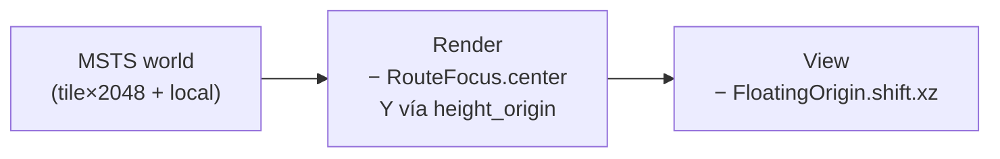
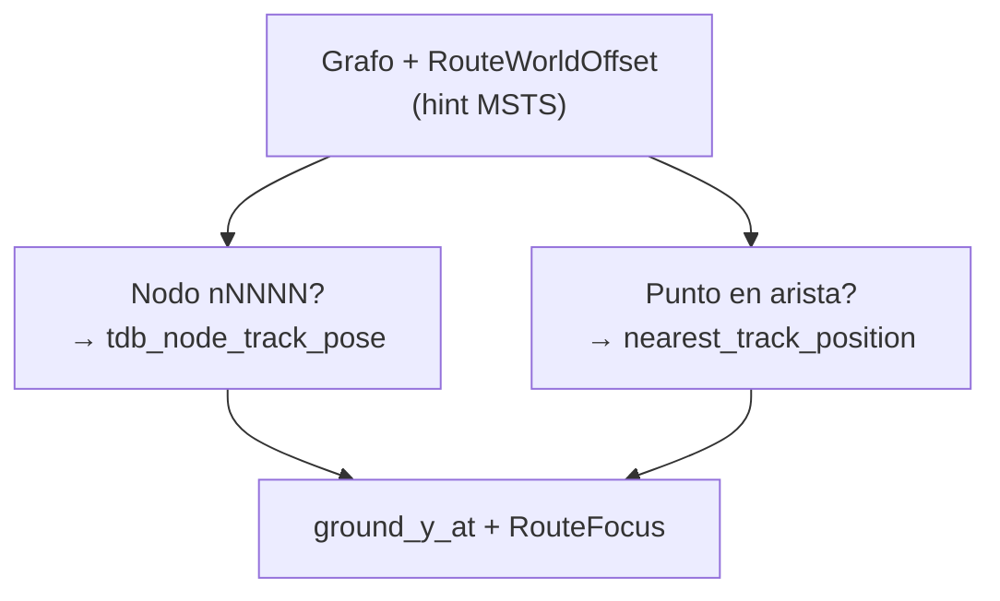

# Coordenadas MSTS / Open Rails / Bevy

Referencia operativa para `openrailsrs-viewer3d`. Implementación: [`coordinates.rs`](../crates/openrailsrs-or-shader/src/coordinates.rs).

Relacionado: [`FULL_SCENERY_LIVE_CHILTERN.md`](FULL_SCENERY_LIVE_CHILTERN.md), [`TSRE5_STUDY.md`](TSRE5_STUDY.md).

---

## Tres espacios



### 1. MSTS world

- Tile **2048 m × 2048 m**, índices **firmados** (UK: `tile_x` negativo).
- Local dentro del tile: **±1024 m** (centro = 0).
- Conversión Bevy (`msts_to_bevy`):

```text
bevy_x = tile_x * 2048 + local_x
bevy_y = local_y
bevy_z = -(tile_z * 2048 + local_z)
```

Rebalanceo al cruzar ±1024 (TSRE `Game::check_coords`, OR, `TRnode::addPositionOffset`):

```text
if local_x >= 1024:  local_x -= 2048; tile_x += 1
if local_x < -1024:  local_x += 2048; tile_x -= 1
(mismo patrón en Z; convención TSRE en Z puede incrementar tile_z al restar 2048)
```

### 2. Render (`RouteFocus`)

- Resta `center` (ancla MSTS world) en XZ.
- **Y:** WORLD/TDB usan Y absoluto (MSL-like). Para render:
  - `to_render_surface` → `world.y - height_origin` (terreno en ancla ≈ 0).
  - `scenery_to_render` = `to_render_surface` sobre la posición WORLD (issue #64: **sin** remap `(scenery_y - center.y) + height_origin`, que aplastaba terraplenes).
- `height_origin` = MSL del terreno en el ancla (`TerrainElevation::sample_world_y`), no el Y del bbox del `.w`.
- API: `scenery_to_render`, `to_render_surface`, `scenery_y_to_msl` (identidad desde #64).

### 3. View (`FloatingOrigin`)

- Resta `shift` solo en **XZ** (umbral 256 m, estilo OR `PrepareFrame`).
- **No** modifica Y (regresión Chiltern 2026-06-19).

---

## LOD / distancia (fórmula TSRE)

Referencia de lectura en TSRE5 `Tile.cpp`:

```text
lodx = (tile_x - playerT_x) * 2048 + obj.local_x - playerW_x
lodz = (tile_z - playerT_z) * 2048 + obj.local_z - playerW_z
dist = sqrt(lodx² + lodz²)
```

openrailsrs usa distancia horizontal desde `RouteFocus` o `ViewWindow` en metros.

---

## Grafo vs escenario MSTS

| Fuente | Espacio | Uso |
|--------|---------|-----|
| `track.toml` | Plano importado (`x_m`, `y_m` → Bevy XZ) | Simulación |
| `.tdb` / `.w` | MSTS tile + local | Visual |
| Overlay `world_anchor` | Posición OR al arrancar actividad | Trim visual |

Cuando grafo y MSTS divergen (~1–2 km en Chiltern parcheado):

```text
RouteWorldOffset.delta = world_anchor_msts − graph_start_position
```

Prioridad del ancla: **overlay > `.trk` RouteStart > bbox `.w` > grafo**.

---

## Alineación visual grafo → TDB

La simulación usa coords planas del grafo. Los marcadores visuales (paradas, señales, nodos debug, extremos de vía lógica) usan `.tdb` cuando está cargado.



| API | TSRE5 | Uso |
|-----|-------|-----|
| `tdb_node_track_pose` | `getDrawPositionOnTrNode` | Paradas en nodo |
| `nearest_track_position` | `findNearestPositionOnTDB` | Señales, puntos en arista |
| `TrackPositionResolver` | índice tile + TSection | Resolver compartido |

Radio snap: `OPENRAILSRS_TDB_SNAP_RADIUS_M` (default 2500 m). Detalle y validación: [`VIEWER3D_TESTING.md`](VIEWER3D_TESTING.md) § Alineación grafo → TDB.

---

## Stop sim → posición TDB real

1. Grafo: caminar aristas desde `start` con `start_offset_m` → odometría sim (sin cambiar).
2. Visual parada: `marker_render_world_at_node` sobre nodo homólogo TDB (`n10778` → id 10778).
3. Visual señal: `marker_render_world_on_edge` (hint grafo → snap centreline).
4. Comparar con objetos `.w` en el mismo tile (`--audit-placement`).

---

## Ficheros `.w`

Patrón: `world/w-006080+014925.w` → tile X = -6080, Z = 14925 (signo Z invertido en nombre).

Parser: texto `Tr_Worldfile` o binario token 375 — ver `openrailsrs-formats` `world.rs`.
