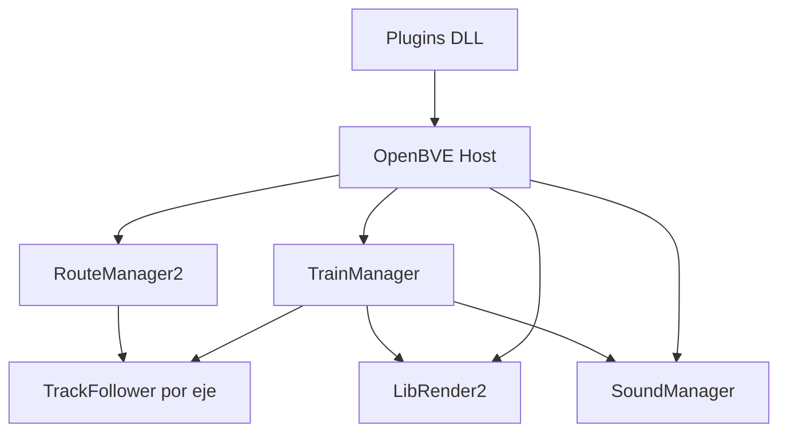

# OpenBVE: referencia complementaria para openrailsrs

Este documento resume el **código fuente de [OpenBVE](https://github.com/leezer3/OpenBVE)** analizado a partir del clon en `../OpenBVE/` (workspace `ProyectoOpenRails`). Sirve como **segunda referencia** junto a Open Rails: OpenBVE aporta sobre todo en **parsers de assets MSTS de tren** (ENG/WAG/CON, CVF, SMS, shapes); Open Rails sigue siendo la fuente principal para **rutas, topología, física y viewer 3D del mundo**.

Relacionado:

- Open Rails (referencia principal): [`OPEN_RAILS_VIEWER_3D.md`](OPEN_RAILS_VIEWER_3D.md)
- Validación cruzada parsers: [`PARSER_CROSS_VALIDATION.md`](PARSER_CROSS_VALIDATION.md)
- Cabina 3D: [`CABVIEW3D_ROADMAP.md`](CABVIEW3D_ROADMAP.md)
- Sonidos: [`SIMULACION_3D_ROADMAP.md`](SIMULACION_3D_ROADMAP.md) §4
- Shapes binarios: [`MSTS_SHAPE_BINARY_PARSER.md`](MSTS_SHAPE_BINARY_PARSER.md)
- Licencias externas: [`THIRD_PARTY_REFERENCES.md`](THIRD_PARTY_REFERENCES.md)

---

## 1. Qué es OpenBVE

OpenBVE es un simulador ferroviario **centrado en cabina** (vista conductor), originalmente para rutas **BVE** (CSV/RW, BVE5 TXT, Mechanik DAT). Desde ~2020 incluye **soporte parcial de trenes MSTS** (`.eng`, `.wag`, `.con`, CVF, SMS, shapes `.s`), pero **no lee rutas MSTS** (no hay plugin `Route.Msts`).

| Aspecto | OpenBVE | openrailsrs |
|---------|---------|-------------|
| Stack | C# + OpenGL (OpenTK) | Rust + Bevy (viewer3d) |
| Rutas | BVE nativo | MSTS/OR (`track.toml`, TDB, `.trk`) |
| Trenes MSTS | Parcial (WIP) | Parser tipado + física en evolución |
| Licencia código nuevo | BSD-2 | (repo propio) |

---

## 2. Arquitectura general

| Módulo | Rol | Ruta en workspace |
|--------|-----|-------------------|
| **OpenBveApi** | Contratos: rutas, trenes, objetos, sonido, plugins | `OpenBVE/source/OpenBveApi/` |
| **OpenBVE** | Host: loop, input, UI, HUD, AI jugador | `OpenBVE/source/OpenBVE/` |
| **TrainManager** | Simulación tren: coches, frenos, motores, handles | `OpenBVE/source/TrainManager/` |
| **RouteManager2** | Mundo BVE: tracks, estaciones, señales | `OpenBVE/source/RouteManager2/` |
| **LibRender2** | Motor OpenGL: cámara, shaders, cabina | `OpenBVE/source/LibRender2/` |
| **SoundManager** | Audio OpenAL 3D | `OpenBVE/source/SoundManager/` |
| **Plugins/** | Loaders por formato (DLL) | `OpenBVE/source/Plugins/` |

**Idea clave:** OpenBVE usa **plugins de formato** (`Train.MsTs`, `Object.Msts`, `Formats.Msts`, …) sobre un host estable (`HostInterface`). Conceptualmente similar a los crates modulares de openrailsrs.

---

## 3. Mapa de archivos útiles (MSTS)

Rutas relativas al workspace `ProyectoOpenRails/OpenBVE/source/`.

| Subsistema | Archivo | Utilidad para openrailsrs |
|------------|---------|---------------------------|
| Lexer Kuju / SIMISA | `Plugins/Formats.Msts/Plugin.cs`, `Tokens.cs` | Segunda opinión en tokens MSTS |
| Parser ENG/WAG/CON | `Plugins/Train.MsTs/Train/VehicleParser.cs` | Checklist campos vs `EngineFile` |
| Consist | `Plugins/Train.MsTs/Train/ConsistParser.cs` | Resolución paths trainset |
| Adhesión MSTS | `Plugins/Train.MsTs/Train/Adhesion.cs`, `MSTSAxle.cs` | Parámetros WheelSlip/Sanding |
| Cabina CVF | `Plugins/Train.MsTs/Panel/CvfParser.cs` | **Referencia principal CVF** |
| Variables cabina | `Plugins/Train.MsTs/Panel/Enums/PanelSubject.cs` | Mapeo throttle/brake/RPM → animación |
| Sonido SMS | `Plugins/Train.MsTs/Sound/SmsParser.cs` | Streams/triggers MSTS |
| Runtime SMS | `TrainManager/Sounds/MSTS/SoundStream.cs`, `SoundTrigger*.cs` | Curvas volumen/frecuencia |
| Shapes `.s` | `Plugins/Object.Msts/ShapeParser.cs` | Edge cases (secundario vs OR `SBR.cs`) |
| Texturas ACE | `Plugins/Texture.Ace/` | Decodificación ACE |
| Curvas tracción MSTS | `TrainManager/Power/MSTS/MSTSAccelerationCurve.cs` | **Simplificado** — no usar para paridad física |
| AI conductor | `OpenBVE/Game/AI/AI.SimpleHuman.cs` | Heurísticas conducción autónoma |
| Track follower 1D | `OpenBveApi/Routes/Track.TrackFollower.cs` | Patrón API posición escalar (modelo BVE, no MSTS) |

---

## 4. Matriz de utilidad

| Área | openrailsrs hoy | Usar OpenBVE | Usar Open Rails |
|------|-----------------|--------------|-----------------|
| Grafo / TDB / `.trk` | `openrailsrs-msts`, `track.toml` | **No** | **Sí** (autoritativo) |
| Física diesel / paridad OR-P* | `openrailsrs-train`, `openrailsrs-sim` | Solo checklist campos ENG | **Sí** (autoritativo) |
| Shapes `.s` binario | `shape_binary_reader` | `Object.Msts/ShapeParser.cs` (secundario) | `SBR.cs`, `ShapeFile.cs` (primario) |
| Cabina 3D `.cvf` | mesh sí (`cab_view.rs`); animación no | **`CvfParser.cs` + `PanelSubject.cs`** | `CabViewFile.cs` (también incompleto) |
| Audio `.sms` | Sintético (`openrailsrs-audio`) | **`SmsParser.cs`** | `SoundManagement.cs` |
| AI conductor | `AutoDriver`, `ScriptedDriver` | `AI.SimpleHuman.cs` | Activity AI |
| Rutas BVE | — | Nativo OpenBVE | — |

### Cuándo consultar cada fuente

1. **Rutas, señales Activity, física diesel, multi-cuerpo, viewer terreno** → Open Rails.
2. **CVF, SMS, cobertura ENG/WAG, shapes raros** → OpenBVE + validar contra OR si hay duda de comportamiento.
3. **Nunca** usar la física MSTS de OpenBVE (`MSTSAccelerationCurve`) como objetivo de paridad: está simplificada y mapeada a modelos BVE.

---

## 5. Licencia y atribución

- Código **nuevo** de OpenBVE: **BSD-2-Clause** (ver headers en `CvfParser.cs`, `SmsParser.cs`, etc.).
- Open Rails: **GPL-3** — leer para entender comportamiento; **no copiar** bloques de código GPL en Rust.
- Al portar **ideas o algoritmos** desde OpenBVE (p. ej. mapeo `PanelSubject`), citar *The OpenBVE Project* en comentarios del módulo Rust correspondiente.

Ver también [`THIRD_PARTY_REFERENCES.md`](THIRD_PARTY_REFERENCES.md).

---

## 6. Limitaciones conocidas de OpenBVE (MSTS)

| Limitación | Evidencia |
|------------|-----------|
| Sin rutas MSTS | No existe `Route.Msts` en `Plugins/` |
| Vapor incompleto | `VehicleParser.cs`: `// NOT YET IMPLEMENTED FULLY` |
| Frenos mixtos vacío+aire | `VehicleParser.cs`: `FIXME: Need to implement vac braked / air piped` |
| Curva tracción simplificada | `MSTSAccelerationCurve.cs`: F=ma con MaxForce, no RPM MSTS |
| Adhesión en frenado | `MSTSAxle.cs`: fórmula BVE, no MSTS original |
| CVF animaciones | `CvfAnimation.cs`: `TODO: Implement properly` |

---

## 7. Piloto CVF (openrailsrs-formats)

**Estado:** parser tipado mínimo en `openrailsrs-formats/src/typed/cvf.rs` (2026-06).

| Token MSTS | Struct Rust | Referencia OpenBVE / OR |
|------------|-------------|-------------------------|
| `Tr_CabViewFile` | `CabViewFile` | `CabviewFileParser` / `CabViewFile.cs` |
| `CabViewType` | `cab_view_type: Option<u32>` | tipo cabina (2D/3D) |
| `CabViewFile` + `Position` + `Direction` | `CabView` | vistas 2D del panel |
| `CabViewControls` | `controls: Vec<CabControl>` | bloque de mandos |
| `MultiStateDisplay` | `CabControl::MultiStateDisplay` | aguja digital multi-estado |
| `Type ( THROTTLE_DISPLAY … )` | `ControlType` | `PanelSubject.Throttle_Display` |
| `States` / `State` / `SwitchVal` | `ControlState` | valor simulación → frame gráfico |
| `Dial`, `Digital` | `CabControl::Dial`, `Digital` | instrumentos analógicos/digitales |

**CLI:** `openrailsrs inspect archivo.cvf` imprime resumen tipado (vistas, controles, tipos).

**Tests:** `tests/fixtures/minimal.cvf` (sintético); opcional `OPENRAILSRS_CVFFIXTURE` apuntando a un `.cvf` real local.

**Siguiente paso:** cablear `CabViewFile` en `openrailsrs-viewer3d` (`cab_cvf.rs`) para animar mandos con telemetría live — ver [`CABVIEW3D_ROADMAP.md`](CABVIEW3D_ROADMAP.md) P3.

---

## 8. Próximos aprovechamientos (priorizado)

| Prioridad | Entregable | Referencia OpenBVE | Crate destino |
|-----------|------------|-------------------|---------------|
| 1 | Animación cabina desde `CabViewFile` | `CvfParser` + `PanelSubject` | `openrailsrs-viewer3d/cab_cvf.rs` |
| 2 | Playback `.sms` locomotora | `SmsParser.cs` | `openrailsrs-audio` o crate `openrailsrs-sms` |
| 3 | Auditoría campos ENG/WAG | `VehicleParser.cs` vs `EngineFile` | **`openrailsrs audit-vehicle`** + [`PARSER_CROSS_VALIDATION.md`](PARSER_CROSS_VALIDATION.md) |
| 4 | AI conductor mejorado | `AI.SimpleHuman.cs` | `openrailsrs-sim` |
