# Roadmap de paridad con Open Rails

Plan de implementación para cerrar las diferencias entre **openrailsrs** y el simulador físico de [Open Rails](https://github.com/openrails/openrails), identificadas en el análisis de código fuente (2026-05-26).

**Estado de calibración actual (baseline):**

| Escenario | Duración | RMS velocidad | Notas |
|-----------|----------|---------------|-------|
| Chiltern Birmingham | 136 s | ~0.28 m/s | `assume_signals_clear`, Davis explícito en escenario |
| Chiltern full-throttle (Exp B) | 120 s | ~0.51 m/s (0–30 s) | OR-P13 trail ORTS + `chiltern_fullthrottle` |
| SCE Glasgow | 100 s | ≤1.0 m/s (umbral) | Crucero ~14 mph @ 27 % throttle alineado |

Este documento **no reemplaza** [`ROADMAP.md`](../ROADMAP.md) ni [`CALIBRATION.md`](../CALIBRATION.md); los complementa con trabajo específico de paridad física.

---

## Leyenda

| Símbolo | Significado |
|---------|-------------|
| ✅ | Hecho |
| 🔶 | Parcial / calibrado con atajos |
| 🔲 | Pendiente |
| P0 | Crítico para validación OR existente |
| P1 | Alto impacto en realismo general |
| P2 | Contenido específico o largo plazo |

**Referencias OR (lectura obligatoria por fase):**

- `Source/Orts.Simulation/Simulation/RollingStocks/MSTSDieselLocomotive.cs`
- `Source/Orts.Simulation/Simulation/RollingStocks/Subsystems/PowerSupply/DieselEngine.cs`
- `Source/Orts.Simulation/Simulation/RollingStocks/MSTSLocomotive.cs`
- `Source/Orts.Simulation/Simulation/RollingStocks/TrainCar.cs`
- [Manual OR — Physics](https://open-rails.readthedocs.io/en/latest/physics.html)

---

## Visión general

```mermaid
flowchart LR
    subgraph wave1["Ola 1 — Diesel eléctrico-hidráulico"]
        A1[OR-P1 Throttle aparente + P/v]
        A2[OR-P2 Auto-friction CN]
        A3[OR-P3 Rampas tracción]
    end
    subgraph wave2["Ola 2 — Tren como sistema"]
        B1[OR-P4 Multi-cuerpo]
        B2[OR-P5 Davis por vehículo]
        B3[OR-P6 Frenos MSTS]
    end
    subgraph wave3["Ola 3 — Mundo y señales"]
        C1[OR-P7 Señales + driver]
        C2[OR-P8 Resistencia ambiental]
    end
    subgraph wave4["Ola 4 — Especializados"]
        D1[OR-P9 Gearbox mecánico]
        D2[OR-P10 Freno dinámico]
        D3[OR-P11 Vapor avanzado]
    end
    wave1 --> wave2 --> wave3 --> wave4
```

| Ola | Fases | Objetivo | Regresión esperada |
|-----|-------|----------|-------------------|
| 1 | OR-P1 … OR-P3 | Paridad diesel Class 47 / Blue Pullman | Chiltern + SCE deben seguir pasando |
| 2 | OR-P4 … OR-P6 | Longitud del tren y frenado real | Nuevos baselines OR (frenada completa) |
| 3 | OR-P7 … OR-P8 | Actividades MSTS sin `assume_signals_clear` | Chiltern sin override de señales |
| 4 | OR-P9+ | Contenido mecánico / vapor / DB | Por escenario |

---

## OR-P1 — Throttle aparente y tope P/v diesel (P0)

**Objetivo:** Replicar la cadena OR en locos diesel-eléctricos con `ORTSMaxTractiveForceCurves` (Class 47, DMBSA).

**Gap actual:**

- OR limita el throttle efectivo con `ReverseThrottleRPMTab[RealRPM]` → `ApparentThrottleSetting` antes de consultar curvas (`MSTSLocomotive.UpdateTractionForce`).
- OR limita fuerza con `LocomotiveMaxRailOutputPowerW × throttle × DieselEngineFractionPower`, no con `DieselPowerTab(RPM)` escalado heurísticamente.
- Nuestro `effective_power_w()` usa escalado idle→tab (< 50 % lineal, ≥ 50 % pleno) — calibración SCE, no paridad literal.

**Implementación:**

| Paso | Crate / archivo | Trabajo |
|------|-----------------|---------|
| 1 | `openrailsrs-formats` | Parsear `ReverseThrottleRPMTab`, `LocomotiveMaxRailOutputPowerW`, `ORTSTractiveForceIsPowerLimited`, `UnloadingSpeedMpS` |
| 2 | `openrailsrs-train/diesel.rs` | `apparent_throttle(rpm) -> f64`; cap P/v con `rail_power_w × t × run_fraction` |
| 3 | `openrailsrs-sim/physics.rs` | Usar `min(t_driver, t_apparent)` en curvas; separar HUD-power de rail-power cap |
| 4 | Escenarios | Flag `[simulation] legacy_power_cap = true` para transición; retirar hack 50 % cuando P1 pase tests |

**Criterios de aceptación:**

- [ ] Test unitario: RPM bajo → fuerza limitada aunque throttle driver = 1.0
- [ ] `audit_sce_cruise` y `audit_chiltern_forces` pasan sin overrides de potencia
- [ ] SCE 100 s: RMS ≤ 1.0 m/s; crucero 27 % dentro de ±0.5 mph vs OR
- [ ] Chiltern 136 s: RMS ≤ 0.35 m/s (no empeorar >10 % vs baseline actual)

**Referencias OR:** `DieselEngine.cs` L1366–1416, `MSTSLocomotive.cs` L2555–2635, `MSTSDieselLocomotive.cs` L635–698.

**Estimación:** 3–5 días.

---

## OR-P2 — Auto-friction OR completa (P0)

**Objetivo:** Sustituir `davis_est.rs` simplificado por las fórmulas Davis 1926 / CN 1992 de OR cuando falten `ORTSDavis_*`.

**Gap actual:**

- OR calcula A/B desde `ORTSBearingType`, masa, número de ejes; C desde área frontal y `ORTSDavisDragConstant`.
- Nosotros escalamos 502.8 / 1.55 / 1.43 por masa relativa a un coach de 34 t.

**Implementación:**

| Paso | Trabajo |
|------|---------|
| 1 | Parsear `ORTSBearingType`, `ORTSWagonFrontalArea`, `ORTSDavisDragConstant`, conteo de ejes (`WheelAxles` / `NumWheels`) en `.eng`/`.wag` |
| 2 | Nuevo módulo `openrailsrs-train/auto_friction.rs`: `calc_davis_a/b/c(bearing, mass, axles, frontal_area, drag_const, wagon_type)` portando lógica de `TrainCar.UpdateTrainBaseResistance_*` |
| 3 | Reemplazar `estimate_davis_coefficients()`; mantener override `[train.davis]` en escenario |
| 4 | Test con vagones SCE MK2 (sin ORTSDavis en content) vs valores OR logueados en `-verboseconfig` |

**Criterios de aceptación:**

- [ ] Vagón SCE MK2: A/B/C dentro de ±5 % vs OR `-verboseconfig`
- [ ] SCE 100 s sigue pasando sin `[train.davis]` en escenario
- [x] Chiltern puede quitar override manual cuando Pullman + 6 coaches coincidan con OR (`chiltern_validate` sin `[train.davis]`)

**Referencias OR:** PR [#1207 auto_friction](https://github.com/openrails/openrails/commit/d01848a), manual Physics § Davis.

**Estimación:** 4–6 días.

**Depende de:** ninguna (paralelo a OR-P1).

---

## OR-P3 — Rampas de tracción y fuerza continua (P1)

**Objetivo:** Transitorios suaves y protección térmica continua como OR.

**Gap actual:**

- OR: `TractionForceRampUpNpS`, `TractionForceRampDownNpS`, `TractionPowerRampUpWpS`, `AverageForceN` + `ContinuousForceTimeFactor`.
- Nosotros: solo `RunUpTimeToMaxForce` en modelos legacy.

**Implementación:**

| Paso | Trabajo |
|------|---------|
| 1 | Parsear rampas desde `.eng` / bloque Diesel |
| 2 | Estado en `TrainSimState`: `traction_force_n`, `average_force_n` por motor |
| 3 | `UpdateForceWithRamp` equivalente en `physics.rs` antes del paso de velocidad |
| 4 | Reducir fuerza cuando `AverageForceN` supera rating continuo |

**Criterios de aceptación:**

- [x] Experimento B (aceleración 100 % throttle): baseline OR + `chiltern_fullthrottle` (vel RMS 0–30 s ~0.51 m/s vs OR; umbral fase ≤2.0). OR-P13: DMBSH hereda ORTS del DMBSA con `effort_scale` hasta 4× y run-up 15 s.
- [x] No overshoot de velocidad >2 m/s vs OR en arranque Chiltern (`chiltern_startup_overshoot`)

**Estimación:** 3–4 días.

**Depende de:** OR-P1 (misma ruta de tracción).

---

## OR-P4 — Cablear simulación multi-cuerpo (P1)

**Objetivo:** Activar `multi_body_step()` en corridas normales, no solo en tests.

**Gap actual:**

- `coupler.rs` y `VehicleState` existen; `runner.rs` nunca inicializa `state.vehicles` → siempre masa puntual.
- `BrakeSystem::from_vehicles` ya usa posiciones del consist.

**Implementación:**

| Paso | Crate | Trabajo |
|------|-------|---------|
| 1 | `openrailsrs-sim/runner.rs`, `multi_runner.rs` | Inicializar `vehicles`, `couplers`, `vehicle_masses` desde `Consist` (longitudes, masas, offsets) |
| 2 | `openrailsrs-train` | Exponer `Consist::vehicle_layout() -> Vec<VehicleLayout>` (posición, masa, length_m) |
| 3 | `physics.rs` | Aplicar tracción solo a vehículo 0; resistencia Davis **por vehículo** (prep. OR-P5) |
| 4 | `[simulation] multi_body = true` en escenario (default false hasta validado) |

**Criterios de aceptación:**

- [ ] Test integración: tren 2 coches — retraso de aceleración del vagón vs loco visible en CSV
- [ ] Chiltern 136 s con multi_body: RMS ≤ 0.40 m/s (transitorios distintos, umbral relajado inicial)
- [ ] Frenada: pico de fuerza en cabeza vs cola coherente con propagación de aire

**Estimación:** 4–5 días.

**Depende de:** OR-P5 parcial (resistencia por vehículo recomendada).

---

## OR-P5 — Resistencia por vehículo en el paso físico (P1)

**Objetivo:** OR calcula `FrictionForceN` por `TrainCar`; nosotros sumamos Davis agregado.

**Implementación:**

| Paso | Trabajo |
|------|---------|
| 1 | `TrainPhysics`: `Vec<DavisCoefficients>` paralelo a vehículos |
| 2 | En multi-cuerpo: `f_resist_i` por vehículo; en masa puntual: suma (comportamiento actual) |
| 3 | Opcional fase 1: resistencia en curva `(mass × μ × (gauge + wheelbase)) / (2 × radius)` desde `PathData.curve_radius_m` |

**Criterios de aceptación:**

- [ ] Suma de resistencias por vehículo = resistencia agregada actual ±1 % en Chiltern/SCE
- [ ] Con curva en track: deceleración en curva medible vs OR (Experimento free-roll en curva)

**Estimación:** 2–3 días (+2 días si incluye curva).

**Depende de:** OR-P2 (coeficientes por vehículo).

---

## OR-P6 — Frenos MSTS / OR completos (P1)

**Objetivo:** Ir más allá del proxy spring-ramp hacia el modelo de presión de OR.

**Gap actual:**

- OR: `MSTSBrakeSystem`, tipos de zapata (Karwatzki), blending DB/fricción, skid, `BrakeShoeCoefficientFriction` vs velocidad.
- Nosotros: cilindros con rampa fija + `BrakeCommandMapping` (121 PSI → cilindro).

**Implementación (incremental):**

| Sub-fase | Alcance |
|----------|---------|
| P6a | Presión de cilindro como estado (0–max PSI), no fuerza directa; mapeo driver → reducción tubo |
| P6b | Coeficiente de zapata vs velocidad (curvas Karwatzki para Cast Iron / HFC / Disc) |
| P6c | Skid limit: `min(force, mass × g × skid_friction)` |
| P6d | Blending con freno dinámico (requiere OR-P10) |

**Criterios de aceptación:**

- [ ] Experimento A (costa libre tras frenada fuerte): perfil v(t) post-suelta freno dentro de 0.5 m/s RMS vs OR
- [ ] Chiltern fase 0–40 s (frenos al inicio): mejora posición max sin empeorar velocidad global

**Estimación:** P6a–c: 1–2 semanas.

**Depende de:** OR-P4 (distribución de fuerza por vehículo).

---

## OR-P7 — Señales y driver OR sin atajos (P1)

**Objetivo:** Validar Chiltern con señales reales y driver que respete aspectos.

**Gap actual:**

- Chiltern usa `assume_signals_clear = true`.
- `or-eval-driver` replay puro; no reacciona a Stop/Caution.
- OR Activity mode obedece señales y límites de velocidad del path.

**Implementación:**

| Paso | Trabajo |
|------|---------|
| 1 | Import MSTS: mapear `SignalItem` + aspectos dinámicos desde actividad (parcial en Fase 25b) |
| 2 | `ScriptedDriver` opcional: reducir throttle / aplicar freno ante Stop en bloque adelante |
| 3 | `[route] assume_signals_clear = false` en Chiltern cuando scripts + posiciones sean correctos |
| 4 | Baseline OR Activity (no Explorer) para misma ventana temporal |

**Criterios de aceptación:**

- [ ] Chiltern 136 s sin `assume_signals_clear`: RMS ≤ 0.5 m/s vs baseline Activity OR
- [ ] Ninguna violación de Stop (velocidad > 0.5 m/s en bloque rojo)

**Estimación:** 1–2 semanas (mucho contenido/ruta).

**Depende de:** scripts de señal ya en Fase 22; import actividad Fase 25b.

---

## OR-P8 — Resistencia ambiental (P2)

**Objetivo:** Curva, túnel, viento, temperatura de rodamientos.

**Implementación:**

| Componente | Fuente OR | Prioridad |
|------------|-----------|-----------|
| Resistencia en curva | `TrainCar` base curve resistance | Alta |
| Túnel | `TunnelCrossSection`, perimeter | Media |
| Viento | `WindDependency` | Baja |
| Starting resistance | `Friction0N` vs Davis extendido | Media |

**Criterios de aceptación:**

- [ ] Escenario con curva R=500 m: delta velocidad vs OR en costa libre ≤ 1 m/s RMS

**Estimación:** 1 semana por componente mayor.

---

## OR-P9 — Transmisión mecánica (gearbox + DieselTorqueTab) (P2)

**Objetivo:** Locomotoras `DieselTransmissionType = Mechanic` y DMUs con caja de cambios.

**Gap:** OR usa `GearBox.TractiveForceN`, embrague, `DieselTorqueTab`; rama completamente ausente en openrailsrs.

**Implementación:**

| Paso | Trabajo |
|------|---------|
| 1 | Parsear `DieselTorqueTab`, `GearBox` params, `DieselTransmissionType` |
| 2 | Subsistema `GearBoxState`: marchas, RPM motor vs velocidad rueda, slip embrague |
| 3 | Bypass curvas F(v,t) cuando `HasGearBox && Mechanic` |

**Criterios de aceptación:**

- [ ] Escenario de prueba con loco mecánico MSTS: velocidad máxima y aceleración dentro de 15 % vs OR

**Estimación:** 2–3 semanas.

---

## OR-P10 — Freno dinámico (P2)

**Objetivo:** `DynamicBrakeForceCurves`, `MaximumDynamicBrakePowerW`, blending.

**Implementación:** Parseo + rama en `physics.rs` cuando throttle = 0 y DB activo; integración con P6d.

**Estimación:** 1 semana.

---

## OR-P11 — Adhesión avanzada y wheel slip (P2)

**Objetivo:** `UseAdvancedAdhesion`, clima, `AdhesionFactor`, wheel slip dinámico más allá de Curtius estático.

**Estimación:** 1 semana.

---

## OR-P12 — Vapor avanzado OR (P2)

**Objetivo:** Sustituir / complementar `steam_step()` simplificado con Advanced Steam OR para contenido histórico.

**Estado:** Fase 24 ✅ modelo básico; sin paridad OR.

**Estimación:** 3+ semanas (proyecto separado).

---

## OR-P13 — Segundo motor Chiltern (DMBSH) (P1)

**Objetivo:** Cerrar gap del stub legacy P/v del DMBSH (cola Blue Pullman).

**Opciones (en orden de preferencia):**

1. Curvas `ORTSMaxTractiveForceCurves` reales en el `.eng` DMBSH (content).
2. Calibración dedicada `DieselTractionModel` desde baseline OR Experimento D.
3. Heredar curvas DMBSA con factor de escala por `MaxPower`/`MaxForce`.

**Criterios de aceptación:**

- [x] Chiltern fase 40–65 s: RMS ≤ 0.35 m/s (ORTS trail heredado del DMBSA + run-up 15 s)
- [x] Experimento B 0–30 s: ~0.51 m/s RMS (antes ~0.98; umbral fase 2.0)

**Estimación:** 2–4 días (depende de content).

**Depende de:** OR-P1, OR-P2.

---

## OR-P14 — Parámetros eléctricos y supply scripting (P2)

**Objetivo:** `ScriptedLocomotivePowerSupply`, límites de potencia auxiliar, EMU multi-coche.

**Estimación:** 2 semanas.

---

## OR-P15 — Eliminación de overrides de calibración (P0 cierre)

**Objetivo:** Escenarios validables solo con assets MSTS/OR, sin `[train.davis]` ni `[simulation]` hacks.

**Checklist final:**

- [ ] `examples/chiltern/scenario.toml` — sin Davis manual ni `assume_signals_clear`
- [ ] `examples/sce/scenario.toml` — sin overlay de velocidad/freno salvo contenido MSTS incorrecto documentado
- [ ] Umbrales estrictos: Chiltern 0.30 m/s RMS / 25 m posición; SCE 0.35 m/s
- [ ] CI: `chiltern_validate`, `sce_validate`, tests de auditoría diesel

---

## Estrategia de validación transversal

Cada fase OR-P* debe incluir:

1. **Tests unitarios** — función pura portada de OR (tabla entrada/salida desde logs `-verboseconfig`).
2. **Tests de auditoría** — `crates/openrailsrs-train/tests/audit_*.rs` con `--nocapture`.
3. **Baseline OR** — CSV en `examples/baselines/`; ventana temporal documentada en README del escenario.
4. **compare-or** — `[validate]` en `scenario.toml`; no mergear si regresión > umbral acordado.
5. **Feature flag** — `[simulation] or_parity_level = 0|1|2` para activar comportamiento nuevo sin romper CI durante transición.

### Experimentos OR (desde CALIBRATION.md)

| ID | Propósito | Fase que lo consume |
|----|-----------|---------------------|
| A | Costa libre (Davis) | OR-P2, OR-P5 |
| B | Aceleración 100 % | OR-P1, OR-P3 ✅ |
| C | Crucero por notch | OR-P1 ✅ parcial |
| D | Segundo motor | OR-P13 |
| E | Frenada EP | OR-P6 |

---

## Cronograma sugerido

| Mes | Entregables |
|-----|-------------|
| **1** | OR-P1 + OR-P2 + OR-P13 → Chiltern/SCE estables sin hacks de potencia/Davis |
| **2** | OR-P3 + OR-P4 + OR-P5 → multi-cuerpo opt-in; resistencia por vehículo |
| **3** | OR-P6a–c + OR-P7 → frenos y señales Chiltern Activity |
| **4+** | OR-P8 … OR-P12 según contenido objetivo (gearbox, vapor, etc.) |

---

## Matriz de trazabilidad (gap → fase)

| Gap del análisis | Fase |
|------------------|------|
| ApparentThrottle / ReverseThrottleRPMTab | OR-P1 |
| Cap P/v rail power vs DieselPowerTab | OR-P1 |
| Auto-friction CN / bearing type | OR-P2 |
| Rampas tracción / fuerza continua | OR-P3 |
| Multi-cuerpo no cableado | OR-P4 |
| Davis agregado vs por vehículo | OR-P5 |
| Frenos MSTS completos | OR-P6 |
| assume_signals_clear / driver | OR-P7 |
| Curva / túnel / viento | OR-P8 |
| Gearbox + DieselTorqueTab | OR-P9 |
| Freno dinámico | OR-P10 |
| Adhesión avanzada / wheel slip | OR-P11 |
| Vapor avanzado | OR-P12 |
| DMBSH stub | OR-P13 |
| UnloadingSpeed | OR-P1 |
| DieselEngineFractionPower | OR-P1 |
| TractiveForcePowerLimited | OR-P1 |
| Overrides `[train.davis]` | OR-P15 |

---

## Riesgos y mitigaciones

| Riesgo | Mitigación |
|--------|------------|
| Regresión Chiltern al quitar hacks | Feature flag + baseline congelado; OR-P15 solo al final |
| Content MSTS inconsistente (DMBSH) | Documentar desviaciones; tests por escenario, no global |
| Complejidad frenos MSTS | Entrega incremental P6a→d; mantener proxy como fallback |
| Gearbox mecánico amplio | Fase separada; no bloquea diesel-eléctrico |
| Logs OR difíciles de reproducir | Scripts Wine/documentados en `examples/*/README.md` |

---

## Próximo paso recomendado

**Empezar por OR-P1** (throttle aparente + cap P/v OR) en paralelo con **OR-P2** (auto-friction), porque desbloquean OR-P13 y permiten retirar los dos atajos de calibración más frágiles (`effective_power_w` heurístico y `[train.davis]` en Chiltern).

Cuando una fase esté en progreso, actualizar el estado en este archivo y enlazar el PR en la tabla de la fase correspondiente.
