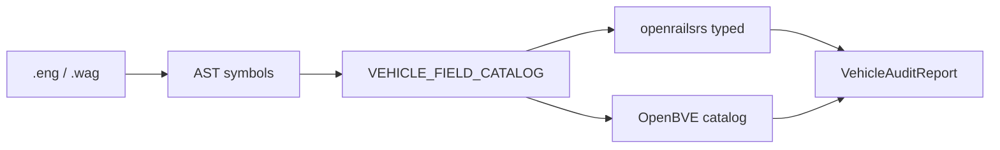

# Validación cruzada de parsers MSTS (Open Rails ↔ OpenBVE ↔ openrailsrs)

Documento de referencia para auditar **qué tokens** de `.eng` / `.wag` parsea cada stack y dónde hay huecos accionables.

Relacionado:

- OpenBVE: [`OPENBVE_REFERENCE.md`](OPENBVE_REFERENCE.md)
- Paridad física OR: [`OR_PARITY_ROADMAP.md`](OR_PARITY_ROADMAP.md)
- Cabina CVF: [`CABVIEW3D_ROADMAP.md`](CABVIEW3D_ROADMAP.md)

---

## 1. Tres fuentes, tres roles

| Fuente | Rol en la auditoría | Autoritativo para |
|--------|---------------------|-------------------|
| **openrailsrs** | Parser tipado Rust (`EngineFile`, `WagonFile`) | Sim headless, paridad OR |
| **OpenBVE** | Catálogo estático desde `VehicleParser.cs` | Campos MSTS “clásicos”, cabina, SMS, frenos neumáticos |
| **Open Rails** | Validación runtime (`compare-or`, baselines Chiltern) | Comportamiento físico final |

**No** comparamos binarios en runtime: el puente es **por cobertura de tokens** en el AST + parse tipado exitoso.



---

## 2. Herramienta CLI

```bash
# Texto legible
openrailsrs audit-vehicle examples/chiltern/trains/RF_Blue_Pullman/RF_WP_DMBSA.eng

# JSON (CI / scripts)
openrailsrs audit-vehicle path/to/loco.eng --json
```

**Código:** `openrailsrs-formats/src/vehicle_field_catalog.rs`, `vehicle_audit.rs`.

### Secciones del informe

| Sección | Significado |
|---------|-------------|
| **Gaps (OpenBVE parses, openrailsrs does not)** | Tokens presentes en el archivo que OpenBVE mapea a sim/cab/audio y nosotros aún no — candidatos de implementación |
| **OR / openrailsrs-first** | Tokens ORTS presentes que OpenBVE no modela — seguir referencia Open Rails |
| **Unknown symbols** | Tokens en el archivo sin fila en el catálogo — revisar manualmente o ampliar catálogo |
| **catalog coverage %** | Porcentaje del catálogo marcado `parsed`/`partial` por parser |

---

## 3. Catálogo de campos

El catálogo (`VEHICLE_FIELD_CATALOG`) lista ~70 tokens frecuentes con:

- `openrailsrs`: `Parsed` | `Partial` | `Ignored` | `NotImplemented` | `NotApplicable`
- `openbve`: idem
- `category`: physics, brake, cab, audio, visual, …
- `notes`: referencia cruzada breve

### Ejemplos de gaps típicos (locomotoras diesel MSTS)

| Token | openrailsrs | OpenBVE | Acción sugerida |
|-------|-------------|---------|-----------------|
| `BrakeSystemType` | no | parsed | OR-P6 frenos MSTS; ver OR + OpenBVE `CarBrake` |
| `CabView` | ignored | parsed | Ya tenemos parser `.cvf`; falta enlace desde `.eng` |
| `Sound` | ignored | parsed | Roadmap SMS en `openrailsrs-audio` |
| `WheelRadius` / `NumWheels` | no | parsed | Adhesión/eje; baja prioridad si OR no lo exige |
| `ORTSMaxTractiveForceCurves` | parsed | n/a | Mantener paridad OR; no portar desde OpenBVE |

---

## 4. Workflow recomendado

1. **Auditar** el `.eng` del consist de calibración (Chiltern DMBSA, SCE Class 47).
2. Priorizar **gaps OpenBVE** que afecten gameplay (frenos, cabina, sonido).
3. Para campos **OR-first** (`ORTS*`), leer Open Rails y ampliar `EngineFile` — no OpenBVE.
4. Tras implementar un token, actualizar su fila en `vehicle_field_catalog.rs` y re-ejecutar audit.
5. Opcional: gate CI con `--json` y umbral de gaps (p. ej. fallar si crece la lista).

### Tests en repo

```bash
cargo test -p openrailsrs-formats vehicle_audit
```

- Fixture mínimo: `tests/fixtures/typed_minimal.eng`
- Regresión Chiltern (si existe): `../../examples/chiltern/trains/RF_Blue_Pullman/RF_WP_DMBSA.eng`

---

## 5. Ampliar el catálogo

Al encontrar tokens nuevos en contenido real:

1. Confirmar en OpenBVE `VehicleParser.cs` si hay `case KujuTokenID.*`.
2. Confirmar en `engine.rs` / `wagon.rs` si openrailsrs ya lee el token.
3. Añadir fila en `VEHICLE_FIELD_CATALOG` con estados correctos.
4. Documentar referencia OR en `notes` si aplica.

---

## 6. Limitaciones

- El catálogo **no** lista todos los ~400 tokens Kuju — solo los relevantes para vehículos.
- `Partial` es juicio manual (p. ej. `Size` solo usa longitud).
- OpenBVE no parsea bloques ORTS → muchos campos Chiltern aparecen como **openrailsrs-first**, no como gaps OpenBVE.
- La auditoría **no** sustituye `compare-or` para validar física.
