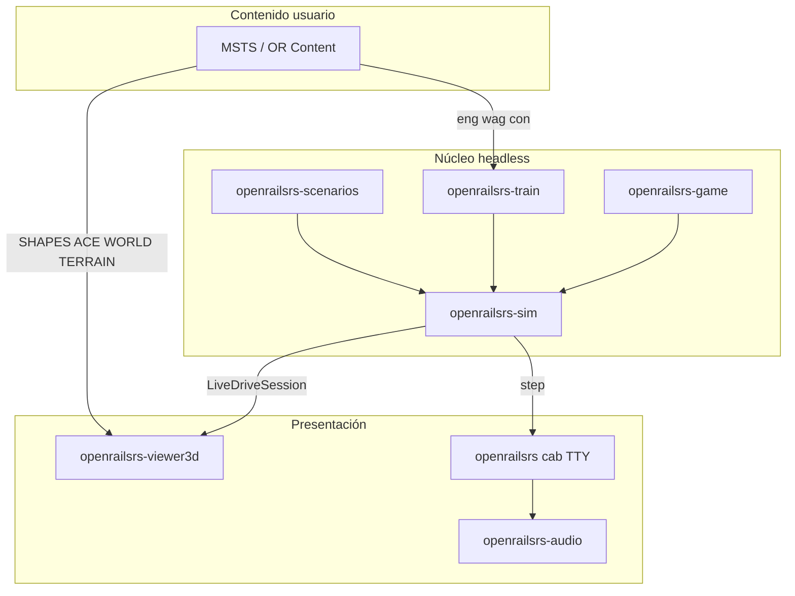

# Roadmap: simulación 3D jugable (trenes, cabina, mundo)

Documento de referencia para pasar de **viewer 3D + replay CSV** a un **simulador visual jugable** alineado con Open Rails, sin romper el núcleo headless.

Relacionado:

- Arquitectura OR vs Bevy: [`OPEN_RAILS_VIEWER_3D.md`](OPEN_RAILS_VIEWER_3D.md)
- Instalación contenido MSTS/OR: [`CHILTERN_OR_SETUP.md`](CHILTERN_OR_SETUP.md)
- Issue GitHub: [#8](https://github.com/cavazquez/openrailsrs/issues/8)
- Fase 23 en [`ROADMAP.md`](../ROADMAP.md) (lista histórica; este doc es la fuente de verdad para fases **jugables**)

---

## 1. Principios de diseño

| Principio | Implicación |
|-----------|-------------|
| **Sim autoritativo** | Toda la física vive en `openrailsrs-sim`. Bevy solo presenta y captura input. |
| **Headless primero** | `openrailsrs-cli sim`, tests y CI no dependen de Bevy/X11. |
| **Crates separados** | `openrailsrs-viewer3d` (o futuro `play3d`) depende de `sim`, no al revés. |
| **Contenido MSTS externo** | El repo no redistribuye rutas completas ni meshes Pullman; el usuario apunta a su carpeta OR/MSTS. |
| **Paridad incremental** | Cada fase tiene criterio de “hecho” medible (visual + tests donde aplique). |



---

## 2. Estado actual del código (inventario)

### 2.1 Viewer 3D (`openrailsrs-viewer3d`)

| Módulo | Archivo | Qué hace |
|--------|---------|----------|
| Entrada | `src/main.rs` | `route_dir`, `scenario.toml` (replay CSV), o **`--live scenario.toml`** |
| Mundo | `world.rs`, `terrain.rs`, `forest.rs`, `water.rs`, `sky.rs`, `precipitation.rs` | Tiles `.w`, `.y`/RAW, bosque, agua, cielo, lluvia |
| Vía | `track.rs`, `dyntrack.rs`, `signals.rs` | Grafo `track.toml`, dyntrack básico, marcadores de señal |
| Trenes | `train.rs`, `rolling_stock.rs`, **`live.rs`** | Replay CSV o sim en vivo; meshes `.s` por vehículo |
| Assets | `shapes.rs` | `.s` ASCII → mesh; `.ace` mip 0 → textura Bevy |
| UI | `hud.rs`, `camera.rs`, `teleport.rs` | HUD, orbit/fly/follow, teletransporte |

**Modos de lanzamiento:**

```bash
# Solo topología / mundo (sin tren)
cargo run -p openrailsrs-viewer3d -- examples/smoke/routes/test

# Replay de sim headless previa
cargo run -p openrailsrs-cli -- sim examples/smoke/scenario.toml
cargo run -p openrailsrs-viewer3d -- examples/smoke/scenario.toml

# Sim en tiempo real (Fase A ✅)
cargo run -p openrailsrs-viewer3d -- --live examples/smoke/scenario.toml
```

### 2.2 Sim en vivo (`openrailsrs-sim`)

| API | Archivo | Rol |
|-----|---------|-----|
| `LiveDriveSession` | `live_drive.rs` | Misma inicialización que `run_scenario_headless` (consist, freno, `start_offset`, diesel RPM); `step_realtime(dt)` |
| `step` | `physics.rs` | Integración longitudinal; diesel ORTS, freno aire, vapor |
| `LiveMultiSim` | `multi_runner.rs` | Multi-tren frame-a-frame (usado por `dispatch`, no por viewer3d) |

### 2.3 Cabina hoy (`openrailsrs cab`)

- **Solo terminal** (`crates/openrailsrs-cli/src/cab.rs`): ratatui, W/S/Space, física idéntica a `sim`.
- **Audio** vía `openrailsrs-audio` + `RegionTracker` (`sound_regions.rs`).
- **Sin ventana 3D** ni cabview MSTS.

### 2.4 Parsers de assets (headless)

| Formato | Crate | Viewer 3D | Limitación |
|---------|-------|-----------|------------|
| `.s` shape ASCII | `openrailsrs-formats` | ✅ mesh | `.s` binario tokenized → error |
| `.ace` textura | `openrailsrs-ace` | ✅ mip 0 | Sin mips altos; BGRA MSTS parcial |
| `.w` world | `openrailsrs-formats` | ✅ cubos/meshes | |
| `.y` + RAW terreno | `openrailsrs-formats` | ✅ heightfield + TERRTEX | |
| `cabview` / `cabview3d` | — | ❌ | No hay parser ni render |
| `.sms` / `.wav` (TDB) | parseo en `track_db.rs` | ❌ playback | Solo metadata → `[[sound_regions]]` |

### 2.5 Qué está en git vs qué debe instalar el usuario

| En el repositorio | Fuera del repo (usuario) |
|-------------------|---------------------------|
| `examples/smoke/routes/test/` — demo 3D completa (SHAPES, TERRTEX, TERRAIN, WORLD) | Carpeta de ruta MSTS/OR completa (Chiltern, SCE, etc.) |
| `examples/chiltern/track.toml` + stubs `.eng`/`.wag` (solo física, **sin** `WagonShape`) | `ROUTES/Chiltern/WORLD`, `SHAPES`, sonidos, cabview3d del trainset |
| Baselines CSV OR en `examples/baselines/` | Capturas nuevas con Wine + OR 1.6.x |
| Fixtures MSTS en `crates/*/tests/fixtures/` | |

Scripts relevantes:

- `scripts/sync_chiltern_assets.sh` → copia **física** Pullman desde OR Content a `examples/chiltern/trains/` (no meshes ni cabina).
- `openrailsrs import-msts` → `track.toml` + `scenario.toml` desde `.tdb`/`.act`.

---

## 3. Imágenes y texturas: de dónde salen

### 3.1 Jerarquía MSTS / Open Rails

Open Rails usa la misma disposición de carpetas que MSTS. El viewer resuelve paths relativos al **directorio de ruta** pasado a `openrailsrs-viewer3d` (o al `route.path` del escenario).

```
ROUTES/MiRuta/
├── MiRuta.tdb          # topología (import → track.toml en openrailsrs)
├── TERRAIN/            # *.y, *_y.raw, *_f.raw
├── TERRTEX/            # grass.ace, microtex.ace, …
├── WORLD/              # *.w (objetos estáticos, bosque, agua, dyntrack)
├── SHAPES/             # *.s (geometría 3D)
└── TEXTURES/           # *.ace (texturas referenciadas por shapes y world)

TRAINS/TRAINSET/MiTren/
├── MiLoco.eng
├── MiVagon.wag
├── SHAPES/             # a veces duplicado por trainset
├── TEXTURES/
└── CABVIEW3D/          # cabina 3D OR (no soportada aún)
    └── *.ace, *.cvf
```

### 3.2 Cómo el viewer carga cada capa

| Capa visual | Origen en disco | Código |
|-------------|-----------------|--------|
| Terreno | `TERRAIN/*.y` + `*_Y.RAW` + parches en `.y` | `terrain.rs`, shader `assets/shaders/terrain.wgsl` |
| Texturas suelo | `TERRTEX/*.ace` | `terrain_material.rs` |
| Objetos fijos | `WORLD/*.w` → `Static` con `FileName` → `SHAPES/foo.s` | `world.rs` + `shapes.rs` |
| Bosque / agua | `Forest`, `HWater` en `.w` | `forest.rs`, `water.rs` |
| Vía decorativa | `Dyntrack` en `.w` | `dyntrack.rs` (sin perfiles TSection del `.tdb`) |
| Material rodante | `WagonShape` / `Shape (...)` en `.eng`/`.wag` del consist | `rolling_stock.rs` busca en `route_dir` y `scenario_dir/SHAPES` |
| Fallback | Sin shape o shape binario | Cubo coloreado |

**Convención de búsqueda** (`shapes.rs`): `route_dir/SHAPES`, `route_dir/shapes`, y carpetas del escenario.

### 3.3 Demo commiteada vs Chiltern real

| Escenario | Meshes 3D en viewer | Motivo |
|-----------|---------------------|--------|
| `examples/smoke` | ✅ `test.s`, `yard_shed.s`, terreno texturizado | Assets mínimos **en git** |
| `examples/chiltern` (solo repo) | ❌ cubos | Stubs de `sync_chiltern_assets.py` sin `WagonShape` |
| Chiltern + Content OR | ✅ si apuntás el viewer a la carpeta de ruta MSTS | Ej.: `ROUTES/Chiltern` con WORLD/SHAPES reales |

Para ver el Pullman en 3D hace falta **una de**:

1. Apuntar `openrailsrs-viewer3d` al directorio de ruta MSTS/OR que tenga `WORLD/` y `SHAPES/` del trainset Blue Pullman, **o**
2. Extender `sync_chiltern_assets.py` (fase D) para copiar también shapes/texturas (licencia/redistribución a criterio del usuario).

### 3.4 Formatos imagen soportados hoy

| Formato | Uso | Herramienta |
|---------|-----|-------------|
| `.ace` | Texturas MSTS/OR (DXT/RGBA) | `openrailsrs ace-decode in.ace out.png` |
| PNG | Salida de debug; no entrada directa en viewer | `ace-decode` |
| GLTF/OBJ | Mencionado en ROADMAP futuro | **No implementado** |

---

## 4. Sonidos: de dónde salen (y qué falta)

### 4.1 Open Rails / MSTS (referencia)

En OR, el sonido real proviene de:

- **Locomotora/vagón:** entradas en `.eng`/`.wag` (streams, `.wav` bajo el trainset).
- **Ruta:** `SoundSourceItem` en `.tdb` referenciando `.sms` o `.wav`.
- **Actividad:** bloque `SoundRegions` en `.act` (override de tipo/volumen).
- **Cabina:** eventos ligados a controles en scripts/C# y cabview (no portados).

Estructura típica en Content:

```
ROUTES/Chiltern/SOUND/          # o similar según ruta
TRAINS/TRAINSET/RF_Blue_Pullman/*.wav
```

### 4.2 Qué hace openrailsrs hoy

| Capa | Implementación | Archivos |
|------|----------------|----------|
| Motor cab | **`openrailsrs-audio`** — sinusoides vía `rodio` | `crates/openrailsrs-audio/src/lib.rs` |
| Motor | Frecuencia ~60 Hz; volumen ∝ velocidad | `SetVelocity` |
| Freno | ~800 Hz × intensidad freno | `SetBraking` |
| Bocina | 440 Hz, 500 ms | `Horn` |
| Ambiente | Loop por `[[sound_regions]]`; `kind` → Hz (tunnel 90, urban 320, …) | `EnterRegion` / `LeaveRegion` |
| Import regiones | TDB `SoundSourceItem` + overrides `.act` | `import_activity.rs` → `build_sound_regions` |
| Playback `.sms`/`.wav` | **No** | Parseado en TDB; nombre `.sms` no se usa al reproducir |

**Integración actual:** solo `openrailsrs cab` (TTY). **`--live` en viewer3d no reproduce audio** (Fase B).

### 4.3 De dónde sacar sonido “real” en el futuro

| Fuente | Fase sugerida | Notas |
|--------|---------------|-------|
| Seguir con sintético mejorado | B (rápido) | Pitch/RPM, ruido banda, sin licencias |
| WAV del trainset MSTS | C+/D | Resolver paths desde `.eng`; `rodio`/`kira` decode |
| `.sms` de MSTS | D+ | Formato propietario; estudiar OR `SoundManagement.cs` o convertir con herramientas comunitarias |
| Pack libre (CC0) | Opcional | Bocina/motor genéricos si no hay Content |

---

## 5. Fases del roadmap jugable

Leyenda: ✅ hecho · 🔶 parcial · 🔲 planificado

### Resumen ejecutivo

| Fase | Nombre | Estado | Entregable visible |
|------|--------|--------|-------------------|
| **0** | Viewer mundo + replay | ✅ | Mundo MSTS + tren desde CSV |
| **A** | Live link sim ↔ Bevy | ✅ | `--live`, conducir en 3D |
| **B** | Conducción pulida + audio + juego | 🔲 | Sonido, señales, paradas en HUD |
| **C** | Cabina (interior / panel) | 🔲 | Gauges o cabview MSTS |
| **D** | Assets MSTS hardening | 🔲 | `.s` binario, LOD, sync shapes |
| **E** | Vía visual avanzada | 🔲 | Peralte, TSection, splines |
| **F** | Modo juego completo | 🔲 | Campaña, scoring visual, multi-tren live |
| **G** | Editor de ruta 3D | 🔲 | ROADMAP Fase 15 |

---

### Fase 0 — Viewer 3D + replay (issue #8, órdenes 1–11) ✅

**Objetivo:** Demostrar que el pipeline MSTS → Bevy funciona sin acoplar el sim.

**Hecho en:** `openrailsrs-viewer3d` (ver checklist en [`OPEN_RAILS_VIEWER_3D.md`](OPEN_RAILS_VIEWER_3D.md)).

**Assets necesarios:** carpeta de ruta con `TERRAIN/`, `WORLD/`, `SHAPES/`, `TEXTURES/` (demo: `examples/smoke/routes/test`).

**No incluye:** sim en vivo, cabina, sonido real, shapes binarios.

---

### Fase A — Enlace sim en vivo ✅

**Objetivo:** Misma física que `cab`/`sim`, con el tren moviéndose en la ventana 3D.

**Código:**

- `openrailsrs-sim/src/live_drive.rs` — `LiveDriveSession`
- `openrailsrs-viewer3d/src/live.rs` — input W/S/Space, spawn/update consist
- `main.rs` — flag `--live`

**Criterios de hecho:**

- [x] `step_realtime` avanza `TrainSimState` sin escribir CSV
- [x] Posición en grafo (`edge_id`, `pos_on_edge_m`) → transform Bevy
- [x] HUD: velocidad, throttle, freno, límite, tiempo
- [x] Follow camera (`T`) con tren live
- [x] Test unitario `live_session_advances_time_on_smoke_scenario`

**Limitaciones conocidas:**

- Controles de driver solo en cámara **orbit** (en fly, WASD mueven la cámara).
- Sin señales runtime, sin `openrailsrs-game`, sin audio.
- Un tren (`[train]` del escenario).
- Chiltern con stubs del repo → cubos; smoke o Content OR → meshes.

---

### Fase B — Conducción pulida, audio y reglas de juego 🔲

**Objetivo:** Experiencia “actividad jugable” en exterior 3D, no solo sandbox físico.

| Entrega | Descripción | Código previsto |
|---------|-------------|-----------------|
| **B1 Audio en viewer** | Conectar `AudioEngine` al loop `--live` (velocidad, freno, bocina H) | `live.rs` + `openrailsrs-audio` |
| **B2 Regiones de sonido** | `[[sound_regions]]` en escenarios importados; `RegionTracker` en Bevy | Reutilizar `sound_regions.rs` |
| **B3 Señales en runtime** | Aspectos desde sim (o grafo + `clear_after_s`) reflejados en marcadores 3D | `runner.rs` hooks → resource Bevy |
| **B4 HUD de juego** | Paradas, retraso, objetivo; integrar `openrailsrs-game` | `game` crate + `hud.rs` |
| **B5 Input** | Mantener W/S en orbit; opcional: gamepad / sensibilidad | `live.rs` |
| **B6 Calibración** | Validar en `examples/smoke` y documentar Chiltern con ruta OR externa | tests + README |

**Assets de sonido (fase B):** por defecto **sintético** (sin archivos). Opcional: documentar carpeta `SOUND/` de la ruta si en el futuro se cargan WAV.

**Depende de:** Fase A ✅.

**Estimación:** 2–4 semanas (1 dev).

---

### Fase C — Cabina 🔲

**Objetivo:** Vista de conductor (inmersión), no solo cámara exterior.

Open Rails usa `cabview3d/` (meshes + texturas `.ace`) y a veces `cabview` 2D. **openrailsrs no parsea ni renderiza cabview.**

| Enfoque | Descripción | Esfuerzo | Recomendación |
|---------|-------------|----------|----------------|
| **C1 Cabview MSTS** | Parser CVF + sprites/meshes cabina | Muy alto | Largo plazo; seguir OR `cabview3d` |
| **C2 Cabina genérica** | Cab 3D procedural o mesh único reutilizable | Medio | Solo si no hay content |
| **C3 Híbrido (preferido primero)** | Vista 3D exterior + **panel egui/Bevy UI** con palancas, velocímetro, manómetros fed por `LiveDriveSession` | Medio-bajo | **Primera entrega C** |

**Datos ya disponibles en sim para el panel (C3):**

- `velocity_mps`, `throttle`, `brake`
- `diesel_rpm_*`, `diesel_apparent_*` (si se exportan al HUD)
- `boiler_pressure_bar` (vapor)
- Freno aire: telemetría en CSV (`brake_*`); exponer en live

**Assets imagen cabina (C1):** del trainset en OR Content, p. ej.  
`Content/Chiltern/TRAINS/TRAINSET/RF_Blue_Pullman/CABVIEW3D/`

**Depende de:** Fase A; recomendable B1 (audio) para bocina en cabina.

**Estimación:** C3 ~3–6 semanas; C1 ~2–4 meses adicionales.

---

### Fase D — Assets MSTS (geometría y sync) 🔲

**Objetivo:** Que rutas y trenes reales se vean bien sin cubos fallback.

| Entrega | Descripción |
|---------|-------------|
| **D1 Shapes binarios** | Parser `.s` tokenized (`UnsupportedBinaryShape` hoy) |
| **D2 LOD / distancia** | Cambio de LOD por distancia; unload tiles lejanos (`AssetServer`) |
| **D3 Animación shape** | Jerarquía animada en `.s` (puertas, bogies) — como OR `SharedShape` |
| **D4 Sync ampliado** | `sync_chiltern_assets.py`: opción `--with-shapes` copiar `WagonShape` + SHAPES/TEXTURES |
| **D5 ACE completo** | Mips, BGRA flag MSTS, menos fallbacks magenta |
| **D6 GLTF pipeline** (opcional) | Export/import para content propio sin MSTS |

**De dónde salen las imágenes:** instalación MSTS/OR del usuario; el repo solo documenta paths y parsers.

**Depende de:** Fase 0 ✅; mejora independiente de B/C.

**Estimación:** continuo; D1+D4 ~1–2 meses.

---

### Fase E — Vía visual avanzada 🔲

**Objetivo:** Alinear mesh de vía con gradiente/peralte del sim y decoración OR.

| Entrega | Descripción |
|---------|-------------|
| **E1 Splines 3D** | `track.toml` + elevación → mesh continuo (no solo cilindros de grafo) |
| **E2 Peralte / cant** | Usar `grade_percent` y datos TDB si se importan |
| **E3 TSection / `.tdb`** | Perfiles de riel como OR `DynamicTrackPrimitive` |
| **E4 Acoplamiento sim–visual** | Multi-body: posición por vehículo en 3D (no solo cabeza del tren) |

**Datos:** `track.toml` (en repo); TDB completo vía `import-msts` (parcial hoy).

**Depende de:** D (opcional); A para validar velocidad en pendiente.

---

### Fase F — Modo juego completo 🔲

**Objetivo:** Sesión jugable con objetivos, varios trenes, menú.

| Entrega | Descripción |
|---------|-------------|
| **F1** | `openrailsrs play3d` o menú en viewer: elegir escenario, overlay |
| **F2** | `LiveMultiSim` → varios consists en 3D |
| **F3** | Campaña / timetable visual (`examples/mitre_campaign`) |
| **F4** | Pausa, reinicio, resumen `outcome.toml` en pantalla |
| **F5** | Asumir señales / dificultad desde escenario |

**Depende de:** A, B (mínimo B4), D parcial para presentación.

---

### Fase G — Editor de ruta 3D (ROADMAP Fase 15) 🔲

**Objetivo:** Editar `track.toml` en el viewer (nodos, aristas, señales).

Independiente del sim jugable; puede reutilizar `track.rs` y gizmos Bevy.

---

## 6. Matriz: fase × fuente de assets

| Fase | Geometría 3D | Texturas | Sonido | Cabina visual |
|------|--------------|----------|--------|----------------|
| 0 | MSTS `SHAPES`+`.w` o smoke git | `.ace` TERRTEX/TEXTURES | — | — |
| A | Igual que 0 | Igual | — | — |
| B | Igual | Igual | Sintético (+ regiones TOML) | — |
| C | Igual | Panel UI; C1: `CABVIEW3D` | Bocina/motor | C3: HUD; C1: cabview OR |
| D | Binario `.s`, sync trainset | ACE mips | — | — |
| E | + splines vía | — | — | — |
| F | — | — | — | — |

---

## 7. Guía rápida: qué instalar para cada escenario

### Smoke (todo en repo, sin OR)

```bash
cargo run -p openrailsrs-viewer3d -- --live examples/smoke/scenario.toml
```

Meshes: `examples/smoke/routes/test/SHAPES/test.s`.

### Chiltern (física en repo, visual desde OR Content)

```bash
# Física diesel (ya en repo)
./scripts/sync_chiltern_assets.sh

# Sim / validación
cargo run -p openrailsrs-cli -- sim examples/chiltern/scenario.toml

# 3D con mundo real: apuntar al directorio de RUTA MSTS/OR
CHILTERN_ROUTE="$HOME/Documentos/Open Rails/Content/Chiltern/ROUTES/Chiltern"
cargo run -p openrailsrs-viewer3d -- --live examples/chiltern/scenario.toml
# Nota: hoy el viewer carga route.path relativo al escenario (./ = examples/chiltern).
# Para WORLD/SHAPES de la ruta real hace falta symlink o copiar TERRAIN/WORLD/SHAPES
# bajo examples/chiltern/ — ver README chiltern (próxima mejora: --route-root).
```

**Sonido:** `openrailsrs cab examples/chiltern/scenario.toml` (sintético). Viewer `--live`: sin audio hasta Fase B.

### SCE / otras rutas importadas

Mismo patrón: `import-msts` → `track.toml` en `examples/sce/`; assets 3D desde `Content/Demo Model 1/ROUTES/SCE/`.

---

## 8. Deuda técnica y mejoras transversales

| Tema | Estado | Fase |
|------|--------|------|
| `--route-root` para mezclar `scenario.toml` del repo + `WORLD/` de OR externo | 🔲 | B o D |
| README Fase 23 marcada 🔲 pero órdenes 1–11 ✅ | Doc | Actualizar `README.md` |
| Señales enforced en `LiveDriveSession` | 🔲 | B |
| Freno residual Chiltern al arrancar en live | 🔲 | Afinar init como `ScriptedDriver` |
| CI: tests viewer sin GPU | 🔶 | `app_smoke` unit-style |
| Windows/macOS Bevy | 🔲 | features winit |

---

## 9. Referencias de código Open Rails (lectura)

Clon shallow de OR (`RunActivity/Viewer3D/`):

| Tema | Archivo OR |
|------|------------|
| Terreno | `Terrain.cs` |
| Shapes / LOD | `Shapes.cs` |
| Escenary `.w` | `Scenery.cs` |
| Trenes | `Trains.cs`, `MSTSWagonViewer.cs` |
| Cabina | `CabView.cs`, grupo `RenderPrimitiveGroup::Cab` |
| Sonido | `SoundManagement.cs` (no portado) |

---

## 10. Historial de este documento

| Fecha | Cambio |
|-------|--------|
| 2026-05 | Creación: fases A–G, inventario código, fuentes imagen/sonido, post Fase A (`--live`) |

Cuando se complete una fase, actualizar la columna **Estado** en §5 y marcar criterios en la subsección correspondiente.
