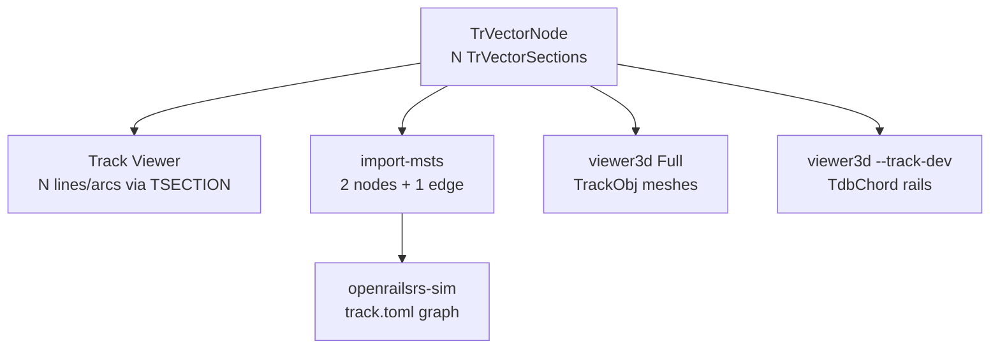

# Estudio: Open Rails Track Viewer vs vía `.tdb` en openrailsrs

Informe de aprendizaje (2026-06-21): cómo **Track Viewer** (OR Contrib) modela la vía MSTS y qué implica para `import-msts`, `--track-dev` y `track_audit` en openrailsrs.

**Alcance:** `.tdb` + `TSECTION.DAT`, geometría vectorial, junctions/items. Fuera de alcance: editor `.pat`, carreteras `.rdb`, terreno 2D aplanado, ejecutar Track Viewer en Linux.

**Relacionado:** [`OPEN_RAILS_VIEWER_3D.md`](OPEN_RAILS_VIEWER_3D.md), [`VIEWER3D_TESTING.md`](VIEWER3D_TESTING.md), [`SIMULACION_3D_ROADMAP.md`](SIMULACION_3D_ROADMAP.md) fase E (vía 3D).

---

## 1. Resumen ejecutivo

**Track Viewer** es un visor **2D cenital** (XNA + WPF) para inspeccionar rutas MSTS: dibuja cada `TrVectorSection` como recta o arco usando `TSECTION.DAT`, coloca items ferroviarios (señales, plataformas, …) sobre esa geometría y permite editar paths `.pat`. **No** renderiza escenario 3D ni trenes.

**openrailsrs** separa tres capas:

| Capa | Fuente | Uso |
|------|--------|-----|
| Simulación | `track.toml` (grafo lógico) | Física, BFS, señales lógicas |
| Import | `import-msts` (`.tdb` → TOML) | Generar grafo desde MSTS |
| Visual 3D | `.tdb` chords, `TrackObj`, shapes | `--track-dev`, Full mode |

### Cinco lecciones para openrailsrs

1. **Track Viewer es la referencia de geometría 2D fiel** — recorre *todas* las secciones con longitud/ancho/curva de `TSECTION.DAT`; nuestros `TdbChord` conectan *anclas* entre secciones, no replical `FindLocationInSection` tramo a tramo.
2. **`import-msts` colapsa cada `TrVectorNode` en una sola arista** — curvas intermedias y peralte desaparecen del grafo lógico; la sim no “sabe” de arcos MSTS.
3. **`shape_idx == 0` se ignora en `--track-dev`** — Track Viewer sí dibuja sección 0 vía `tsection.dat`; el fixture `minimal.tdb` queda sin chords (ver §4.3).
4. **El signo del tile X importa** — anchor Chiltern es `tile_x = -6080`; usar `6080` positivo deja 0 chords en 1500 m (bug corregido en test de audit).
5. **`track_audit` cuantifica el gap** — con MSTS Chiltern + grafo importado, verdict **Good** cerca de Birmingham (4117 chords, ~98 % match); ver [`fixtures/chiltern-track-audit.json`](fixtures/chiltern-track-audit.json).

---

## 2. Mapa de código Open Rails (lectura)

Orden sugerido de lectura en [`openrails/Source/Contrib/TrackViewer/`](../../openrails/Source/Contrib/TrackViewer/):

| Archivo | Contenido clave |
|---------|-----------------|
| [`TrackViewer.cs`](../../openrails/Source/Contrib/TrackViewer/TrackViewer.cs) | `SetRoute()` → `RouteData`, orden de `Draw()` |
| [`Drawing/DrawTrackDB.cs`](../../openrails/Source/Contrib/TrackViewer/Drawing/DrawTrackDB.cs) | `RouteData`, `DrawTracks`, `FindLocationInSection`, items |
| [`Drawing/DrawArea.cs`](../../openrails/Source/Contrib/TrackViewer/Drawing/DrawArea.cs) | `WorldLocation` → píxeles; `DrawLine` / `DrawArc` |
| [`Drawing/DrawWorldTiles.cs`](../../openrails/Source/Contrib/TrackViewer/Drawing/DrawWorldTiles.cs) | Contornos 2048 m de tiles `WORLD/` (sin parsear `.w`) |

### Pipeline de dibujo (Track Viewer)

```
DrawTerrain → DrawWorldTiles → DrawTrackDB.DrawTracks → junctions → paths → items
```

Culling por **índices por tile** (`availableRailVectorNodeIndexes`) antes de iterar nodos.

---

## 3. Modelo de datos MSTS

### 3.1 Carga de archivos

**Track Viewer `RouteData`** (constructor en `DrawTrackDB.cs`):

1. `*.trk` → nombre base del `.tdb`
2. `*.tdb` → `TrackDB`
3. `TSECTION.DAT` — prioridad: `OpenRails/` → `GLOBAL/` ruta → `GLOBAL/` install; merge opcional `route/TSECTION.DAT`
4. Opcional: `.rdb`, `sigcfg.dat`, eventos `.act` en `TrItemTable`

**openrailsrs** — [`TrackDbFile`](../crates/openrailsrs-formats/src/typed/track_db.rs), [`TSectionCatalog`](../crates/openrailsrs-formats/src/typed/tsection.rs) vía `RouteAssets::new(route_dir)`.

### 3.2 Tabla de correspondencia

| Campo / concepto MSTS | Significado (OR Track Viewer) | Campo Rust | ¿Import? | ¿tdb_chords? |
|----------------------|-------------------------------|------------|----------|--------------|
| `TrackNode` + `TrEndNode` | Fin de vía (punto UiD) | `TrackNodeKind::End` | → nodo TOML | — |
| `TrJunctionNode` + `TrPins` | Desvío | `TrackNodeKind::Junction` | → switch TOML | Puentes junction |
| `TrVectorNode` | Cadena de secciones | `TrackNodeKind::Vector` | → **1 edge** | Branch walk |
| `TrVectorSection` | Ancla + `SectionIndex` | `TrVectorSectionRecord` | Endpoints only | Anclas + span |
| `TileX/Z, X, Y, Z` | Posición tile-local | `TrackVectorPoint` | `x_m`/`y_m` nodos | `section_world_vec3` |
| `AY` (heading) | Rumbo sección | `TrVectorSectionRecord.ay` | Parcial | `heading_deg()` → chord |
| `SectionIndex` → `TrackSection` | Longitud, ancho, curva | `TSectionCatalog` | Longitud edge | `section_shape_length_m` |
| `SectionCurve` | Arco (radius, angle) | `curve_radius_m`, `curve_angle_deg` | **No** | **No** (rectas) |
| `TrItem` / señales | Sobre vector + distancia | `TrItem` → `[[signals]]` | edge_id + `position_m` | audit TrackObj |
| Tile 2048 m | Universo MSTS | Igual en `world.rs` | — | Culling audit radius |

### 3.3 Índices por tile (OR)

Track Viewer pre-indexa nodos vectoriales e items por `(tileX, tileZ)` para no recorrer 18k nodos cada frame. openrailsrs usa **`RouteFocus.horizontal_distance`** + radio (`OPENRAILSRS_VISIBLE_RADIUS_M`, `TRACK_DEV_TDB_RADIUS_M`) en `--track-dev`.

---

## 4. Geometría vectorial

### 4.1 Track Viewer — `FindLocationInSection`

Pseudocódigo (desde `DrawTrackDB.cs` ~1325):

```
loc = TvsLocation(tvs)   // tile + local X,Y,Z
cosA = cos(tvs.AY); sinA = sin(tvs.AY)

if section is straight:
    loc.X += sinA * distanceAlongSection
    loc.Z += cosA * distanceAlongSection
else curved:
    sign = (curve.Angle > 0) ? -1 : +1
    angleRad = -distance / radius
    // rota heading y desplaza desde centro de curva
    loc.X -= sign * radius * (cosA - cos(AY + sign*angleRad))
    loc.Z += sign * radius * (sinA - sin(AY + sign*angleRad))
```

`DrawTrackSection` elige `DrawLine(width, …, length, AY)` o `DrawArc(width, …, radius, AY, angle)`.

### 4.2 openrailsrs — `TdbChord`

En [`tdb_track.rs`](../crates/openrailsrs-viewer3d/src/tdb_track.rs) + [`bevy-scenery/spawn/tdb_track.rs`](../crates/openrailsrs-bevy-scenery/src/spawn/tdb_track.rs):

1. Filtra secciones con `shape_idx != 0`.
2. Ordena secciones según pin de entrada (`entry_pin`).
3. Encadena **anclas** (`section_world_vec3`) entre secciones consecutivas.
4. Extiende la última sección con `single_section_end_world`: preferencia `TrackVectorGeometry.end`, else `heading_deg()` + longitud de `tsection` o `node_length_m`.
5. Emite un chord por par de anclas consecutivas (segmento **recto** en XZ).

`TSectionCatalog` **sí** parsea `SectionCurve` (`arc_end_local` en `tsection.rs`) pero **no** se usa al generar chords en viewer3d hoy.

### 4.3 Ejercicio: fixture `minimal.tdb`

Archivo: [`crates/openrailsrs-msts/tests/fixtures/minimal.tdb`](../crates/openrailsrs-msts/tests/fixtures/minimal.tdb)

```
TrVectorNode 2: 1× TrVectorSection, shape_idx=0, pins 1↔3, length 1000 m
```

| Herramienta | Resultado |
|-------------|-----------|
| Track Viewer | Dibuja 1 segmento (longitud desde `tsection` sección 0) |
| `import-msts` | `n1` — `e2` (1000 m) — `n3` |
| `collect_tdb_chords` | **0 chords** (`shape_idx == 0` filtrado) |
| `track_audit` sintético (shape_idx=1) | Verdict **good**, 100 % match — [`fixtures/smoke-track-audit-good.json`](fixtures/smoke-track-audit-good.json) |

**Discrepancia 1:** secciones con índice de shape 0 son válidas en MSTS/OR pero invisibles para `--track-dev`.

### 4.4 Discrepancias adicionales (≥3 documentadas)

| # | Track Viewer / MSTS | openrailsrs | Ejemplo |
|---|---------------------|-------------|---------|
| 1 | Dibuja sección 0 | Filtra `shape_idx != 0` | `minimal.tdb` |
| 2 | Arcos por `SectionCurve` | Chords rectos entre anclas | Curvas largas UK |
| 3 | N secciones → N tramos | N anclas → N−1 chords + span final | Nodo multi-sección |
| 4 | Posición continua a lo largo del vector | Gaps en junctions (audit inter-node) | Chiltern V16897↔V17790 **34.8 m** |
| 5 | Items en distancia exacta sobre vector | Señales en `edge_id` + `position_m` del grafo colapsado | Sim vs mapa OR |

---

## 5. Topología: pins, junctions, items

### 5.1 Track Viewer

- **`DrawJunctionAndEndNodes`:** discos en desvíos, línea orientada en fines de vía (`endnodeAngles`).
- **`DrawTrackItems`:** `DrawableTrackItem` por tile; posición vía `FindLocation(node, sectionIndex, distance)`.
- **Paths `.pat`:** `PathEditor` + `Trainpath` — snap a nodos TDB (fuera de alcance de este estudio; parser en [`path.rs`](../crates/openrailsrs-formats/src/typed/path.rs)).

### 5.2 openrailsrs import

[`import_route.rs`](../crates/openrailsrs-msts/src/import_route.rs):

- `TrVectorNode` → resuelve pins → **dos nodos + un edge** (`length_m`, `speed_limit` del vector).
- `TrItem` señales → `build_signals`: `edge_id` del vector que referencia el item, `position_m = item.distance_m`.
- `msts_aliases` conserva `tdb_id` ↔ id TOML para trazabilidad.

### 5.3 TrackObj vs chords (Chiltern)

Baseline MSTS (anchor Birmingham, radio 1500 m) — [`fixtures/chiltern-track-audit.json`](fixtures/chiltern-track-audit.json):

| Métrica | Valor |
|---------|-------|
| `verdict` | **good** |
| `tdb_chords` | 4117 |
| `graph_edge_match_pct` | ~98.0 % |
| `chord_endpoint_snap_pct` | ~89.0 % |
| `graph_midpoint_to_chord_m.p95` | 6.0 m |
| `static_trackobj_to_chord_m.p95` | 1.0 m |
| `inter_node_chain_gap_m.max` | 34.8 m |

Track Viewer colocaría un `TrackObj` sobre el vector a distancia MSTS; nosotros medimos distancia perpendicular al chord más cercano (y opcionalmente match por `SectionIdx`).

**Pitfall:** cargar `.tdb` desde `examples/chiltern/` (sin MSTS) con anchor MSTS da **0 chords** — el audit debe usar `--route-root` / `RouteAssets::new(msts_route)`.

---

## 6. Puente import-msts ↔ realidad MSTS



**Qué pierde `track.toml`:**

- Curvas internas (solo longitud escalar del vector).
- `grade_percent` (import pone 0).
- Ancho de vía / peralte.
- Topología fina de items no señal (plataformas, cruces) — no van al TOML.

**Qué conserva:** IDs vía `msts_aliases`, switches inferidos de junctions, señales con edge + distancia, speed posts vía items.

Ejemplo `minimal.tdb` importado:

```toml
[[edges]]
id = "e2"
from = "n1"
to = "n3"
length_m = 1000.0
```

---

## 7. Gap analysis (vía / TDB)

| Gap | Impacto sim | Impacto visual 3D | Nota futura |
|-----|-------------|-------------------|-------------|
| Vector → 1 edge | Alto en curvas | Medio (TrackObj cubre Full) | Splines en sim o grafo enriquecido |
| Sin arcos en chords | Bajo sim | Alto en `--track-dev` | Usar `SectionCurve` + `FindLocationInSection` port |
| `shape_idx == 0` skip | Bajo | Alto en rutas test | Tratar 0 como índice válido a tsection |
| Junction face gaps | Bajo | Medio (huecos en rails dev) | Mejorar `facing_junction_endpoints` |
| Señales sin pos MSTS | Medio | Bajo (marcadores lógicos) | Opcional: pos 3D desde TrItem |
| Sin mapa 2D estilo TV | — | — | Fase 15 editor / visor tdb 2D |
| Sin editor `.pat` | Medio workflow MSTS | — | Parser existe; UI no |

---

## 8. Comandos de reproducción

### Baseline audit (sin ventana)

```bash
cd openrailsrs
export OPENRAILSRS_MSTS_CONTENT="$HOME/Documentos/Open Rails/Content"

# Fixture sintético (Good)
OPENRAILSRS_TRACK_AUDIT="$PWD/docs/fixtures/smoke-track-audit-good.json" \
  cargo test -p openrailsrs-viewer3d --lib write_smoke_track_audit_fixture -- --nocapture

# Chiltern MSTS (Good, ~14 s)
OPENRAILSRS_TRACK_AUDIT="$PWD/docs/fixtures/chiltern-track-audit.json" \
  cargo test -p openrailsrs-viewer3d --lib export_chiltern_msts_track_audit -- --ignored --nocapture
```

### Import y parsers

```bash
cargo run -p openrailsrs-cli -- import-msts --out-dir /tmp/msts-import \
  crates/openrailsrs-msts/tests/fixtures

cargo test -p openrailsrs-formats track_db
cargo test -p openrailsrs-viewer3d track_audit
```

### Track-dev interactivo (requiere ventana X11)

```bash
export OPENRAILSRS_MSTS_CONTENT="$HOME/Documentos/Open Rails/Content"
export OPENRAILSRS_TRACK_DEV_RENDER=1
OPENRAILSRS_TRACK_AUDIT=/tmp/track-audit.json \
  cargo run --release -p openrailsrs-viewer3d -- \
    --track-dev --route-root "$OPENRAILSRS_MSTS_CONTENT/Chiltern/ROUTES/Chiltern" \
    examples/chiltern/scenario.toml
```

### Dumps offline

```bash
openrailsrs world-dump "$CHILTERN_ROUTE/WORLD/w-6080+14925.w" --csv /tmp/world.csv
openrailsrs inspect "$CHILTERN_ROUTE/Chiltern.tdb"  # AST genérico
```

---

## 9. Referencias cruzadas

- **Parte 2** (items, paths `.pat`, outliers Chiltern): [`TRACKVIEWER_STUDY_PART2.md`](TRACKVIEWER_STUDY_PART2.md)
- Comparativa Track Viewer vs viewer3d (chat previo): secciones escenario 3D vs mapa 2D.
- [`PULLMAN_EXTERIOR_SESSION_2026-06-21.md`](PULLMAN_EXTERIOR_SESSION_2026-06-21.md) — shapes/tren (ortogonal a TDB).
- [`ROADMAP.md`](../ROADMAP.md) Fase 15 — editor de rutas; prerequisito: entender este estudio.
- [`SIMULACION_3D_ROADMAP.md`](SIMULACION_3D_ROADMAP.md) fase E — vía 3D fiel (TSection, peralte).

---

## 10. Criterios de done (plan 2026-06-21)

- [x] `docs/TRACKVIEWER_STUDY.md` con tablas, diagramas y caso Chiltern/smoke
- [x] ≥3 discrepancias OR vs `collect_tdb_chords` / `import_route` (§4.4)
- [x] Audit JSON en [`docs/fixtures/`](fixtures/)
- [x] Enlaces desde `VIEWER3D_TESTING.md` y roadmap
- [x] Sin visor 2D ni editor `.pat` implementados
