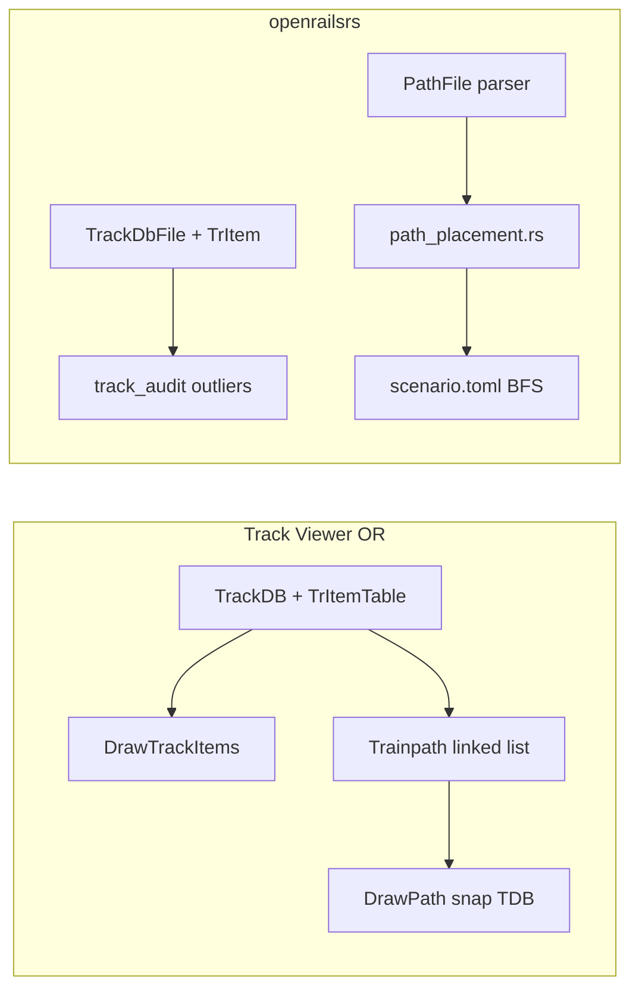
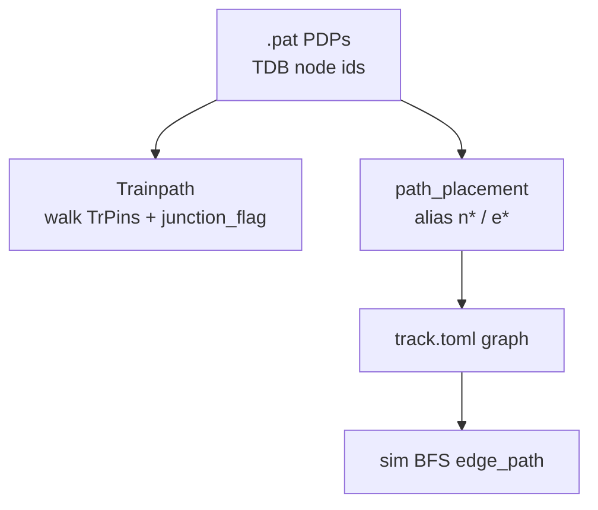

# Estudio Track Viewer — Parte 2 (items, paths, outliers)

Segunda fase del estudio comparativo (2026-06-21): **TrItem** e items ferroviarios, paths `.pat` (Trainpath OR vs `path_placement` openrailsrs) y tres casos outlier de Chiltern documentados con datos reales.

**Alcance:** documentación y comandos headless. Sin render, sin `--track-dev` geometry, sin editor `.pat`.

**Parte 1:** [`TRACKVIEWER_STUDY.md`](TRACKVIEWER_STUDY.md) (`.tdb`, chords, audit geometría).

---

## 1. Resumen ejecutivo

### Cinco lecciones nuevas (Parte 2)

1. **Track Viewer unifica TrItem sobre geometría TDB** — cada item se coloca con `FindLocation(vector, sectionIndex, distanceAlongSection)`; openrailsrs reparte señales/velocidad al grafo colapsado, plataformas/cruces quedan en `TrItemKind::Other` y el visual 3D depende de `TrackObj` en `.w`.
2. **Un `.pat` MSTS no es el recorrido de sim** — OR `Trainpath` camina la topología TDB nodo a nodo; nosotros resolvemos PDPs a ids de grafo (`n*` / `e*`) y la sim hace **BFS** entre `start` y `destination` del escenario, no recorre la lista de 139 PDPs de Birmingham.
3. **PDP sobre `TrVectorNode` colapsado → alias `e*`** — cuando el id TDB del PDP es un vector importado como arista (`msts_aliases`), `path_placement` elige extremo `from`/`to` según el **siguiente** PDP (`resolve_pat_graph_node` en [`path_placement.rs`](../crates/openrailsrs-msts/src/path_placement.rs)).
4. **Paddington platform es un caso especial** — si el PAT empieza en `n1` y el siguiente salto es la línea principal, `DistanceDownPath` del `.srv` se convierte en offset sobre `n3` como `platform_len − distance` (no es el offset literal del `.srv`).
5. **Los outliers de audit tienen causas distintas** — gap inter-nodo (C1) = caras de desvío no alineadas con chords; TrackObj lejano (C2) = shape en `.w` sin ancla chord cercana; gap intra-nodo (C3) = cadena multi-sección con arco no modelado (72.7 m en V16418).



---

## 2. TrItem e items ferroviarios

### 2.1 Open Rails Track Viewer

| Archivo | Rol |
|---------|-----|
| [`DrawTrackDB.cs`](../../openrails/Source/Contrib/TrackViewer/Drawing/DrawTrackDB.cs) `DrawTrackItems`, `FindLocation` | Índice por tile; posición = vector + `sectionIndex` + `distanceAlongSection` |
| [`DrawableTrackItem.cs`](../../openrails/Source/Contrib/TrackViewer/Drawing/DrawableTrackItem.cs) | Factory: `SignalItem`, `PlatformItem`, `SidingItem`, `SpeedPostItem`, `LevelCrItem`, `SoundRegionItem`, … |

Track Viewer dibuja **todos** los tipos de `TrItem` conocidos en el mapa 2D. La posición es continua a lo largo del vector MSTS (incluye curvas vía `FindLocationInSection`).

### 2.2 openrailsrs — parser e import

| Archivo | Rol |
|---------|-----|
| [`track_db.rs`](../crates/openrailsrs-formats/src/typed/track_db.rs) | `TrItem`, `TrItemKind`: `Signal`, `SpeedPost`, `SoundSource`, **`Other`** |
| [`import_route.rs`](../crates/openrailsrs-msts/src/import_route.rs) | `build_signals` → `[[signals]]`; `apply_speed_posts` → cap en edge; `item_to_edge` por vector host |
| [`track_audit.rs`](../crates/openrailsrs-viewer3d/src/track_audit.rs) | `static_trackobj_to_*` — compara **WORLD TrackObj** vs chords TDB, **no** TrItem |

### 2.3 Tabla de correspondencia por tipo MSTS

| Tipo item MSTS | Track Viewer | `import-msts` | viewer3d / audit |
|----------------|--------------|---------------|------------------|
| `SignalItem` | Dibuja + highlight | `[[signals]]` (`edge_id`, `position_m`, aspect) | Marcador 3D lógico (`spawn_signal_markers`) |
| `SpeedPost` | Icono en mapa | `speed_limit_kmh` en edge (cap mínimo) | — |
| `PlatformItem` / `SidingItem` / `CrossoverItem` | `DrawablePlatformItem`, etc. | **`TrItemKind::Other`** (ignorado en TOML) | Mesh vía `TrackObj` `.w` si existe shape |
| `SoundRegionItem` | Región sonido | `[[sound_regions]]` vía actividad (no TDB directo) | Audio sim (futuro) |
| `CarSpawner`, `Hazard`, … | Varios `Drawable*` | `Other` | Depende de escenario / `.w` |

### 2.4 Ejercicio documentado — fixtures y Chiltern

**Fixture `with_signals`** ([`import_msts.rs`](../crates/openrailsrs-msts/tests/import_msts.rs)):

- `TrItem` id 1, señal a 250 m sobre vector 2 → `[[signals]]` con `edge_id = "e2"`, `position_m = 250`.
- Test: `parse_tritem_table_extracts_signal`, `import_route_emits_signals_section`.

**Chiltern importado:**

- `examples/chiltern/track.toml`: **6183** entradas `[[signals]]` (todas las señales TDB mapeadas a edges).
- Speed posts: aplicados como límite en arista (`apply_speed_posts`); no hay marcador visual dedicado en viewer3d.
- Plataformas Paddington/Birmingham: visibles como `TrackObj` (`BR_s_2m5_w01g.s`, etc.) en tiles `.w`, no como TrItem en sim.

**Lección:** Track Viewer = una capa (TrItem + geometría TDB). openrailsrs = tres capas (TOML sim, `.w` visual, audit espacial chord↔TrackObj).

---

## 3. Paths `.pat`

### 3.1 Open Rails

| Archivo | Concepto |
|---------|----------|
| [`Trainpath.cs`](../../openrails/Source/Contrib/TrackViewer/Editing/Trainpath.cs) | Lista enlazada `TrainpathNode`; flags desvío 0/1/reverse |
| [`PathEditor.cs`](../../openrails/Source/Contrib/TrackViewer/Editing/PathEditor.cs) | Snap a vía, wait points, passing paths |
| [`DrawPath.cs`](../../openrails/Source/Contrib/TrackViewer/Editing/DrawPath.cs) vs [`DrawPATfile.cs`](../../openrails/Source/Contrib/TrackViewer/Editing/DrawPATfile.cs) | Path procesado (snap TDB) vs crudo (líneas entre PDP) |

OR recorre **cada PDP como id de nodo TDB** y camina pins/junctions con `junction_flag`.

### 3.2 openrailsrs

| Archivo | Algoritmo |
|---------|-----------|
| [`path.rs`](../crates/openrailsrs-formats/src/typed/path.rs) | `PathDataPoint { node_id, junction_flag, world? }` |
| [`path_placement.rs`](../crates/openrailsrs-msts/src/path_placement.rs) | `resolve_pat_sequence` → `msts_aliases`; `placement_from_distance`; `switches_from_pat` |
| [`import_activity.rs`](../crates/openrailsrs-msts/src/import_activity.rs) | `.act` + player `.pat` → `scenario.route.start/destination` |
| Escenario Birmingham | BFS `n3` → `n10770` en runtime; **no** sigue PDPs explícitos |



### 3.3 Ejercicio 1 — `minimal.pat`

Archivo: [`tests/fixtures/minimal.pat`](../crates/openrailsrs-msts/tests/fixtures/minimal.pat)

```
TrPathPDP ( 1 0 )
TrPathPDP ( 3 0 )
```

| PDP | TDB id | Grafo importado | Resolución |
|-----|--------|-----------------|------------|
| 0 | 1 | `n1` (End) | nodo directo |
| 1 | 3 | `n3` (End) | nodo directo |

Vector intermedio **tdb id 2** no aparece en el PAT (OR lo inferiría al caminar pins). Import: `e2` colapsa `n1`–`n3` (`msts_aliases`: `tdb_id = 2`, `kind = "edge"`).

Test: `cargo test -p openrailsrs-msts parse_minimal_pat`

**Contraste OR:** si un PDP apuntara al vector 2, Track Viewer lo trataría como nodo TDB; `path_placement` lo resolvería a `n1` o `n3` según el PDP siguiente.

### 3.4 Ejercicio 2 — Chiltern Birmingham

Actividad: `RS_Let's go to Birmingham.act`  
PAT: `PATHS/RS_Let's go to Birmingham.pat`  
Escenario: [`examples/chiltern/scenario.toml`](../examples/chiltern/scenario.toml)

**PDPs parseados** (`PathFile`, 139 entradas — test `document_birmingham_pat_for_study`):

| Índice | `tdb_id` | `junction_flag` | Notas |
|--------|----------|-----------------|-------|
| 0 | 1 | 0 | Buffer Paddington (`n1`) |
| 1–9 | 2 | 0 | Repetición sobre vector/edge platform |
| … | 2 | 0 | ~130 PDPs más sobre `tdb_id = 2` |
| 134–137 | 2 | 0 | Tramo final hacia destino |
| 138 | 1 | 0 | Cierre en `n1` (estructura PAT MSTS) |

**Aliases relevantes** (`track.toml`):

| `tdb_id` | Alias | Tipo |
|----------|-------|------|
| 1 | `n1` | node |
| 2 | `e2` | edge `n3` ↔ `n1` |
| 3 | `n3` | node |
| 10770 | `n10770` | node (destino sim) |

**Placement vs escenario:**

| Campo | Valor observado | Fuente |
|-------|-----------------|--------|
| `DistanceDownPath` (`.srv`) | 194.424 m | `read_distance_down_path` |
| `start` | `n3` | Regla platform (`pat[0]=n1` → offset sobre línea principal) |
| `start_offset_m` (escenario) | 305.576 m | `platform_len − DistanceDownPath` (~500 m platform) |
| `destination` | `n10770` | `pick_destination_node` (BFS más lejano > 1 km) |
| Switches | `n10770` diverging, `n10780` straight | `switches_from_pat` (flags ≠ 0 en PDPs) |

**Sim runtime:** el tren arranca en `n3` + 305.576 m y busca camino a `n10770` por aristas del grafo; **no** visita los 139 PDPs ni repite el id 2 ciento veces. Si el grafo importado tiene atajo topológico respecto al PAT OR, la sim puede divergir (validación OR en `[validate]` del escenario).

---

## 4. Casos outlier Chiltern

Fuente: [`fixtures/chiltern-track-audit.json`](fixtures/chiltern-track-audit.json) — verdict **good**, radio 1500 m, anchor Birmingham (`tile_x = -6080`).

Método: tests headless `document_chiltern_outlier_nodes` + `world-dump` CLI.

### 4.1 C1 — Inter-node gap (34.8 m)

**JSON:** `worst_inter_node_gaps[0]` — V16897 ↔ V17790 vía J17283, `gap_m = 34.83`.

| Campo | Observado (`.tdb` MSTS) |
|-------|-------------------------|
| V16897 | Vector 25 m, **1** sección, pins (J17283, J17289), `shape_idx=38654` |
| J17283 | Junction 3 vías: V16897 (branch 1), V17790 (branch 0), V17746 (branch 0) |
| V17790 | Vector 79.8 m, **4** secciones, `ay` −0.801 → 5.421 en última (curva) |

| | Hipótesis | Impacto |
|---|-----------|---------|
| **Observado** | Gap = distancia entre cara de desvío y extremo de chord del vector vecino; `junction_face_gap_m` = `gap_m` (no hay chord endpoint más cercano) | Audit flag, no falla verdict |
| **Hipótesis** | OR dibuja cada rama desde el pin del junction con `FindLocation`; chords usan anclas de sección rectas — ramas en ángulo no comparten vértice | `--track-dev` puede mostrar discontinuidad visual en bifurcación |
| **Sim vs visual** | Grafo importado conecta nodos lógicos en J17283; sim ignora gap geométrico | Sim OK si topología pin es correcta |
| **Acción futura** | Nota en audit; opcional puente junction con `TDB_JUNCTION_BRIDGE_SECTION` (ya usado en chords) | Sin implementar |

### 4.2 C2 — TrackObj lejano (128 m)

**JSON:** `worst_static_trackobj[0]` — uid **9266**, `section_idx=16517`, `vector_id=17312`, `dist_m=128`.

| Campo | Observado |
|-------|-----------|
| Tile | (−6079, 14925) — `w-006079+014925.w` |
| TrackObj uid 9266 | `BR_s_2m5_w01g.s`, local (−1005.2, 28.56, −153.45) |
| V17312 (TDB) | Vector 25 m, **2** secciones, pins (17432, 17437), `shape_idx=38508` |

| | Hipótesis | Impacto |
|---|-----------|---------|
| **Observado** | Objeto estático con `SectionIdx` 16517; chord más cercano del vector 17312 no pasa a < 128 m | Full mode muestra shape; audit lo marca outlier |
| **Hipótesis** | Plataforma/vía auxiliar colocada en `.w` con referencia de sección de otro vector o tile; mismatch tile naming (`w-006079` vs `-6079`) no afecta parse | Visual correcto en OR; chord audit penaliza |
| **Sim vs visual** | No hay TrItem sim para este objeto | Solo visual / decoración |
| **Acción futura** | Filtrar TrackObj por tipo o usar `section_idx` match estricto en audit | Documentado |

### 4.3 C3 — Intra-node chain gap max (72.7 m)

**JSON:** `intra_node_chain_gap_m.max = 72.72`.

| Campo | Observado |
|-------|-----------|
| Peor vector | **V16418** |
| Secciones | **12**, longitud TDB 248.2 m |
| Gap | 72.72 m entre fin chord sec. 10 e inicio chord sec. 11 (`section_index` 11) |
| Pins | (16313, 16762) |

| | Hipótesis | Impacto |
|---|-----------|---------|
| **Observado** | Salto grande entre anclas consecutivas dentro del mismo vector | p95 intra-node = 0; max domina cola |
| **Hipótesis** | Sección con `SectionCurve` (arco largo): OR interpola arco; `collect_tdb_chords` une anclas con segmentos rectos | `--track-dev` “cuerda” vs rail curvo |
| **Sim vs visual** | Edge importado = 248.2 m escalar; sim no ve el gap interno | Longitud sim OK, geometría dev imprecisa |
| **Acción futura** | Parte 1 §4.1 — arcos TSection; priorizar si `--track-dev` se usa para tuning | Nota roadmap fase E |

---

## 5. Matriz de gaps ampliada (Parte 1 + Parte 2)

Discrepancias **nuevas** respecto a la Parte 1 (§4.4 geometría):

| # | Área | Track Viewer / MSTS | openrailsrs | Ejemplo |
|---|------|---------------------|-------------|---------|
| 6 | Items | Todos los `TrItem` en mapa 2D | Solo Signal/SpeedPost/Sound → sim; resto `Other` | Plataforma Paddington |
| 7 | Items | Posición continua en vector+curva | `position_m` sobre edge recto colapsado | Señal mid-curve |
| 8 | Paths | Recorre lista PDP completa | BFS `start`→`destination` en grafo | Birmingham 139 PDPs vs sim |
| 9 | Paths | PDP = nodo TDB siempre | PDP vector → alias `e*`, extremo por **siguiente** PDP | `resolve_pat_graph_node` |
| 10 | Paths | `DrawPath` snap topología | `placement_from_distance` caso especial `n1` platform | offset 305.576 ≠ srv 194.424 |
| 11 | Audit | — | TrackObj vs chord, no TrItem | uid 9266 a 128 m |
| 12 | Audit | Junction continuo en mapa | Inter-node gap hasta 34.8 m (C1) | J17283 |
| 13 | Audit | Arco intra-vector | Intra-node gap hasta 72.7 m (C3) | V16418 sec. 11 |

Las discrepancias 1–5 siguen en [`TRACKVIEWER_STUDY.md`](TRACKVIEWER_STUDY.md) §4.4.

---

## 6. Comandos de reproducción (headless)

### Parsers e import

```bash
cd openrailsrs

# minimal.tdb + minimal.pat
cargo test -p openrailsrs-msts parse_minimal_tdb parse_minimal_pat

# Señales en fixture
cargo test -p openrailsrs-msts parse_tritem_table_extracts_signal import_route_emits_signals_section
```

### Birmingham PAT + placement

```bash
# Requiere MSTS Chiltern + examples/chiltern/track.toml
cargo test -p openrailsrs-msts document_birmingham_pat_for_study -- --ignored --nocapture
```

### Outliers TDB (Parte 2)

```bash
export OPENRAILSRS_MSTS_CONTENT="$HOME/Documentos/Open Rails/Content"
CHILTERN="$OPENRAILSRS_MSTS_CONTENT/Chiltern/ROUTES/Chiltern"

cargo test -p openrailsrs-viewer3d document_chiltern_outlier_nodes -- --ignored --nocapture

# TrackObj tile C2
cargo run -p openrailsrs-cli -- world-dump "$CHILTERN/WORLD/w-006079+014925.w" --csv /tmp/w6079.csv
rg "9266" /tmp/w6079.csv
```

### Audit JSON (Parte 1, baseline outliers)

```bash
OPENRAILSRS_TRACK_AUDIT="$PWD/docs/fixtures/chiltern-track-audit.json" \
  cargo test -p openrailsrs-viewer3d --lib export_chiltern_msts_track_audit -- --ignored --nocapture
```

**Nota:** no se añadió subcomando `pat-dump`; los tests `document_*` cubren el volcado de PDPs.

---

## 7. Referencias cruzadas

- Parte 1: [`TRACKVIEWER_STUDY.md`](TRACKVIEWER_STUDY.md)
- Testing: [`VIEWER3D_TESTING.md`](VIEWER3D_TESTING.md) § Parte 2
- Fixtures audit: [`fixtures/chiltern-track-audit.json`](fixtures/chiltern-track-audit.json)
- Escenario: [`examples/chiltern/scenario.toml`](../examples/chiltern/scenario.toml), [`examples/chiltern/README.md`](../examples/chiltern/README.md)

---

## 8. Criterios de done (Parte 2)

- [x] `docs/TRACKVIEWER_STUDY_PART2.md` — items, paths, 3 casos Chiltern, diagramas
- [x] Ejercicio `minimal.pat` + Birmingham documentado con ids concretos
- [x] ≥5 gaps nuevos (tabla §5: #6–#13)
- [x] Enlaces desde Parte 1 y `VIEWER3D_TESTING.md`
- [x] Sin render, `--track-dev` geometry, ni editor `.pat`
- [x] Tests headless `document_birmingham_pat_for_study`, `document_chiltern_outlier_nodes`
