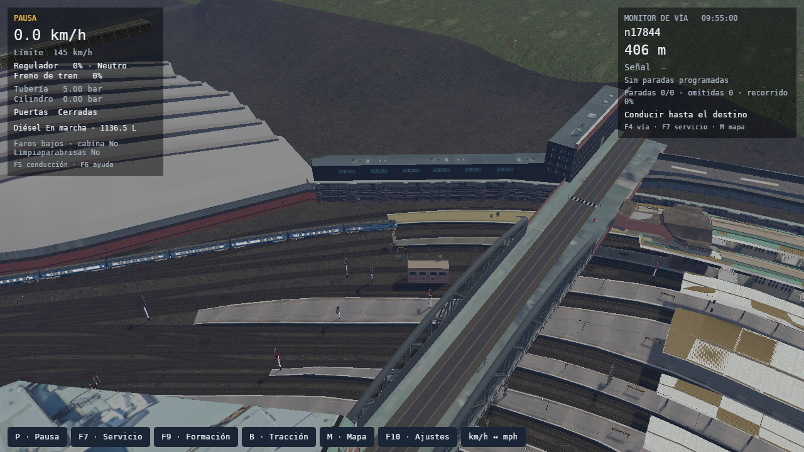
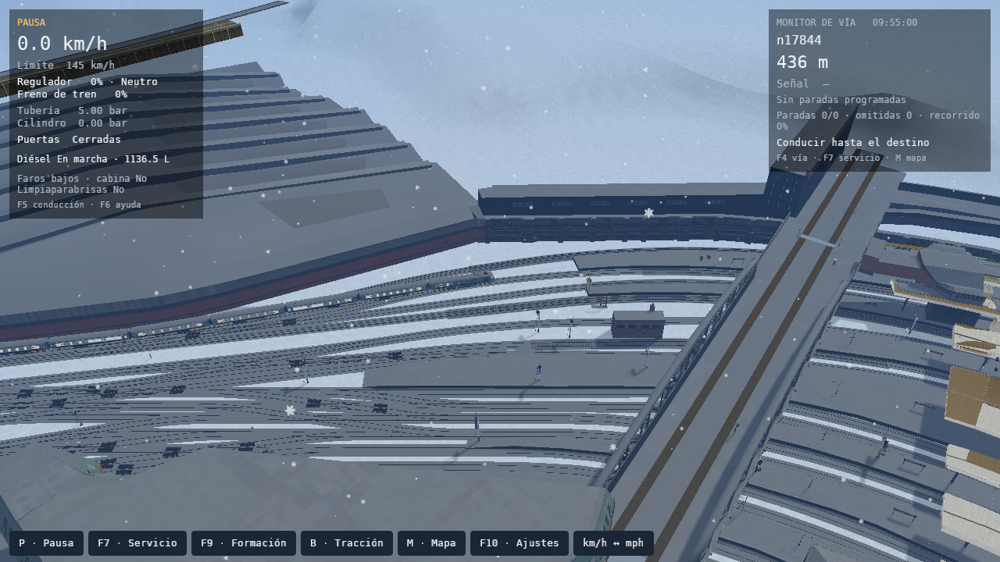

# Paddington: continuidad de la formación y precipitación intensa

Correcciones de los issues [#198](https://github.com/cavazquez/openrailsrs/issues/198) y [#199](https://github.com/cavazquez/openrailsrs/issues/199), verificadas el 7 de octubre de 2026.

## Formación

El vector nativo 17433 incluye la sección dinámica 54452, cuya longitud es cero. El visor le asignaba una longitud estimada de 37,93 m si había otra sección a continuación. Eso desplazaba los coches al cruzar la unión con el vector 17377. Una importación nueva reproducía el mismo defecto.

Se tomaron 48 muestras sobre el itinerario original, a 0, 30, 50, 100, 150 y 250 m de avance. La mayor separación entre centros de coches pasó de **58,55215 m a 20,72657 m**. La diferencia entre longitud del grafo y longitud visual pasó de **37,931758 m a 0,0000044 m**. La prueba nativa adicional midió 20,7238 m entre dos coches que ocupan lados distintos de la unión; el mayor paso espacial para un avance de 0,25 m fue 0,2501 m.

[formation-spacing.json](formation-spacing.json) conserva las muestras geométricas. Las capturas del build corregido registran además las transformaciones ECS de los ocho coches. La comprobación admite 2 m de diferencia entre separación espacial y separación sobre el itinerario para permitir el acortamiento de la cuerda en curvas. No representa una tolerancia física del acoplador. El mayor error observado en las seis capturas fue 0,0511 m.

## Escenario y clima

Linux, RX 7600, Vulkan/RADV y Weston aislado, 1280×720, radio 2 km. Cámara exterior con yaw −1 rad, pitch 0,65 rad y distancia 210 m. Calidad alta, niebla volumétrica de 64 pasos, 8192 partículas GPU, semilla 1 y presentación Fifo. Los escenarios se generaron desde `Test Paddington Suburban Up.pat` con Birmingham Pullman de ocho coches, sin paradas programadas. Se probó también un inicio 30 m más adelante y avance real hasta 251 m. Los archivos originales permanecen fuera del repositorio.

Con el mismo objetivo de captura estable y 120 cuadros de espera:

- **Lluvia intensa:** 221,7 s antes y 62,9 s después. Pico RSS 2744,0 MiB antes y 2699,3 MiB después.
- **Nevada intensa:** 224,2 s antes y 62,1 s después.

Es tiempo desde el lanzamiento hasta una captura con assets, shaders y cambios de detalle estabilizados; no es sólo el tiempo de la pantalla de carga. Se aplican los LOD iniciales directamente, se evitan duplicados para partes fuera de vista y se acotan los rangos usados durante las transiciones visibles. La precipitación utiliza el caché compartido de obstáculos y descarta píxeles transparentes antes de leer la máscara de techos. Se conserva la calidad seleccionada por el jugador.

El modo CPU se comprobó con 2048 partículas de lluvia, y el mixto con 1024 partículas CPU y 3072 GPU de nieve; ambos usaron niebla por distancia. Las seis capturas terminaron sin errores de shaders, recursos pendientes, errores SIGSCR ni transiciones de LOD activas. La captura en movimiento incluye el coste de conducir y estabilizar el escenario a velocidad de simulación ×4.

Los percentiles de la comparación corta incluyen la estabilización posterior al calentamiento; la ejecución anterior acumuló muchas más muestras durante las transiciones de detalle. No permiten atribuir una mejora de FPS sostenidos al shader de precipitación. Fifo y el compositor limitaron estas ejecuciones cerca de 40 FPS. Los tiempos GPU corresponden al mayor tramo instrumentado, sin sumar tramos anidados. Es una medición en un equipo y una ejecución por caso.

Una comprobación adicional de 480 cuadros, semilla 81 y 418 muestras después del calentamiento, mantuvo cámara, radio, calidad y niebla:

- Lluvia intensa: **25,12 / 28,15 / 30,28 ms** (P50/P95/P99).
- Nevada intensa: **25,18 / 28,24 / 32,23 ms** (P50/P95/P99).

Ambas terminaron sin cuadros mayores a 100 ms después del calentamiento. Estos valores describen una escena detenida y estable; la captura en movimiento se registra por separado.

[verification.json](verification.json) identifica binarios, escenarios, condiciones, muestras y resultados. Los logs y reportes completos permanecen en `tmp/paddington-weather-20261007/`. Reproducción: [guía de benchmarks](../../../WEATHER_RENDERER_QA.md#patios-densos-y-continuidad-de-la-formación). Prueba manual: [sección 50](../../../PLAYER_MANUAL_TESTS.md#50-chiltern-v4-formación-y-clima-en-paddington).

## Comprobaciones

`check.sh` pasó con el contenido nativo de Chiltern v4: formato, clippy sin advertencias, 1715 tests Rust contando las tres regresiones nativas ejecutadas aparte, suites Python, build del workspace, oráculos OR 1.6.1 y servicio completo. Las pruebas cubren secciones de longitud cero en ambos sentidos, la unión de Paddington, selección inicial y fuera de vista con más partes que el presupuesto de fades, una paleta que cabe en los índices de Bevy y rechazo de formaciones separadas o de tablas de visibilidad agotadas.
