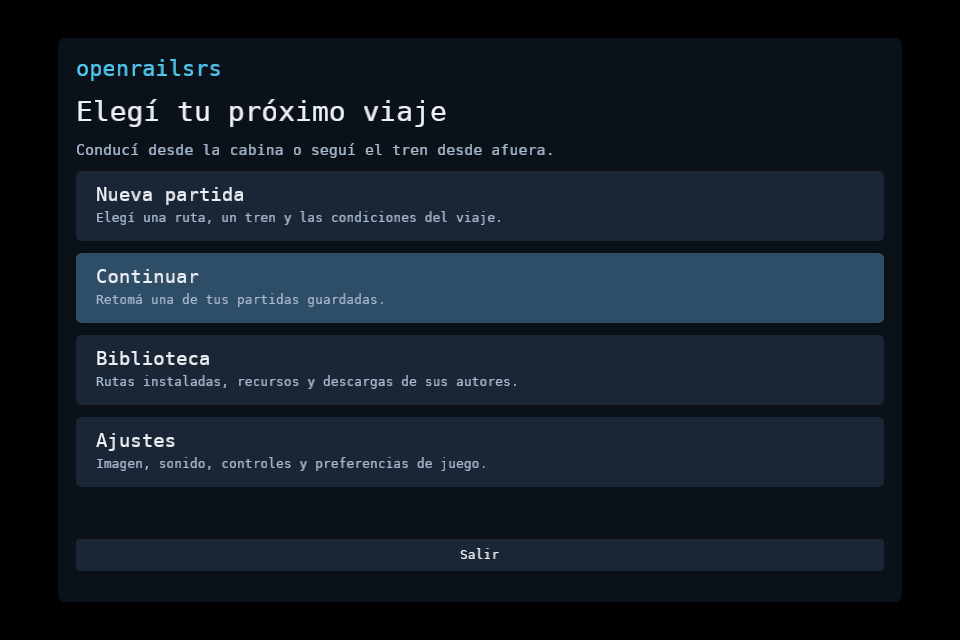
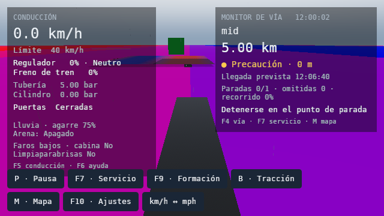
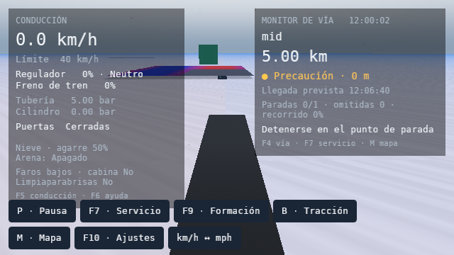

# Primera alpha publicada en Snap Store

El 9 de octubre de 2026 se publicó **openrailsrs 0.1.0-alpha.1**, revisión **1**,
en [latest/edge](https://snapcraft.io/openrailsrs), para Linux amd64. El paquete
tiene base core24 y confinamiento estricto. La descarga pública coincide por
SHA-256 con el archivo instalado y probado.

La construcción usa el código del commit `46100c1`, con correcciones de
empaquetado: entrada de escritorio, descubrimiento Vulkan, mapas XKB y selección
de Python/certificados presentes en core24. No cambia el código del juego.
`verification.json` registra los hashes de esas fuentes y binarios. La copia de
construcción excluye `.git`; por eso `BUILD.json` no contiene un commit interno.

## Prueba del paquete real

Se instaló en una instancia LXD de Ubuntu 24.04 con Snapd 2.76.3. La instalación
local usa `--dangerous` para omitir las assertions de tienda y mantiene el
confinamiento: `snap debug confinement` devuelve `strict`, sin `devmode`.
La prueba se ejecutó como un usuario aislado. Sus datos comunes sobrevivieron a
las actualizaciones locales hasta la revisión x3.

- CLI y catálogo embebido: quince registros.
- HTTPS: respuesta 200 con validación de certificados de core24.
- Menú: captura a 960×640, usando el lanzador real de la aplicación.
- Lluvia y nieve: escenas `examples/smoke/scenario.toml` a 640×360, X11 virtual,
  Vulkan por software y partículas CPU. Sin shaders pendientes/fallidos ni
  formas cercanas sin activar.
- Ocho pruebas de empaquetado, sintaxis del lanzador y auditoría de archivos
  propios: correctas. No se incluyen rutas descargadas ni datos del jugador.

Los colores de terreno y objetos son propios del escenario sintético de prueba.
Estas capturas no evalúan la apariencia de Chiltern. El audio estuvo desactivado;
GPU física, Hanabi en hardware, Wayland, instalación completa de rutas y un viaje
original completo dentro de Snap quedan fuera de esta prueba.

[verification.json](verification.json) conserva resultados y hashes. El `.snap`,
las assertions de tienda y los logs permanecen en `tmp/snap-edge-20261009/`,
fuera de Git. [Instalación y distribución](../../../DISTRIBUTION.md).
