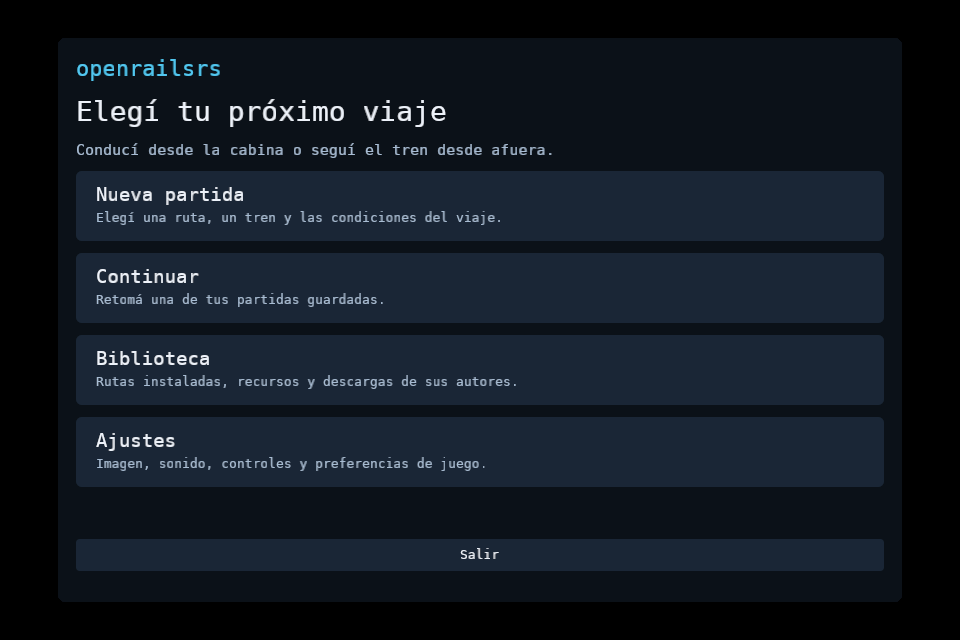
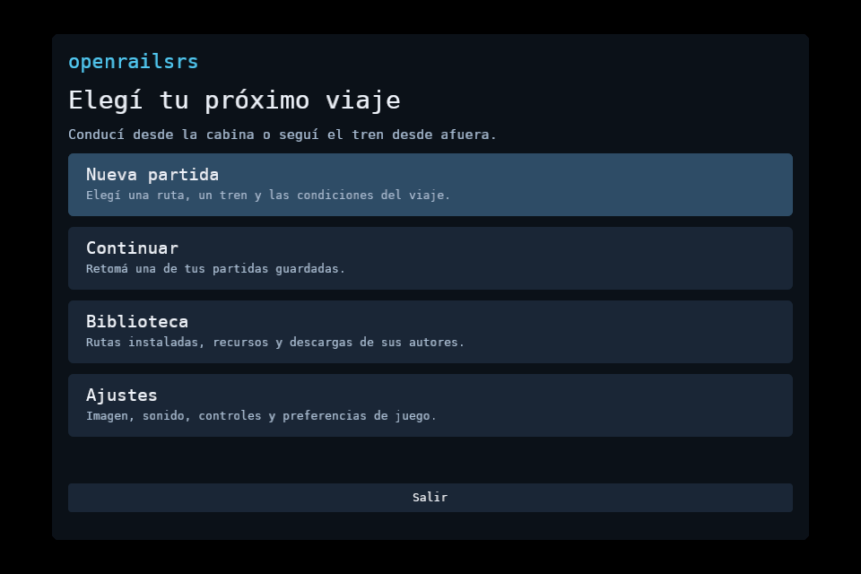

# Arranque del Snap en Wayland y X11

Corrección del [issue #205](https://github.com/cavazquez/openrailsrs/issues/205),
comprobada el 9 de octubre de 2026 con **0.1.0-alpha.2**.

Publicada en [Snap Store](https://snapcraft.io/openrailsrs) como revisión **2**
en **latest/edge**. La descarga pública coincide por SHA-256 con el paquete
instalado y probado.

Snap usa un directorio privado para los archivos de ejecución del cliente.
El compositor mantiene su socket en la carpeta de la sesión. La revisión 1
intentaba conectarse a un socket inexistente y Bevy fallaba antes de abrir el
menú. El lanzador ahora resuelve la conexión real sin cambiar `XDG_RUNTIME_DIR`.
Si Wayland no responde y hay X11, elige X11 antes de iniciar winit.

También se corrigió el diagnóstico NVIDIA: la ausencia de `nvidia-smi` no es
evidencia de incompatibilidad entre módulo y bibliotecas. El aviso requiere la
respuesta concreta de ese comando.

## Paquete completo instalado

Alpha.2 se instaló como revisión local x4 en Ubuntu 24.04/LXD con Snapd 2.76.3,
base core24 y confinamiento estricto, sin `devmode`. Se comprobó el menú a
960×640 en tres casos:

- Wayland: Weston 13, nombre de socket relativo, compositor en el directorio
  padre y `DISPLAY` sin definir.
- Respaldo X11: Wayland no responde y Xvfb ofrece una conexión X11.
- X11 explícito: Wayland disponible y selección `OPENRAILSRS_WINDOW_BACKEND=x11`.

Las tres capturas usan Vulkan por software y terminaron sin shaders pendientes
ni fallidos. La CLI también listó el catálogo. Pasaron 13 pruebas Python de
empaquetado, nueve pruebas Rust del binario, formato, Clippy y sintaxis del
lanzador. La prueba Rust de contenido local conserva su marca `ignored`.
La auditoría de patrones conocidos en archivos propios pasó; no es un detector
universal de secretos.

## Binario y lanzador con GPU física

El binario y el lanzador extraídos de alpha.2 se ejecutaron dentro del Snap
estricto ya instalado en el equipo, revisión 1, aprovechando sus bibliotecas,
base y recursos sin cambios. Se abrió el menú en Wayland con RX 7600/Vulkan
sin el aviso falso de NVIDIA. Esta prueba conserva la instalación del usuario;
no se presenta como una instalación completa de la revisión 2 en ese equipo.

Son pruebas de arranque y menú, con audio desactivado. No certifican un viaje
original completo dentro de Snap. [verification.json](verification.json)
registra hashes, versión publicada y alcance. Los paquetes, assertions y logs
quedan en `tmp/snap-wayland-20261009/`, fuera de Git.

[Cómo actualizar y elegir backend](../../../VIEWER3D.md#snap-waylanderrorconnectionnocompositor-antes-del-menú).
