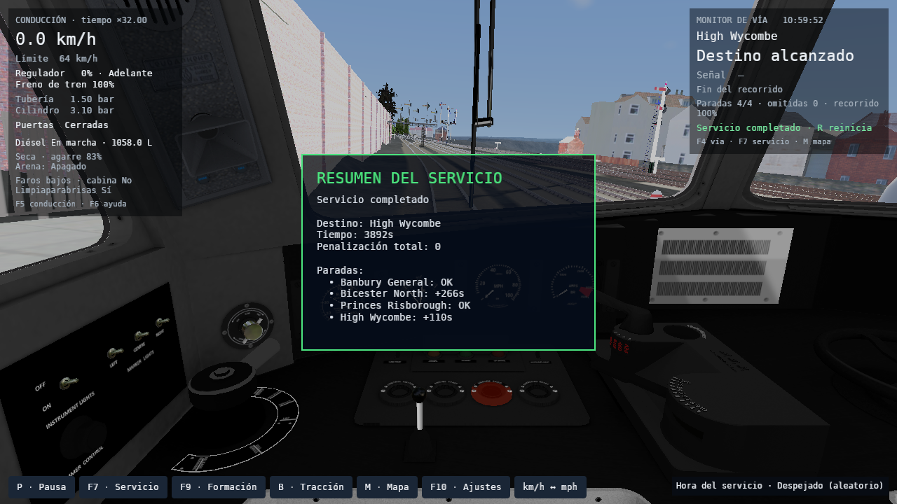
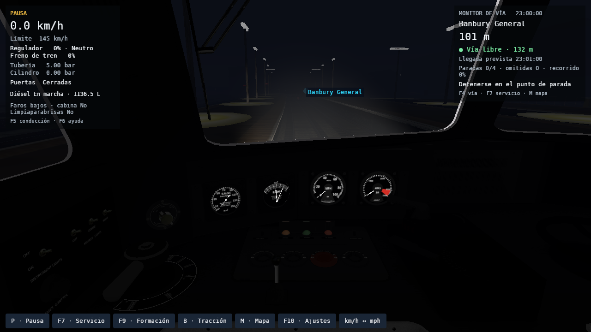

# Viaje completo con clima cambiante

Issues [#202](https://github.com/cavazquez/openrailsrs/issues/202) y [#203](https://github.com/cavazquez/openrailsrs/issues/203), comprobados el 8 de octubre de 2026.

El contacto rueda/riel recibe ahora la intensidad continua que usan lluvia, nieve y niebla, tanto en el tren del jugador como en el tráfico. Llovizna y aguacero dejan de apuntar al mismo agarre. La compensación entre niebla cercana y lejana también se mezcla según la densidad, sin cambiar de golpe cuando el aviso pasa a Niebla. El mojado y secado conservan el reloj físico y los guardados; los oráculos headless mantienen los presets de referencia cuando no solicitan un objetivo continuo.

## Recorrido original

Chiltern v4, `RS_Football Special`, Birmingham Pullman de ocho coches. Banbury General → Bicester North → Princes Risborough → High Wycombe, unos 62,68 km. Se conserva itinerario, cambios de vía y horarios de la actividad; se selecciona invierno para incluir nevadas. El escenario usa la física original importada de una masa: la formación visual no certifica acopladores físicos ni dinámica por vehículo.

GPU RX 7600, Vulkan/RADV, compositor Weston aislado, 1280×720, cabina, radio 450 m, calidad alta, 8192 partículas GPU, niebla Auto, faros bajos y limpiaparabrisas activo; audio desactivado. Clima aleatorio, inicialmente despejado, ritmo Normal de cuatro minutos y semilla 82. Conducción automática de comprobación al 75%, tiempo ×32. Los recursos originales permanecen fuera de Git.

- Cuatro paradas completadas en orden, sin omisiones. Error entre **2,71 y 3,57 m**, con velocidad de llegada menor a **0,1 m/s**.
- Bicester North llega 266 s tarde y High Wycombe 110 s tarde; completar el servicio no implica cumplir todos los horarios.
- Cinco condiciones efectivas: despejado, nublado, lluvia, nieve y niebla. Visibilidad mínima **120 m**.
- **374 muestras** de clima y contacto; **58** muestran frenado en movimiento sobre vía húmeda, con fuerza transmitida a la vía. El agarre normalizado baja hasta 0,5 y su mayor cambio es **0,0088 por segundo de simulación**, frente al límite de continuidad 0,045/s.
- Sin shaders pendientes/fallidos, errores SIGSCR ni recursos cercanos pendientes al terminar. Los ocho coches pasan la comprobación geométrica con tolerancia de 2 m, que admite la cuerda de una curva y no representa el acoplador físico.

## Niebla y faros desde cabina

Tres capturas de la misma escena en Banbury General a las 23:00, con niebla densa, formación pausada y faros apagados, bajos y altos. Se comprueban GPU real, extinción volumétrica y shaders sin fallos. Fuera del HUD, bajos aumenta el RGB medio en 2,05 y altos en 6,43; ninguna comparación agrega píxeles saturados en blanco. La luz cercana conserva el detalle de la vía.

También se conservan [apagados](fog-off.png) y [altos](fog-high.png) para comparar el mismo encuadre. Estas imágenes comprueban respuesta a los faros; no son una comparación de píxeles con Open Rails.

## Memoria y tiempos de cuadro

Antes y después se ejecutó el mismo recorrido y configuración. La ejecución anterior registró P50/P95/P99 de partida **25/87/150 ms**, 111 cuadros mayores a 100 ms y pico RSS de **2229,9 MiB**. La corregida registró **25/38/98 ms**, 43 cuadros mayores a 100 ms y **2644,9 MiB** de pico RSS. VRAM máxima del proceso: **1639,3/1902,7 MiB**, respectivamente.

Es una ejecución por binario, con cachés de archivos/shaders y cadencia de cuadros variables. No permite atribuir esa diferencia a una mejora sostenida de FPS. Permanecen tirones durante el viaje acelerado; ×32 incrementa física y streaming por cuadro. Los percentiles excluyen la carga inicial y conservan el streaming en marcha. RSS y VRAM son mediciones separadas.

### Tiempo normal en Paddington

Dos ejecuciones adicionales con lluvia intensa y nevada intensa, cámara de cabina, radio **2 km**, calidad alta, niebla volumétrica de 64 pasos y 8192 partículas GPU. Se usa el itinerario libre `Test Paddington Suburban Up.pat`, unos 436 m sin paradas, a tiempo **×1**. El objetivo mínimo de captura era 150 m; los recursos se estabilizaron después de llegar al extremo del itinerario, por lo que la captura final está detenida y los percentiles generales incluyen esa espera. No se presentan como un recorrido de cuatro estaciones.

La lluvia registró P50/P95/P99 de partida **25/25/26 ms** y la nieve **25/26/28 ms**, sin cuadros mayores a 100 ms después de la carga inicial. El registro que excluye la espera terminal tampoco tuvo esos tirones: **2463** cuadros con lluvia y **2772** con nieve, con máximos de **41,81/48,78 ms**, respectivamente. Incluye todos los cuadros renderizados durante la simulación activa, también entre pasos de física. Fifo y el compositor mantienen estas ejecuciones cerca de 40 FPS. Son dos pruebas cortas en un equipo, no un objetivo garantizado para cualquier GPU o ruta.

Picos RSS de **3014,9/3008,0 MiB** y VRAM del proceso de **2487,9/2444,5 MiB**. La carga inicial sigue teniendo picos de hasta **1,68 s**; no se ocultan dentro de los percentiles de partida. Los ocho coches, shaders, partículas Hanabi y señales nativas pasaron las verificaciones. El modelo recibe agarre 0,6 con aguacero y 0,5 con nevada intensa; la nieve produjo patinaje durante la aceleración. El modo Llegar sin paradas detiene el cuerpo al completar el objetivo; su velocidad residual de ejes en esa instantánea no se usa como medida física de patinaje.

## Comprobaciones y límites

`check.sh` pasó: formato, clippy sin advertencias, **1727** invocaciones de tests Rust incluidas tres pruebas nativas, suites Python, build del workspace, oráculos fijados de Open Rails 1.6.1 y servicio completo. El validador del viaje también rechaza servicio incompleto, paradas omitidas, falta de contacto continuo, saltos de agarre, muestras no finitas y un supuesto frenado húmedo observado sólo en reposo o sin fuerza en la vía.

La adherencia sigue siendo un modelo normalizado de juego, sin temperatura ni hielo, y no demuestra paridad física completa. El historial de diagnóstico tiene 720 puntos como máximo y se reinicia al iniciar/restaurar; el estado físico y el pronóstico sí se conservan al guardar. Los reportes completos con rutas locales están en `tmp/weather-journey-20261008/`, fuera de Git.

Los contadores por clima registran también los cuadros entre pasos de física, sin duplicar muestras, consumo ni integrales físicas. La prueba comprueba esa separación, pausa, espera terminal y reinicio. Las capturas de faros se tomaron antes de corregir sólo ese contador de diagnóstico; su hash separado queda registrado. El recorrido final usa el ejecutable con el contador corregido.

[verification.json](verification.json) conserva condiciones, hashes, mediciones y muestras sin rutas personales. Reproducción: [guía](../../../WEATHER_RENDERER_QA.md#viaje-completo-bajo-clima-cambiante). Cómo probarlo jugando: [sección 52](../../../PLAYER_MANUAL_TESTS.md#52-viaje-completo-con-clima-cambiante).
