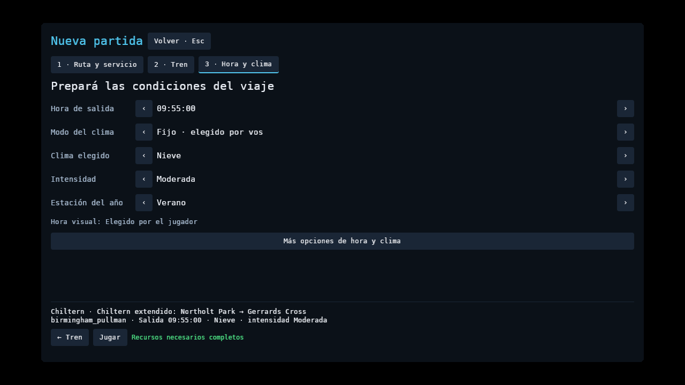
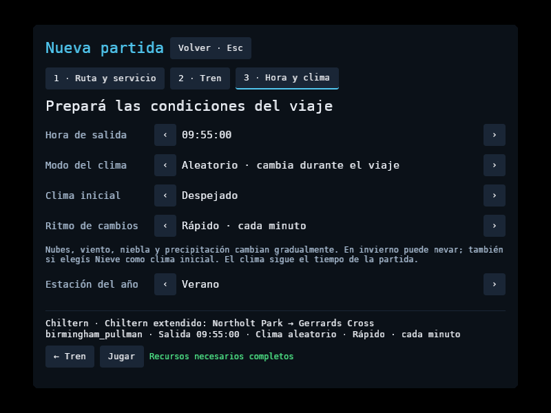
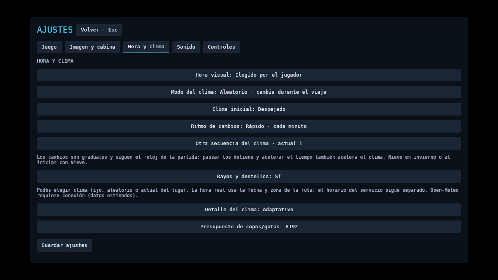
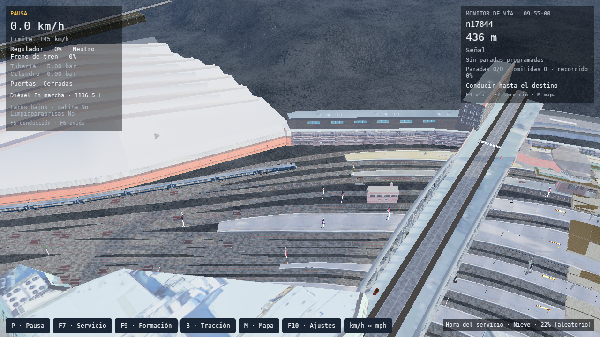

# Intensidad y clima aleatorio durante el viaje

Issues [#200](https://github.com/cavazquez/openrailsrs/issues/200) y [#201](https://github.com/cavazquez/openrailsrs/issues/201), comprobados el 8 de octubre de 2026.

Nueva partida y F10 permiten elegir clima fijo, aleatorio o actual del lugar. Al elegir lluvia o nieve fijas aparece Intensidad: Leve, Moderada e Intensa. Cambiar de lluvia a nieve descarta el perfil anterior. El clima aleatorio usa una secuencia reproducible y cambios graduales de nubes, precipitación, visibilidad y viento, compartidos con sonido y adherencia. El jugador puede elegir el ritmo, cambiar la secuencia y conservar sus preferencias.

El pronóstico sigue el reloj de la partida. Pausar lo congela; acelerar el tiempo lo acelera. Guardar conserva el clima inicial, ritmo, secuencia, condiciones actuales y avance de la transición. Los guardados anteriores siguen siendo compatibles. Clima actual del lugar mantiene su integración con Open-Meteo; el modo aleatorio no consulta el clima por internet.

## Menú

Nueve capturas con preferencias aisladas: lluvia intensa y nieve moderada en Nueva partida y F10; aleatorio en ambas pantallas y opciones avanzadas; Nueva partida y opciones avanzadas a 800×600. El validador comprobó texto visible, límites del panel, botones de inicio/guardar y ausencia de errores de shaders. Las pruebas ECS accionan los controles de intensidad, clima, modo, ritmo y secuencia.

## Escenario original

Once capturas con Chiltern v4 original, Birmingham Pullman de ocho coches, Linux, RX 7600, Vulkan/RADV y Weston aislado. Resolución 1280×720, radio 450 m, cámara exterior con yaw −1 rad, pitch 0,65 rad y distancia 210 m. Calidad alta, niebla Auto y presupuesto de 8192 partículas GPU mediante Hanabi. Los recursos originales permanecen fuera del repositorio.

El escenario de invierno deriva de `Test Paddington Suburban Up.pat`, con un itinerario libre de unos 436 m y sin paradas programadas. La vista elevada sirve para comprobar el estado del clima y los recursos; no representa la perspectiva habitual del conductor.

- Lluvia leve, moderada e intensa: 1474, 5079 y 8192 partículas activas.
- Nieve leve, moderada e intensa: 1802, 4915 y 8192 partículas activas.
- Aleatorio, secuencia 82 y ritmo rápido: despejado a 0 s, transición a 45 s, nieve leve a 60 s y despejado a 120 s. Estas cuatro capturas usan un desplazamiento temporal controlado y la formación pausada para comparar fases.
- Aleatorio en movimiento, secuencia 81: inicio de prueba en la fase de 45 s, avance real de 250,22 m a velocidad de simulación ×4 y captura en la fase de 93,4 s. La intensidad de lluvia alcanzó 96,4%. El reloj del clima avanzó junto con la conducción.

Todas las capturas terminaron sin shaders pendientes ni fallidos y con los ocho coches dentro de la tolerancia geométrica de 2 m. El mayor error de separación entre centros y offsets del itinerario fue 0,0511 m; esa tolerancia permite el acortamiento de la cuerda en curvas y no describe el acoplador físico. El pico RSS estuvo entre 1761,5 y 1841,4 MiB. Son comprobaciones de funcionamiento en un equipo, no una comparación de rendimiento ni un recorrido completo con clima variable.

## Comprobaciones

`check.sh` pasó con Chiltern v4: formato, clippy, 1723 tests Rust contando las tres pruebas nativas ejecutadas aparte, suites Python, compilación del workspace, oráculos OR 1.6.1 y servicio completo. Después de sincronizar las preferencias del menú al continuar una partida, clippy y el build final del visor volvieron a pasar. Las capturas identifican ese binario final.

Las pruebas de clima comprueban continuidad entre fases, semillas, estación del año, independencia de FPS, pausa, evolución de la adherencia y restauración del pronóstico seguida de 300 pasos de simulación. La serialización real de partidas también comprueba guardados anteriores y rechazo de un estado meteorológico inválido.

[verification.json](verification.json) conserva hashes y resultados sin rutas personales. Los logs completos quedan en `tmp/weather-menu-20261008/`. Prueba manual: [sección 51](../../../PLAYER_MANUAL_TESTS.md#51-intensidad-de-lluvia-y-nieve-y-clima-aleatorio). Herramientas y condiciones: [WEATHER_RENDERER_QA.md](../../../WEATHER_RENDERER_QA.md).
