# Clima, escenografía y diagnóstico: issues 190–197

Registro del 7 de octubre de 2026. Las ocho implementaciones se validan con contenido original de Chiltern v4, escenas de Pullman y Hall, tests del workspace y matrices gráficas. #189 se canceló a pedido del usuario porque no consiguió Belgrano CC; no cuenta como una implementación terminada.

## Condiciones de la medición

Linux, AMD Radeon RX 7600, Vulkan/RADV, compositor Weston aislado, 1280×720, radio de escenario 450 m y semilla meteorológica 81. Bevy 0.19.1, Hanabi 0.19.0, inspector 0.37.0 y framepace 0.22.0. Build de desarrollo con optimización 1, sin símbolos, incremental apagado y dos jobs; estas cifras no representan un build release.

Las ejecuciones son secuenciales. Se descartan 60 cuadros de calentamiento y se conservan los posteriores, incluidos los de streaming. El pico de RSS y el muestreo de CPU/GPU abarcan el proceso completo, incluida la carga inicial. VRAM es memoria del cliente DRM del proceso, deduplicada por cliente/dispositivo. La actividad global de la GPU puede incluir compositor u otras aplicaciones; la GPU integrada inactiva no se promedia con la RX 7600. Los datos por dispositivo y valores ausentes quedan en el JSON.

Se usa el mismo ejecutable dentro de cada matriz. Pacing terminó antes de la optimización de memoria de la escenografía; su hash se conserva separado. La implementación de pacing no cambió. Las otras matrices y capturas usan el build final. [verification.json](verification.json) identifica ambos binarios, fuentes, escenarios y capturas.

Los cuadros mayores a 100 ms no se eliminan ni se atribuyen automáticamente al limitador o al clima. La clasificación de diagnósticos observa trabajo de CPU, assets, shaders y streaming; no sustituye un profiler completo.

## Entrega de cuadros (#193)

Tres recorridos A→B→A por modo. Apagado pide VSync Fifo; 30/60/sin límite piden AutoNoVsync, sujeto al compositor.

| Caso | Repeticiones | P50 / P95 / P99 (ms) | RSS pico (MiB) | VRAM pico (MiB) | Cuadros >100 ms |
| --- | ---: | ---: | ---: | ---: | ---: |
| off | 3 | 25.10 / 36.36 / 53.17 | 1585.50 | 1118.50 | 8.00 |
| 30 | 3 | 33.30 / 45.02 / 64.55 | 1582.50 | 1116.53 | 9.00 |
| 60 | 3 | 16.59 / 26.28 / 37.36 | 1596.60 | 1118.86 | 6.00 |
| unlimited | 3 | 9.26 / 15.43 / 26.38 | 1569.50 | 1116.06 | 6.00 |

| Modo | Cola→ECS P50 (ms) | CPU (% de un núcleo) | GPU global (%) |
| --- | ---: | ---: | ---: |
| off | 16.26 | 98.62 | 15.80 |
| 30 | 23.93 | 80.69 | 14.20 |
| 60 | 7.74 | 132.30 | 21.27 |
| unlimited | 1.20 | 212.48 | 31.32 |

**Decisión:** mantener frame pacing experimental apagado por defecto. En este equipo, 60 FPS es una opción razonable para comparar estabilidad y consumo; sin límite mejora los percentiles a costa de mayor CPU/GPU. El límite de 30 FPS no reduce los tirones de streaming. No se cambia el valor habitual a partir de una sola GPU. La latencia es una sonda sintética de cola→siguiente cuadro ECS, no teclado→pantalla.

## Humo y vapor (#194)

Hall, después de avanzar 500 m y emitir realmente, con tres repeticiones por modo. El modo apagado se valida sin emisores ni capacidad de partículas; los otros modos deben registrar emisión, profundidad y capas compatibles.

| Caso | Repeticiones | P50 / P95 / P99 (ms) | RSS pico (MiB) | VRAM pico (MiB) | Cuadros >100 ms |
| --- | ---: | ---: | ---: | ---: | ---: |
| off | 3 | 25.13 / 35.84 / 42.35 | 1485.60 | 1114.49 | 2.00 |
| cpu | 3 | 25.14 / 35.93 / 40.85 | 1472.20 | 1114.23 | 2.00 |
| gpu | 3 | 25.15 / 35.83 / 41.38 | 1475.60 | 1116.16 | 2.00 |
| hybrid | 3 | 25.13 / 35.84 / 42.33 | 1481.60 | 1115.44 | 2.00 |

**Decisión:** integrar Hanabi para partículas visuales en el visor, conservando CPU e híbrido y la opción de apagarlas. La física ferroviaria y el núcleo headless no dependen de Hanabi. El viento compartido inclina los escapes; el efecto respeta profundidad y no se usa para resolver transparencias o ZBias de los modelos importados. El presupuesto permanece acotado y las matrices documentan el coste observado.

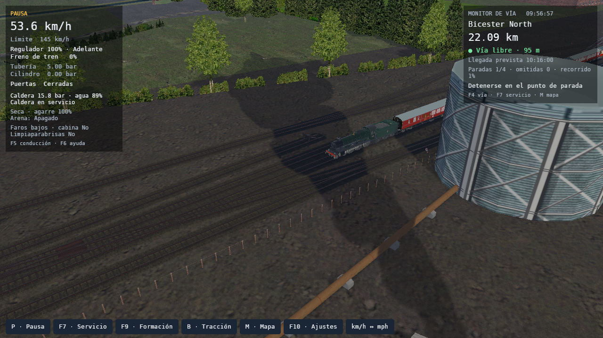
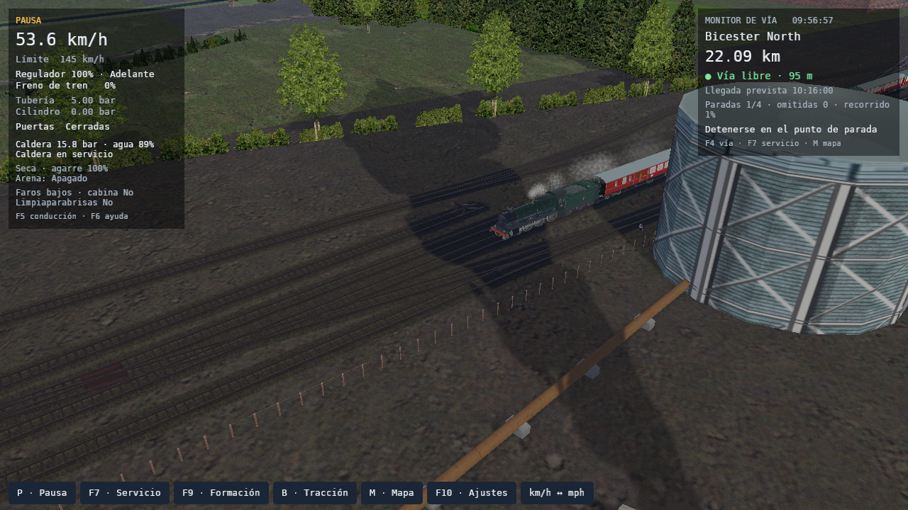

## Lluvia (#192)

Una ejecución por combinación de perfil y calidad: Baja 512, Media 2.048 y Alta 8.192 partículas combinadas como máximo. Las intensidades, el viento, el cielo, la niebla, los escurrimientos del parabrisas y el sonido ambiental usan WeatherState. Las capturas CPU e híbrida adicionales comprueban el reparto del mismo presupuesto.

| Caso | Repeticiones | P50 / P95 / P99 (ms) | RSS pico (MiB) | VRAM pico (MiB) | Cuadros >100 ms |
| --- | ---: | ---: | ---: | ---: | ---: |
| drizzle-low | 1 | 25.13 / 26.35 / 27.14 | 1425.90 | 1121.11 | 0.00 |
| drizzle-medium | 1 | 25.12 / 26.37 / 27.01 | 1439.10 | 1120.28 | 0.00 |
| drizzle-high | 1 | 25.15 / 26.28 / 26.91 | 1437.10 | 1123.78 | 0.00 |
| steady_rain-low | 1 | 25.12 / 26.40 / 27.13 | 1459.70 | 1121.05 | 0.00 |
| steady_rain-medium | 1 | 25.12 / 26.30 / 26.95 | 1430.70 | 1120.26 | 0.00 |
| steady_rain-high | 1 | 25.14 / 26.35 / 26.91 | 1437.00 | 1120.89 | 0.00 |
| downpour-low | 1 | 25.12 / 26.36 / 26.91 | 1399.00 | 1119.15 | 0.00 |
| downpour-medium | 1 | 25.14 / 26.29 / 26.94 | 1428.30 | 1120.26 | 0.00 |
| downpour-high | 1 | 25.14 / 26.34 / 26.90 | 1446.10 | 1120.56 | 0.00 |

En cabina se compara la misma cámara y lluvia intensa, con el limpiaparabrisas apagado y encendido. El barrido reduce temporalmente las gotas dentro de la zona de la escobilla; el tablero y el HUD conservan profundidad y legibilidad.

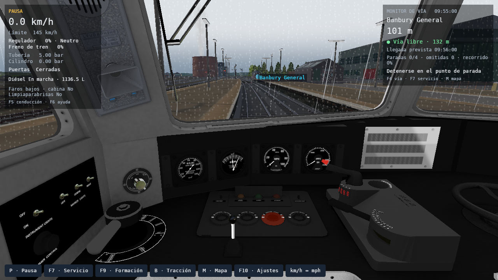


## Nieve (#191)

Una ejecución por combinación. Nevada leve e intensa cambian tamaño, densidad, viento y visibilidad. Después de nevar conserva cobertura con cero partículas cayendo. La máscara usa normales y materiales originales: techos y terreno reciben cobertura irregular; fachadas verticales, cristales e interior de cabina conservan sus texturas. La cobertura es independiente de tile/LOD y tiempo de carga.

| Caso | Repeticiones | P50 / P95 / P99 (ms) | RSS pico (MiB) | VRAM pico (MiB) | Cuadros >100 ms |
| --- | ---: | ---: | ---: | ---: | ---: |
| light_snow-low | 1 | 25.13 / 26.41 / 27.18 | 1483.20 | 1120.61 | 0.00 |
| light_snow-medium | 1 | 25.14 / 26.51 / 27.03 | 1458.70 | 1119.62 | 0.00 |
| light_snow-high | 1 | 25.15 / 26.41 / 27.06 | 1459.20 | 1163.63 | 0.00 |
| heavy_snow-low | 1 | 25.15 / 26.44 / 27.11 | 1449.00 | 1119.09 | 0.00 |
| heavy_snow-medium | 1 | 25.12 / 26.49 / 27.08 | 1441.20 | 1121.18 | 0.00 |
| heavy_snow-high | 1 | 25.16 / 26.48 / 27.03 | 1450.60 | 1120.27 | 0.00 |
| after_snow-low | 1 | 25.15 / 26.40 / 27.01 | 1466.40 | 1115.62 | 0.00 |
| after_snow-medium | 1 | 25.13 / 26.41 / 27.05 | 1449.60 | 1116.38 | 0.00 |
| after_snow-high | 1 | 25.16 / 26.49 / 27.15 | 1442.80 | 1115.88 | 0.00 |

La prueba adicional nevada recorre 7,15 km de cámara y regresa con carga y descarga de sectores: recupera 217 grupos, registra cero discrepancias de hash y conserva cobertura 1,0. La captura de cabina mantiene visibles sus 69 primitivas y separa la precipitación exterior del interior.

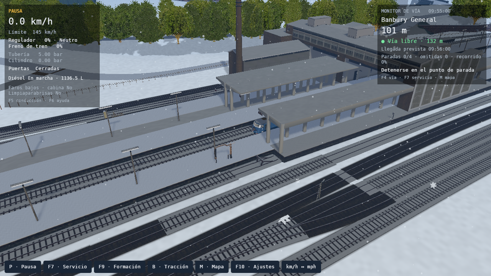
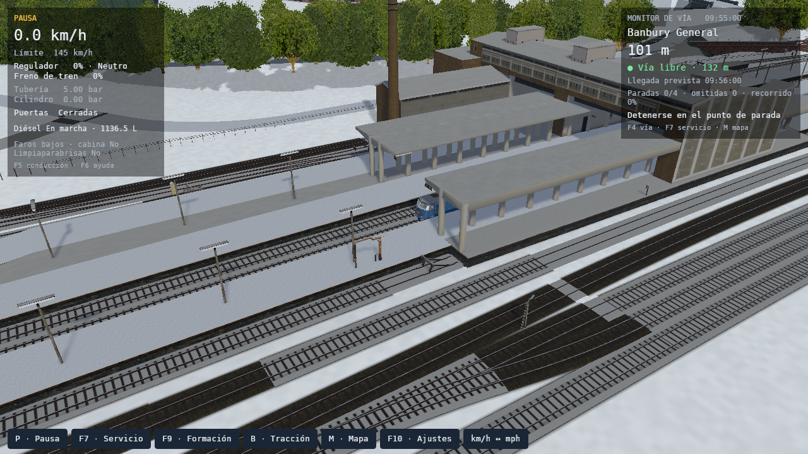
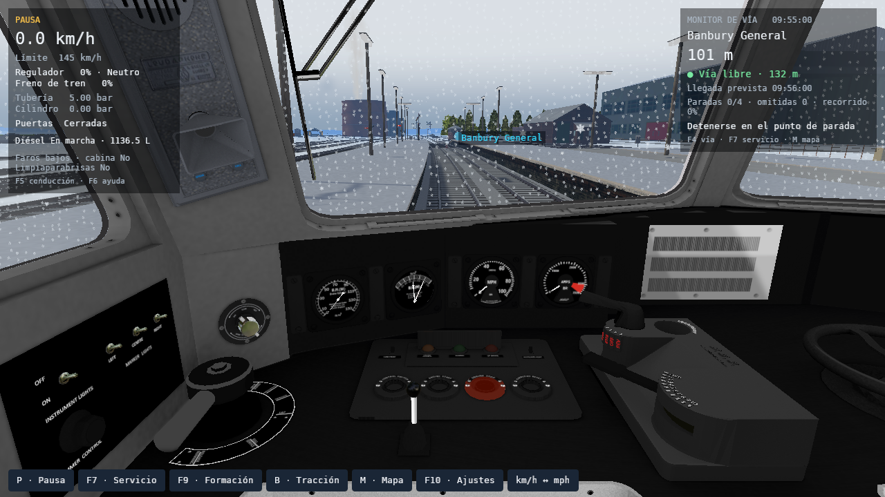
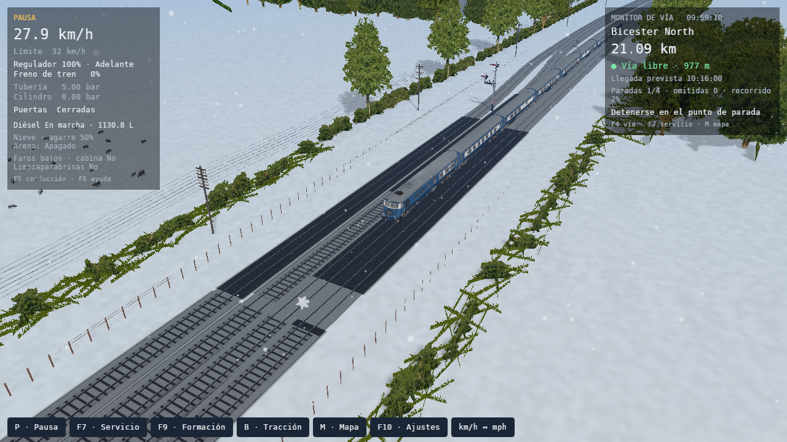

## Tormenta (#190)

Un ciclo de 660 segundos de simulación enlaza aproximación, actividad, despeje y calma. Las cuatro escenas fijan la fase; los tests recorren además sus límites y verifican continuidad, pausa, retroceso del reloj y equivalencia entre tasas de actualización. El estado compartido conserva el clima vivo y expone valores para una futura integración física de adhesión/frenado.

| Caso | Repeticiones | P50 / P95 / P99 (ms) | RSS pico (MiB) | VRAM pico (MiB) | Cuadros >100 ms |
| --- | ---: | ---: | ---: | ---: | ---: |
| approaching | 1 | 25.14 / 26.36 / 26.92 | 1441.10 | 1122.09 | 0.00 |
| active | 1 | 25.14 / 26.38 / 26.87 | 1430.20 | 1119.04 | 0.00 |
| clearing | 1 | 25.13 / 26.29 / 26.97 | 1414.50 | 1123.62 | 0.00 |
| clear | 1 | 25.12 / 26.22 / 26.75 | 1433.00 | 1114.64 | 0.00 |

La ejecución sin pausa registra **4 rayos y 4 eventos de trueno vencidos**. El retraso se calcula como distancia/343 m/s; el registro de la captura de relámpago conserva distancia y demora. La captura muestra flash 1.00. Las pruebas gráficas silencian el audio: comprueban generación y programación del evento, sin presentar esto como una escucha manual. La guía indica cómo escuchar con volumen habilitado; los tests de audio verifican mute, pausa, intensidad, atenuación interior y muestras acotadas.

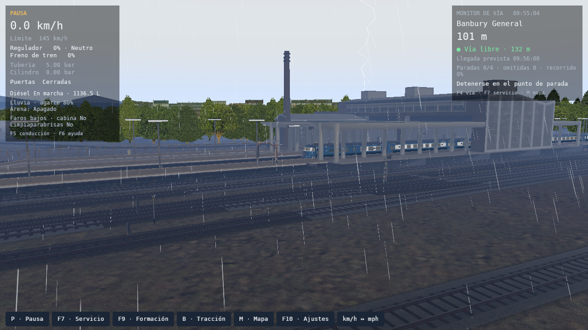

## Escenografía opcional (#197)

El modo Auténtico conserva los materiales MSTS y no añade vegetación. El modo Mejorado usa grupos de matas instanciadas, semillas por coordenadas, tres niveles de densidad/altura, fade de aparición y salida gradual hacia terreno texturizado. Las máscaras originales de geometría y TERRTEX excluyen infraestructura, agua y Forest; pendiente, altura y distancia a vía gradúan la densidad. Sombras sólo en la franja cercana. Lluvia oscurece y aumenta levemente el brillo; nieve aplana/desatura; bosque y matas comparten viento.

Tres recorridos A→B→A por perfil, con floating origin, carga y descarga de tiles:

| Caso | Repeticiones | P50 / P95 / P99 (ms) | RSS pico (MiB) | VRAM pico (MiB) | Cuadros >100 ms |
| --- | ---: | ---: | ---: | ---: | ---: |
| authentic | 3 | 25.09 / 36.36 / 53.42 | 1583.90 | 1118.31 | 8.00 |
| enhanced | 3 | 25.09 / 36.27 / 51.73 | 1598.40 | 1118.08 | 8.00 |

La optimización elimina la copia del RDB y del catálogo completo, y compila caminos sólo al reconstruir la región cercana. No se repitió el aumento previo de RAM: las diferencias de RSS pico por par son **+28,5 / +14,5 / −44,3 MiB**, media **−0,4 MiB**, con rangos que se superponen. La mediana mejorada sigue **14,5 MiB (+0,9 %) por encima** de Auténtica; el máximo de toda la tanda aumenta 6,2 MiB (+0,4 %). No se presenta esto como cero bytes de coste ni como garantía para otras rutas. En las repeticiones no aparece una regresión de memoria consistente por encima de la variación observada.

P50/P95/P99 y VRAM se mantienen dentro de la variación de las ejecuciones. Los tirones >100 ms tienen mediana 8 en ambos perfiles; una ejecución mejorada registra 9, y el resto 8. Permanecen incluidos en la tabla. Los tres regresos recuperan vegetación con **cero discrepancias de hash** y envíos reales de dibujo. La vegetación ocupa una ventana acotada; las máscaras ferroviarias regionales mantienen margen de seguridad durante streaming.

El modo Auténtico pasa la referencia: MAE RGB **0.0000**, píxeles con diferencia >16 **0.0000 %**. La comparación previa que motivó la corrección de memoria se conserva en el JSON; no se reemplaza por las cifras nuevas sin dejar registro.

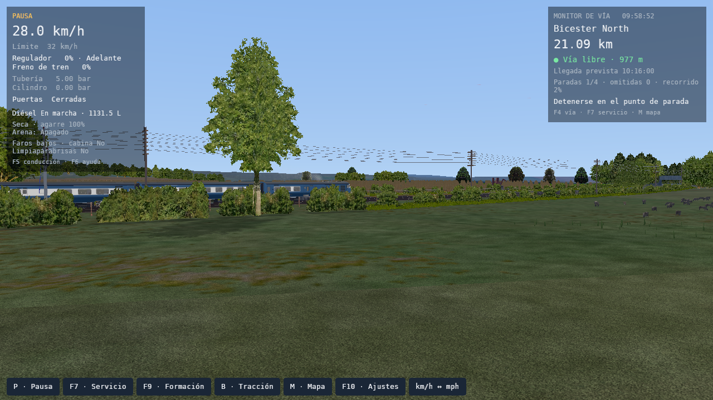
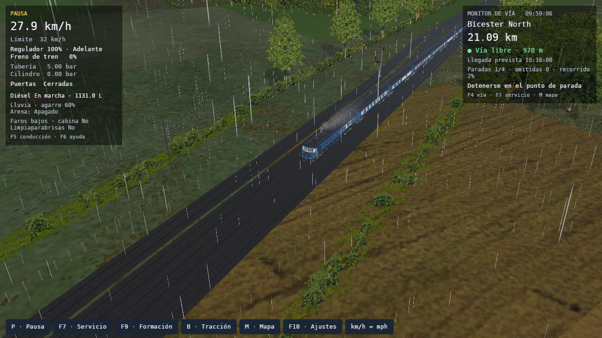
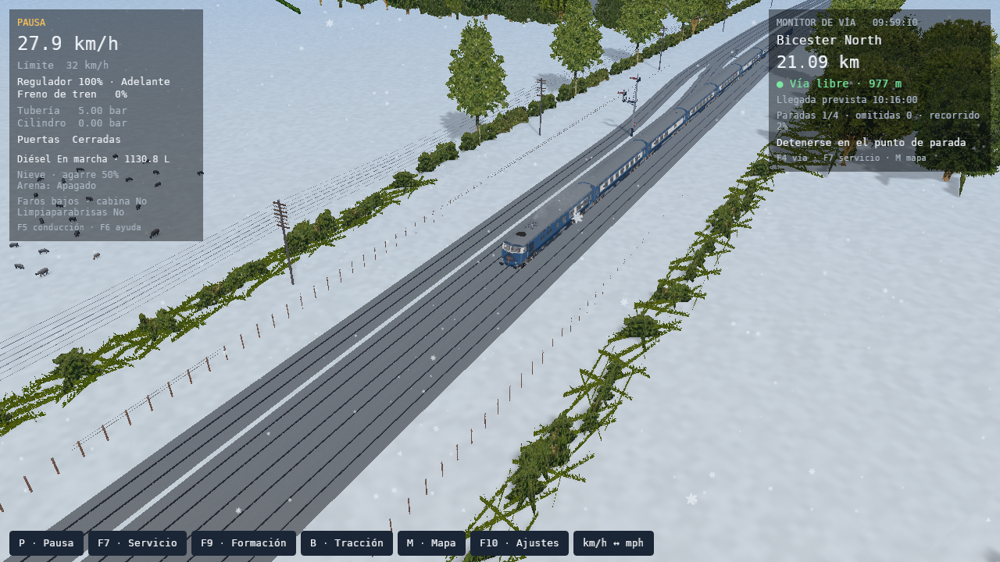

## Herramientas de desarrollo (#195 y #196)

F11 abre FPS/gráfico oficial; Ctrl+F11 muestra picking; Ctrl+Shift+F11 exporta percentiles, categorías y datos del renderer. El registro se reinicia por partida y limita muestras y picos. Las features dev-tools, dev-inspector y experimental-framepace se verifican individualmente y juntas; no están activas por defecto ni añaden dependencias al motor headless.

El inspector de F12 es de sólo lectura. Selección por mouse o nombre, panel desplazable y redimensionable, tipos registrados y bloqueo de controles mientras se usa. La selección del Pullman expone BlendATexDiff, textura bp01x.ace, Mask 0,7843 y bias efectivo 0,00115; su cabina expone TexDiff, floor.ace, material Opaque y capas 0/2. El estado importado permanece separado del material efectivo. El test del widget exige que un valor pequeño de bias se muestre con precisión.

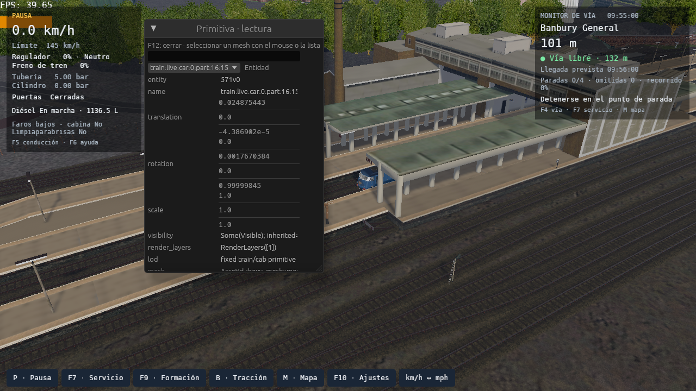
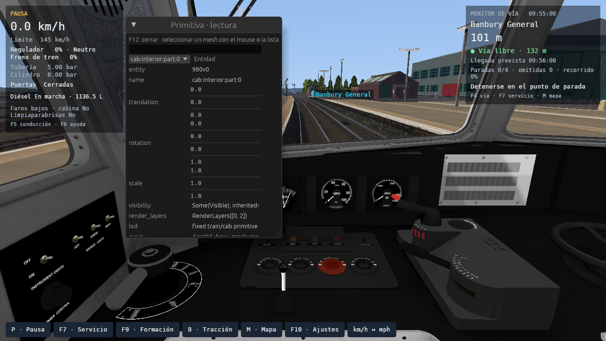

## Comprobaciones y alcance

`check.sh`: **1708 tests Rust aprobados**, 45 ignorados y 126 suites; Rustfmt, Clippy con todas las features y build aprobados. Los tests Python incluyen presupuesto, validadores de benchmark, selección de GPU y clientes DRM. Los oráculos físicos de Open Rails 1.6.1 y el servicio de tres estaciones pasan con sus umbrales originales. También pasa Clippy del build habitual.

Las 52 ejecuciones de matrices y 15 capturas/comprobaciones adicionales exigen GPU real, shaders listos y cero errores de pipelines. No certifican otros adaptadores, contenido de otras rutas, sonido escuchado por una persona ni paridad visual general con Open Rails. Las mejoras meteorológicas son opciones propias del visor y no alteran los oráculos ferroviarios.

## Repetir las escenas

Instalar el paquete original **Chiltern v4** desde el origen que ofrece la biblioteca, fuera del repositorio. La actividad es `RS_Football Special.act`. Pullman usa `Birmingham Pullman.con`; vapor usa `RS_Football Special.con` (4994 Downton Hall y ténder). El recorrido conservado pasa por Banbury General, Bicester North, Princes Risborough y High Wycombe.

La plantilla [service.toml.in](service.toml.in) guarda el recorrido y los parámetros de la prueba; no contiene modelos, texturas ni descargas. Desde la raíz del repositorio, definir `CHILTERN_ROUTE` como la carpeta `ROUTES/Chiltern` y `CHILTERN_CONSISTS` como `TRAINS/CONSISTS` del paquete original:

```bash
export CHILTERN_IMPORT="$PWD/tmp/qa/chiltern-import"
target/debug/openrailsrs import-msts "$CHILTERN_ROUTE" --out-dir "$CHILTERN_IMPORT"
python3 - <<'PY'
import json, os
from pathlib import Path
base = Path("docs/fixtures/compatibility/weather-renderer-2026-10-07")
out = Path("tmp/qa")
out.mkdir(parents=True, exist_ok=True)
for label, consist in (("pullman", "Birmingham Pullman.con"),
                       ("steam", "RS_Football Special.con")):
    text = (base / "service.toml.in").read_text()
    for token, value in {
        "@IMPORTED_TRACK@": os.environ["CHILTERN_IMPORT"],
        "@CONSIST_FILE@": str(Path(os.environ["CHILTERN_CONSISTS"]) / consist),
    }.items():
        text = text.replace(json.dumps(token), json.dumps(value))
    (out / f"{label}-service.toml").write_text(text)
PY
export CHILTERN_SERVICE="$PWD/tmp/qa/pullman-service.toml"
export CHILTERN_STEAM_SERVICE="$PWD/tmp/qa/steam-service.toml"
```

Usar los comandos de [la guía de QA](../../../WEATHER_RENDERER_QA.md). La suite VFX necesita `tmp/qa/steam-service.toml` y `--target-m 500`; pacing y escenografía usan Pullman con `--target-m 1500`. Esta última suite desplaza la cámara 7,15 km en línea recta hacia un punto del recorrido situado a 8 km, y vuelve mientras la física está pausada. Los dos extremos esperan disponibilidad de assets y tres segundos adicionales. Para repetir las cifras se usaron `--ready-frames 300 --timeout-s 600`; cada matriz especifica sus repeticiones.

Las capturas son de openrailsrs con contenido original, no imágenes ejecutadas en Open Rails. El modo Auténtico se compara además con la captura de referencia de openrailsrs anterior a estos cambios. La paridad física fijada a Open Rails 1.6.1 se verifica por separado en `check.sh`.

Para jugar y verificar cada función: [pruebas manuales, sección 49](../../../PLAYER_MANUAL_TESTS.md#49-clima-perfiles-escenografía-y-herramientas-de-desarrollo).
