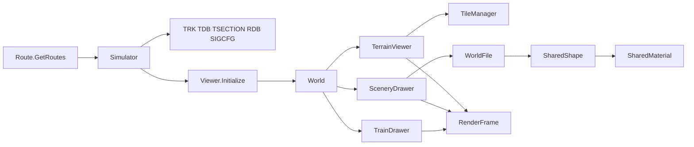
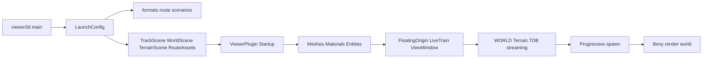
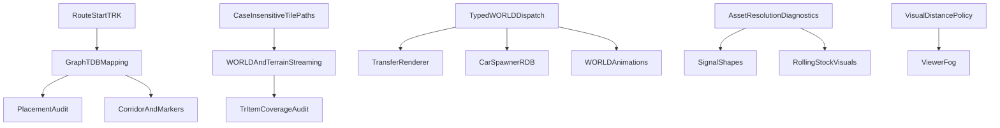

# OpenRails → openrailsrs: análisis de brechas de renderizado de rutas

Fecha: 2026-07-20  
Ruta de referencia: Chiltern  
Alcance: mundo visual, infraestructura y material rodante visible. Se excluyen física, conducción, señalización lógica, timetable, dispatching, IA, sonido y multiplayer.

## Resumen ejecutivo

`openrailsrs-viewer3d` sí alcanza el render world de Bevy: en Chiltern cargó terreno texturizado, objetos WORLD, ocho vehículos y vía TDB, sin abortar ni quedar fuera del frustum. El problema no es una única conversión global rota, sino una combinación de cuatro brechas:

1. ~~**La correspondencia grafo lógico ↔ TDB no está demostrada.**~~ **Resuelto en #26:** el ID `nNNNN`/alias solo se acepta si el pose TDB está a ≤25 m del hint del grafo; si no, se usa nearest o fallback de grafo. En Chiltern Birmingham, `n10778`/`n10770` rechazan el ID a ~1835 m (`mapping_method=graph_fallback`, `rejected_tdb_id` informado) y ya no teletransportan marcadores.
2. **Los audits actuales producen resultados incompletos o engañosos.** ~~`--audit-placement` devolvió `null`…~~ **(#27 OK)**. ~~`--audit-tr-item` contó 6375 errores con 60 tiles~~ **(#28: solo evalúa señales cuyo tile está en cobertura WORLD; fuera → `outside_coverage`)**.
3. **OpenRails tiene dispatch visual especializado que openrailsrs todavía no posee por completo.** ~~Transfer~~ **(#31 OK)**, ~~CarSpawner/RDB~~ **(#32 OK: v1 shape + motion sobre chord RDB)**, ~~Pickup/Hazard~~ **(#33 OK: tipado + shape rest-pose; Hazard vía `.haz`→Global)**, ~~animaciones WORLD~~ **(#34 OK: loop `ShapeAnimBinding` sobre mesh horneada)**, ~~catenaria~~ **(#36 OK: wire procedural sobre TrackObj/Dyntrack)**, ~~señales/lámparas~~ **(#37 OK)**. Queda rolling-stock animado (#40); sombras de tren/terreno (#41/#42) OK.
4. **El viewer jugable tiene política de distancia configurable** (default **2000 m**, CLI `--viewing-distance` / `[viewer3d].viewing_distance_m` / env), frente a tiles completos dentro de `ViewingDistance` (500–10000 m) en OpenRails. ~~Fog~~ **(#39 OK)**; ~~terreno recibe sombras~~ **(#42 OK)**; ~~exterior del tren proyecta~~ **(#41 OK)**.

La conversión base MSTS→Bevy (`tile×2048`, Z global negado), `RouteFocus`, el floating origin XZ y el pipeline de shapes/ACE están implementados y funcionaron en la reproducción. No hay evidencia para reescribirlos de forma global.

## Síntomas observados

- El modo Full cargó 4 tiles WORLD, 4 tiles de terreno y 1155 objetos visibles a 300 m.
- Se descartaron 6538 objetos WORLD por quedar fuera de 300 m al inicio.
- Se generaron 1024 patches de terreno texturizados, 11 con holes `_F.RAW`.
- Se construyeron 4945 entidades mesh de WORLD.
- El corredor TDB produjo `7/13 node`, `0/13 nearest`, `6/13 graph fallback`.
- El filtro de corredor aceptó 427 de 549 chords.
- `--audit-placement`: `anchor vs graph = 12,2 m`, pero `graph vs TDB = 1835,5 m`.
- `--audit-placement`: `max_scenery_to_tdb_xz_m = null`; 25 TrackObj de muestra tampoco obtuvieron nearest TDB.
- `--audit-tr-item` (tras #28): 12818 items, 6183 señales, 60 tiles cobertura → 2241 evaluadas / 3918 `outside_coverage`, 223 enlaces WORLD, **2449 errores** (antes 6375).
- El tile Birmingham `w-006080+014925.w` contiene 687 Static y 1659 TrackObj.
- Chiltern contiene tokens WORLD visuales no cubiertos de extremo a extremo: ~~376 `CarSpawner`~~ **(#32: tráfico RDB)**, ~~858 `Transfer`~~ **(#31)**, ~~240 `Pickup` y 2 `Hazard`~~ **(#33: shape tipada; Hazard→Global)**.

## Caso reproducible

```text
Route root:
/home/cristian/Documentos/Open Rails/Content/Chiltern/ROUTES/Chiltern

Scenario:
examples/chiltern/scenario.toml

Activity source:
RS_Let's go to Birmingham.act

Anchor:
tile -6080,14925 local 891.831,35.7818,582.756
```

Inventario observado:

| Recurso | Cantidad / presencia |
|---|---:|
| WORLD en disco | 928 ficheros |
| SHAPES en disco | 13620 entradas |
| TEXTURES en disco | 5235 entradas |
| TILES en disco | 1675 entradas |
| TDB | `Chiltern.tdb`, 18194 nodos y 66702 vector sections |
| RDB | `Chiltern.rdb` |
| TSection OR | `OpenRails/tsection.dat`, 13735 shapes y 6676 sections |
| WORLD cargado por audit | 60 tiles / 46027 items |
| WORLD Full a 300 m | 4 tiles / 7693 leídos / 1155 retenidos |
| Consist | 8 vehículos |

## Pipeline de OpenRails



OpenRails separa Loader, Updater y Render. Cada 250 ms, `World.LoadPrep()` toma el tile de cámara y el Loader actualiza terreno, WORLD, shapes, texturas y material rodante. Cada frame, `PrepareFrame` aplica culling/LOD y llena secuencias de `RenderFrame`: `WorldOpaque`, `WorldBlended`, `Lights`, `Precipitation`, `Interior`, `Cab` y overlays.

Archivos clave:

- `openrails/Source/Orts.Menu/Routes.cs`
- `openrails/Source/Orts.Simulation/Simulation/Simulator.cs`
- `openrails/Source/RunActivity/Viewer3D/Viewer.cs`
- `openrails/Source/RunActivity/Viewer3D/World.cs`
- `openrails/Source/RunActivity/Viewer3D/Tiles.cs`
- `openrails/Source/RunActivity/Viewer3D/Terrain.cs`
- `openrails/Source/RunActivity/Viewer3D/Scenery.cs`
- `openrails/Source/RunActivity/Viewer3D/Shapes.cs`
- `openrails/Source/RunActivity/Viewer3D/Materials.cs`
- `openrails/Source/RunActivity/Viewer3D/RenderFrame.cs`
- `openrails/Source/RunActivity/Viewer3D/Forest.cs`
- `openrails/Source/RunActivity/Viewer3D/Signals.cs`
- `openrails/Source/RunActivity/Viewer3D/Wire.cs`
- `openrails/Source/RunActivity/Viewer3D/Trains.cs`
- `openrails/Source/RunActivity/Viewer3D/RollingStock/MSTSWagonViewer.cs`

## Pipeline de openrailsrs



El contenido MSTS no usa `AssetLoader`: se parsea de forma síncrona en CPU y se inserta mediante `Assets::add`. `ViewerPlugin` encadena el spawn inicial y luego actualiza floating origin, tren, `ViewWindow`, streaming y LOD. Los sistemas sí crean `Mesh3d`, materiales, transforms y visibilidad; no se confirmó un fallo general de extracción al render world.

Archivos clave:

- `crates/openrailsrs-viewer3d/src/main.rs`
- `crates/openrailsrs-viewer3d/src/lib.rs`
- `crates/openrailsrs-viewer3d/src/launch.rs`
- `crates/openrailsrs-viewer3d/src/world.rs`
- `crates/openrailsrs-viewer3d/src/terrain.rs`
- `crates/openrailsrs-viewer3d/src/terrain_spawn.rs`
- `crates/openrailsrs-viewer3d/src/tdb_track.rs`
- `crates/openrailsrs-viewer3d/src/track_position.rs`
- `crates/openrailsrs-viewer3d/src/shapes.rs`
- `crates/openrailsrs-viewer3d/src/forest.rs`
- `crates/openrailsrs-viewer3d/src/signals.rs`
- `crates/openrailsrs-viewer3d/src/train.rs`
- `crates/openrailsrs-viewer3d/src/live.rs`
- `crates/openrailsrs-viewer3d/src/camera.rs`
- `crates/openrailsrs-or-shader/src/coordinates.rs`
- `crates/openrailsrs-bevy-scenery/src/shapes/`

## Comparación de las 20 etapas

| Etapa | OpenRails | openrailsrs actual | Diferencia / consecuencia | Certeza |
|---|---|---|---|---|
| 1. Descubrimiento | Menú escanea `ROUTES/*` | CLI + escenario y `--route-root` | No hay selector de rutas; no bloquea el comando explícito | Alta |
| 2. Configuración | TRK más overrides OR | scenario/overlay + TRK parcial | Dependencia fuerte del overlay `world_anchor` | Alta |
| 3. Paths | `MSTSPath`, `ORFileHelper`, route/global | índices case-insensitive para shapes; lookup directo en streaming | `.W`/`.T` o nombre no canónico puede desaparecer en Linux | Confirmada |
| 4. Parsing | Parsers especializados por formato/objeto | AST/typed parsers, desconocidos a `Other` | ~~CarSpawner/Pickup/Hazard tipados~~ (#31–#33); ~~Electrified/wire~~ (#36); residual LevelCrossing/etc. | Confirmada |
| 5. Coordenadas | `WorldLocation`/`WorldPosition`, Z→XNA | `MstsWorldPosition`, Z→Bevy | Conversión base coincide; mapeo grafo↔TDB no | Confirmada |
| 6. Tiles | Radio por `ViewingDistance`, MRU 64 | radio métrico configurable (default 2000 m) + hystéresis unload | Pop-in residual vs OR | Parcial (#30) |
| 7. Terreno | `.t`, Y/F RAW, patch 17×17 | `.t`, Y/F RAW, patch texturizado | Base funcional; sombras y edge cases incompletos | Alta |
| 8. Texturas terreno | shader list + microtex/estaciones | `TerrainMaterial` base + microtex | Se observó 1024/1024 patches texturizados | Confirmada funcional |
| 9. Track DB | TDB + TSECTION + junctions | TDB + TSECTION + chords/procedural | Nearest/correspondencia fallan en audit Chiltern | Confirmada |
| 10. Geometría vía | shapes, dyntrack y perfiles TRP | shapes WORLD + vía procedural | Carreteras se excluyen del path TDB; TrackObj puede omitirse | Confirmada |
| 11. WORLD | dispatch por clase | diez tipos typed + `Other` | Faltan renderers especializados | Confirmada |
| 12. Instanciación | StaticShape/Animated/Transfer/etc. | shape genérica, procedural o cubo | Transfer/animaciones no equivalentes | Confirmada |
| 13. Modelos | `SharedShapeManager`, route/global | cache de sesión, route/global | Shapes observadas sí cargan; unresolved TrackObj puede quedar invisible | Confirmada en código |
| 14. Sprites | Forest camera-facing, lights, labels | `OrForestMaterial` + VS camera-facing; UI; precipitación | Alpha/sorting residual vs doble paso OR | Parcial (#38) |
| 15. Trenes visuales | viewers especializados y AnimatedPart | shape estática por vehículo + transform | Sin bogies/puertas/pantógrafo animados | Confirmada |
| 16. Entidades | primitivas en RenderFrame | entidades Bevy y assets | Pipeline llega al render; no es causa raíz global | Confirmada |
| 17. Transforms | matrices MSTS→XNA + jerarquía | matrices MSTS→Bevy + jerarquía | Base probada; raw node-ID TDB es incorrecto como mapping | Confirmada |
| 18. Materiales | alpha test/blend, doble paso, fog | Standard + OR materials con DistanceFog (#39) | Alpha/sorting residual vs doble paso OR | Parcial |
| 19. Cámara | tile de cámara, far=`ViewingDistance` | orbit/chase/driver, floating origin XZ | Cámara inicia y renderiza; radio de escena domina visibilidad | Confirmada |
| 20. Culling/orden | FOV + distancia + LOD + secuencias | frustum Bevy + stream por viewing distance + layers | Pop-in residual; fog y blend ordering menos fieles | Parcial (#30) |

## Coordenadas y transformaciones

### Lo que coincide

```text
world_x = tile_x * 2048 + local_x
world_y = local_y
world_z = -(tile_z * 2048 + local_z)
```

- Tile MSTS: 2048 m, posición local aproximadamente ±1024 m.
- Shape-local: `(x, y, -z)`.
- `QDirection`: `(qx, qy, -qz, qw)`.
- Matrix3×3: conversión XNA-compatible implementada en `matrix3x3_to_rotation_scale`.
- `RouteFocus` reduce magnitudes absolutas antes del spawn.
- `FloatingOrigin` desplaza solo XZ y conserva la altura.

### Brecha confirmada

`TrackPositionResolver::graph_node_to_tdb_id` elimina el prefijo `n` y usa el número directamente:

```text
n10778 → TDB node 10778
```

El audit Chiltern demuestra que el resultado está 1835,5 m del nodo del grafo alineado al anchor. El número conservado por un import no prueba identidad después de parches, overlay o reconstrucción del grafo. Debe validarse con posición, conectividad y/o metadatos persistidos durante import.

### Precisión

Las posiciones absolutas Chiltern son aproximadamente X=-12,45 millones y Z=-30,57 millones. Bevy recibe posiciones rebased mediante `RouteFocus` y floating origin; no se observaron `NaN` en transforms de runtime. Los `NaN` impresos por el audit son formateo de valores `Option::None`, no coordenadas GPU.

## Formatos visuales

| Formato | OpenRails | openrailsrs | Estado end-to-end |
|---|---|---|---|
| `.trk` | ruta + override OR | parse básico | Parcial; el audit no obtuvo RouteStart real |
| `.tdb` | vía, junctions, TrItems | parse + procedural | Parcial; geometría funciona, mapping grafo y nearest requieren corrección |
| `.rdb` | tráfico/carreteras | sin pipeline visual | No soportado end-to-end |
| `tsection.dat` | sections/shapes/road/tunnel | parse amplio | Soportado para track; roads excluidas del TDB procedural |
| `.w` | dispatch especializado | typed + Other | Parcial |
| `.t` | terrain shaders/patches | terrain + patches | Soportado en caso Chiltern |
| `_Y.RAW` | elevación | elevación | Soportado |
| `_F.RAW` | holes | holes | Soportado; 11 patches observados |
| `_N.RAW` | OR tampoco lo usa plenamente | no soportado | No abrir issue sin evidencia visual |
| `.s` | SharedShape/LOD/anim | mesh/LOD parcial | Geometría estática soportada; animación runtime parcial |
| `.sd` | descriptor/flags | parse/uso parcial | Pendiente de matriz exhaustiva |
| `.ace` | textura/material | textura/material | Soportado con fallbacks |
| `.dds` | preferencia OR | soporte parcial según path | Pendiente de validación específica |
| `sigcfg.dat` | subobjetos/lámparas | loader visual + lámparas (#37) | Filtro mesh por matrix residual |
| `carspawn.dat` | coches/RDB | sin renderer | No soportado |
| `TrProfile` | dyntrack | procedural propio | Parcial, no paridad completa |
| `.eng/.wag/.con` | shapes + partes animadas | shapes + consist | Modelos sí; animaciones parciales/ausentes |
| `.cvf` | cabina | cabina 3D/overlay | Parcial, fuera del núcleo de mapa salvo visual |

## Integración Bevy

- No hay `AssetLoader` custom MSTS; no es por sí mismo un bug visual y no se crea issue de refactor.
- ~~`ViewerPlugin` registra `update_world_shape_anim` sin bindings~~ **(#34: spawn WORLD inserta `ShapeAnimBinding`/`ShapeAnimState` para shapes con controllers; loop FrameRate)**.
- `WorldItem::Other` conserva nombre/transform, pero pierde el dispatch especializado.
- TrackObj sin shape resoluble usa procedural cuando puede; con placeholders desactivados puede quedar invisible.
- ~~`viewer3d` no configura `DistanceFog`~~ **(#39: `camera_distance_fog` + fog en OrTerrain/OrScenery/OrForest; sky-dome sin fog)**.
- Exterior de tren y varios meshes usan `NotShadowCaster`.
- ~~Forest genera dos quads cruzados fijos~~ **(#38: 1 quad/árbol + `or_forest.wgsl` SideVector/Eye; alpha mask 200/255)**.
- La política de layers de cabina/exterior está implementada; no se observó que ocultara el mundo en chase.

## Errores confirmados

| ID | Prioridad | Hallazgo | Evidencia |
|---|---|---|---|
| C1 | P0 | Mapping grafo→TDB por ID sin validación | 1835,5 m; `graph_node_to_tdb_id` |
| C2 | P1 | Placement audit no encuentra nearest para ningún TrackObj muestreado | Mitigado (#27): 25/25 matches Birmingham |
| C3 | P1 | TrItem audit marca señales fuera de cobertura WORLD | Mitigado (#28): 3918 outside / 2449 errors evaluables |
| C4 | P1 | Streaming case-sensitive en Linux | lookup directo `.w`/`.t` |
| C5 | P1 | Radio visual estrecho (hist. 120 m) | Mitigado (#30): default 2000 m + CLI/config; falta paridad total con OR |
| C6 | P1 | TransferObj no tiene renderer de quad | Mitigado (#31): `transfer.rs` mesh terrain-following + alpha mask; Chiltern fixture 5/5 |
| C7 | P1 | CarSpawner/RDB no llega al render | Mitigado (#32): `WorldItem::CarSpawner` + `.rdb`/`carspawn.dat` + `road_cars.rs` (1 coche/spawner, chord RDB) |
| C8 | P2 | Pickup/Hazard pierden renderer especializado | Mitigado (#33): tipado + spawn shape; Hazard `.haz`→`Global/Shapes`; sin anim refill/scare |
| C9 | P1 | Animación WORLD no está cableada | Mitigado (#34): bindings + loop; sin LevelCrossing/Pickup/turntable drivers |
| C10 | P2 | Catenaria ausente | Mitigado (#36): `Electrified`/`OverheadWireHeight` + wire sobre TrackObj/Dyntrack; HideWire watermark 2/3; sin `overheadwire.ace` (material procedural) |
| C11 | P2 | Señales no reproducen subobjetos/lámparas | Mitigado (#37): `sigcfg` + lámparas; bitmask heads; mesh subobj completo residual |
| C12 | P2 | Forest no es camera-facing | Mitigado (#38): mesh OR + `OrForestMaterial`/`VSForest`; sin golden 4 ángulos |
| C13 | P2 | Fog ausente del viewer jugable | Mitigado (#39): fog ≈ viewing distance; sin noche dinámica |
| C14 | P2 | Animaciones visuales del rolling stock ausentes | shapes estáticas, sin `AnimatedPart` equivalente |
| C15 | P2 | Exterior del tren no proyecta sombras | Mitigado (#41): opacos castean; glass/blend conservan `NotShadowCaster` |
| C16 | P2 | Terreno custom no recibe sombras equivalentes | Mitigado (#42): `terrain.wgsl` half-Lambert + `fetch_directional_shadow`; dual-tex/fog/holes intactos |
| C17 | P1 | TrackObj irresoluble puede omitirse silenciosamente | placeholders false + procedural condicional |

## Hipótesis pendientes

1. ~~**RouteStart real devuelve `null`.**~~ **Resuelto en #25:** el fallo era el layout plano MSTS `RouteStart ( … )` (y `RouteID`/`Name`) frente al Lisp anidado del fixture; además ahora se prefiere `OpenRails/*.trk` con resolución de `include`. Validado: Chiltern → `RouteStart(-6079, 14925, -896, 182)`.
2. **Orden alpha de vegetación/transfers.** Hay diferencias de arquitectura con el doble paso y sorting de OpenRails, pero faltan capturas comparables.
3. **Seams entre tiles de terreno.** El caso inicial cargó cuatro tiles sin log de discontinuidad; falta medición geométrica de bordes.
4. **Culling de objetos grandes.** No se reprodujo desaparición por bbox/frustum; requiere fixture o cámara reproducible.
5. **DDS/estacional/nocturno.** El código soporta parte del camino, pero no se midió cobertura de assets Chiltern.
6. **Cambios y junction gaps.** Existe fallback procedural y audits previos, pero no se obtuvo captura comparable en esta ejecución.

## Dependencias



Orden recomendado:

1. RouteStart y mapping grafo↔TDB.
2. Audits de placement/TrItem.
3. Paths case-insensitive y política de distancia visual.
4. Dispatch WORLD y TrackObj unresolved.
5. Transfer, CarSpawner/RDB y animaciones WORLD.
6. Señales y catenaria.
7. Forest, fog, sombras y rolling stock.
8. Infraestructura de regresión visual.

## Issues

Se revisaron todos los issues existentes antes de publicar. El issue #5 trata comparación de simulación y queda fuera de este alcance. El issue #8 se conserva como epic histórico del viewer 3D; los siguientes son unidades verificables, no duplicados.

| Issue | Prioridad | Título | Dependencias principales |
|---|---|---|---|
| [#25](https://github.com/cavazquez/openrailsrs/issues/25) | P0 | `[Coordinates] Parsear RouteStart de rutas reales antes de usar fallbacks de anchor` | — |
| [#26](https://github.com/cavazquez/openrailsrs/issues/26) | P0 | `[Coordinates] Sustituir el mapeo nNNNN→TDB por una correspondencia validada` | #25 |
| [#27](https://github.com/cavazquez/openrailsrs/issues/27) | P1 | `[Validation] Corregir nearest TrackObj→TDB en placement audit` | **Cerrado** — distancia XZ absoluta + anillo 3×3 |
| [#28](https://github.com/cavazquez/openrailsrs/issues/28) | P1 | `[Validation] Limitar signal_no_world_ref a la cobertura WORLD realmente cargada` | **Cerrado** — `outside_coverage` vs `missing_in_loaded_tile` |
| [#29](https://github.com/cavazquez/openrailsrs/issues/29) | P1 | `[Tiles] Resolver WORLD y terrain tiles sin sensibilidad a mayúsculas en Linux` | — *(implementado: `tile_paths` + catálogos compartidos)* |
| [#30](https://github.com/cavazquez/openrailsrs/issues/30) | P1 | `[Culling] Sustituir el radio visual fijo de 120 m por una política de distancia/tile` | **Cerrado** — default 2000 m + CLI/config/hystéresis |
| [#31](https://github.com/cavazquez/openrailsrs/issues/31) | P1 | `[World Objects] Renderizar TransferObj como quad texturizado sobre terreno` | **Cerrado** — mesh terrain-following + alpha/depth_bias; Chiltern `w-006084+014930` 5/5 |
| [#32](https://github.com/cavazquez/openrailsrs/issues/32) | P1 | `[World Objects] Parsear CarSpawner y renderizar tráfico visual sobre RDB` | **Cerrado** — dump tipado; pose `TrItemRData`; carspawn lists; 1 coche/spawner con motion |
| [#33](https://github.com/cavazquez/openrailsrs/issues/33) | P2 | `[World Objects] Soportar visualmente PickupObj y HazardObj en WORLD` | **Cerrado** — tipado + dump; Pickup shape de ruta; Hazard `.haz`→Global; rest pose (sin refill/scare) |
| [#34](https://github.com/cavazquez/openrailsrs/issues/34) | P1 | `[World Objects] Conectar animaciones MSTS WORLD con ShapeAnimBinding` | **Cerrado** — `frame_rate`; spawn + update loop; delta sobre mesh rest-baked |
| [#35](https://github.com/cavazquez/openrailsrs/issues/35) | P1 | `[Assets] No omitir silenciosamente TrackObj sin shape resoluble` | **Cerrado** — relative `FileName` + accounting mesh/procedural/failed; Birmingham 1659/1659 |
| [#36](https://github.com/cavazquez/openrailsrs/issues/36) | P2 | `[Track] Renderizar catenaria y overhead wires desde TrackObj/Dyntrack` | **Cerrado** — TRK params + wire procedural; RoadShape/HideWire omitidos; Chiltern height 10000 m oculta wire |
| [#37](https://github.com/cavazquez/openrailsrs/issues/37) | P2 | `[Signals] Renderizar shapes, subobjetos y lámparas MSTS visibles` | **Cerrado** — `SignalUnit`/`SignalSubObj`; `sigcfg` visual; lámparas emisivas; diamante oculto con TrItem |
| [#38](https://github.com/cavazquez/openrailsrs/issues/38) | P2 | `[Sprites] Orientar Forest billboards a cámara y validar alpha` | **Cerrado** — 1 quad/árbol; `or_forest.wgsl` SideVector/Eye; alpha mask 200/255; test mesh |
| [#39](https://github.com/cavazquez/openrailsrs/issues/39) | P2 | `[Materials] Aplicar fog atmosférico en openrailsrs-viewer3d` | **Cerrado** — `DistanceFog` en cámara + shaders OR; visibilidad = viewing distance |
| [#40](https://github.com/cavazquez/openrailsrs/issues/40) | P2 | `[Rolling Stock Visuals] Animar bogies, ruedas, puertas y pantógrafo desde shapes MSTS` | animación shared |
| [#41](https://github.com/cavazquez/openrailsrs/issues/41) | P2 | `[Rolling Stock Visuals] Permitir sombras del exterior del tren` | **Cerrado** — opacos sin `NotShadowCaster`; transparentes excluidos |
| [#42](https://github.com/cavazquez/openrailsrs/issues/42) | P2 | `[Terrain] Integrar recepción de sombras en TerrainMaterial` | **Cerrado** — shadow sampling en `terrain.wgsl` (viewer); microtex + fog conservados |
| [#43](https://github.com/cavazquez/openrailsrs/issues/43) | P1 | `[Validation] Crear regresiones visuales reproducibles OpenRails↔Bevy` | #25–#29 |
| [#44](https://github.com/cavazquez/openrailsrs/issues/44) | P3 | `[Materials] Añadir tangent space opcional para assets PBR con normal maps` | fuente normal-map, #48 |
| [#45](https://github.com/cavazquez/openrailsrs/issues/45) | P2 | `[Meshes] Recomponer normales ausentes o degeneradas en shapes MSTS` | — |
| [#46](https://github.com/cavazquez/openrailsrs/issues/46) | P2 | `[Textures] Parsear light_model_cfgs y uv_ops para modos wrap/mirror/clamp` | #48 |
| [#47](https://github.com/cavazquez/openrailsrs/issues/47) | P2 | `[Materials] Unificar modos specular MSTS entre StandardMaterial y OrSceneryMaterial` | #48 |
| [#48](https://github.com/cavazquez/openrailsrs/issues/48) | P1 | `[Assets] Introducir tipos Asset y AssetLoader para formatos MSTS/OR` | — |
| [#49](https://github.com/cavazquez/openrailsrs/issues/49) | P1 | `[Assets] Unificar RouteAssets y AssetIndex en un catálogo de ruta compartido` | #29, #48 |
| [#50](https://github.com/cavazquez/openrailsrs/issues/50) | P1 | `[Assets] Mantener caché de shapes y texturas entre streams de tiles` | #48, #49 |
| [#51](https://github.com/cavazquez/openrailsrs/issues/51) | P1 | `[Assets] Liberar meshes, imágenes y materiales GPU al descargar tiles` | #50 |
| [#52](https://github.com/cavazquez/openrailsrs/issues/52) | P1 | `[Bevy Integration] Implementar ScenerySpawnPlugin compartido para viewer3d y render3d` | #48–#50 |
| [#53](https://github.com/cavazquez/openrailsrs/issues/53) | P1 | `[Assets] Modelar WORLD y terrain como assets compuestos por tile` | #29, #48, #49 |
| [#54](https://github.com/cavazquez/openrailsrs/issues/54) | P1 | `[Assets] Exponer diagnósticos estructurados de carga y fallback` | #35, #48 |
| [#55](https://github.com/cavazquez/openrailsrs/issues/55) | P1 | `[Bevy Integration] Eliminar carga bloqueante de ruta antes de abrir la ventana` | #48, #52, #53 |
| [#56](https://github.com/cavazquez/openrailsrs/issues/56) | P2 | `[Meshes] Unificar el builder de shapes de render3d con bevy-scenery` | #47, #48 |
| [#57](https://github.com/cavazquez/openrailsrs/issues/57) | P1 | `[Performance] Eliminar el doble parse de cada shape WORLD` | **Cerrado** — 1 `ShapeFile` parse / path único |
| [#58](https://github.com/cavazquez/openrailsrs/issues/58) | P1 | `[Performance] Implementar instancing o batching seguro para objetos WORLD repetidos` | #34, #50 |
| [#59](https://github.com/cavazquez/openrailsrs/issues/59) | P1 | `[Performance] Filtrar objetos WORLD por ventana durante el parse` | **Cerrado** — filtro XZ al materializar |
| [#60](https://github.com/cavazquez/openrailsrs/issues/60) | P1 | `[Performance] Reducir entidades y materiales por patch de terreno` | #31 |
| [#61](https://github.com/cavazquez/openrailsrs/issues/61) | P2 | `[Performance] Actualizar TrItemWorldIndex incrementalmente por tile` | #28, #53 |
| [#62](https://github.com/cavazquez/openrailsrs/issues/62) | P2 | `[Performance] Evitar scans globales por frame para unload y LOD WORLD` | #6, #30, #31 |
| [#63](https://github.com/cavazquez/openrailsrs/issues/63) | P2 | `[Performance] Construir TileHeightIndex una vez por lote en render3d` | #6 |

Etiquetas creadas y aplicadas cuando correspondía: `map-rendering`, `coordinates`, `validation`, `needs-investigation`, `tiles`, `world-objects`, `assets`, `asset-loader`, `culling`, `track-rendering`, `sprites`, `materials`, `meshes`, `textures`, `terrain`, `rolling-stock-visuals`, `camera`, `performance` y `bevy`.

## Auditoría complementaria: tangentes, AssetLoader y rendimiento

### Tangent space, normales y normal maps

- **Confirmado:** los builders de shape insertan posición, normal y UV, pero no `Mesh::ATTRIBUTE_TANGENT`; los materiales no asignan `normal_map_texture`.
- **Confirmado en OpenRails:** el pipeline clásico usa `VertexPositionNormalTexture` y `SceneryShader.fx` consume la normal interpolada. No existe TBN/normal map moderno en la referencia inspeccionada.
- **Conclusión:** la ausencia de tangentes/bitangentes no explica la diferencia visual de Chiltern. El issue #44 se clasifica P3 y opt-in para futuras extensiones PBR, no como paridad OpenRails.
- **Brecha visual real:** cuando una shape trae normales ausentes, degeneradas o con índices inválidos, el fallback actual puede aplicar una única normal; #45 propone recomposición geométrica selectiva.
- **Brecha de formato/material:** `light_model_cfgs`/`uv_ops` contienen address modes que OpenRails sí aplica parcialmente; #46 no debe confundir `uv_op_embossbump` con normal mapping moderno.
- Los caminos `StandardMaterial` y `OrSceneryMaterial` no representan igual `Specular25/750`; #47 centraliza esta semántica sin exigir tangentes.

### AssetLoader y arquitectura de assets

- **Confirmado:** no existe ninguna implementación de `AssetLoader` ni registro de loaders MSTS. `AssetServer` solo se usa para shaders WGSL internos.
- `RouteAssets` (viewer3d) y `AssetIndex` (render3d) duplican scans y resolución de precedencia; #49 propone un catálogo compartido.
- ~~`WorldSpawnProgress` conserva caches únicamente durante un ciclo de spawn~~ **(#50: `WorldShapeLodCache` de sesión con hit/miss; streams reutilizan Mesh/Image/ShapeFile)**.
- ~~El unload despawnea entidades, pero no retira entradas de `Assets<Mesh/Image/Material>`~~ **(#51: eviction por refs vivas al unload en viewer3d + render3d; shapes/texturas compartidas se conservan)**.
- `ScenerySpawnPlugin` sigue siendo un stub mientras los dos binarios mantienen máquinas de estados distintas; #52 y #55 migran scheduling y startup de forma incremental.
- El refactor no debe ser cosmético: #48–#56 vinculan cada cambio a carga async, deduplicación, lifecycle, diagnóstico o eliminación de builders divergentes.

### Baseline de optimización reproducido

Chiltern, build release, `OPENRAILSRS_VIEW_RADIUS_M=300`, modo `--live`:

| Métrica | Resultado |
|---|---:|
| Tiempo aproximado hasta escena WORLD lista | 7,1 s |
| Fase de assets de shapes WORLD | 4666 ms |
| Objetos WORLD parseados / retenidos | 7693 / 1155 |
| Objetos descartados tras materialización | 6538 (85 %) |
| Entidades WORLD / instancias | 4945 / 1155 |
| Spawn de terreno | ~~2289 ms~~ → **1137 ms** (#60) |
| Patches de terreno | 1024 → **20 chunks / 13 materials** (#60; 11 holes) |
| Spawn WORLD progresivo total | 4935 ms |

Hallazgos confirmados:

1. ~~Cada `.s` se parsea dos veces en `parse_next_shape_batch`~~ **(#57: un parse → mesh + LOD file; Chiltern 300 m: 308/308 parses)**.
2. El batching de shapes está deshabilitado porque la implementación previa rompe visuales; no debe reactivarse sin golden tests (#58).
3. ~~El filtro radial ocurre después de materializar todo el `.w`~~ **(#59: skip al materializar; mismo set que retain)**.
4. ~~Cada patch de terreno crea entidad y material propios~~ **(#60: merge por `terrain_shader_material_key` + build paralelo; 1024→20/13, 2289→1137 ms)**.
5. ~~`TrItemWorldIndex` se reconstruye completo cuando cambia la longitud de la escena~~ **(#61: delta por tile add/remove; rebuild solo recovery)**.
6. Unload y LOD WORLD ejecutan queries globales cada frame; el coste exacto todavía requiere spans de profiling (#62).
7. render3d reconstruye `TileHeightIndex` por tile aunque el lote no cambie (#63).

El issue histórico #6 conserva el profiling transversal. Los issues #57–#63 contienen optimizaciones concretas con baseline y criterios de aceptación, evitando duplicar un issue genérico de rendimiento.

## Comandos usados

```bash
cd /home/cristian/repos/propios/ProyectoOpenRails/openrailsrs
export OPENRAILSRS_MSTS_CONTENT="$HOME/Documentos/Open Rails/Content"
export CHILTERN_ROUTE="$OPENRAILSRS_MSTS_CONTENT/Chiltern/ROUTES/Chiltern"

cargo run --release -p openrailsrs-viewer3d -- \
  --audit-placement --route-root "$CHILTERN_ROUTE" \
  examples/chiltern/scenario.toml

OPENRAILSRS_TR_ITEM_AUDIT=/tmp/chiltern-tr-item-audit.json \
cargo run --release -p openrailsrs-viewer3d -- \
  --audit-tr-item --route-root "$CHILTERN_ROUTE" \
  examples/chiltern/scenario.toml

# Viewing distance: default 2000 m; override via CLI, [viewer3d].viewing_distance_m, or env.
target/release/openrailsrs-viewer3d --live --viewing-distance 2000 \
  --route-root "$CHILTERN_ROUTE" examples/chiltern/scenario.toml

# Narrower window (legacy env still works):
OPENRAILSRS_VIEW_RADIUS_M=300 \
target/release/openrailsrs-viewer3d --live \
  --route-root "$CHILTERN_ROUTE" examples/chiltern/scenario.toml

OPENRAILSRS_RUN_CORRIDOR_SCENERY=1 OPENRAILSRS_VIEW_RADIUS_M=300 \
target/release/openrailsrs-viewer3d --run-corridor --live \
  --route-root "$CHILTERN_ROUTE" examples/chiltern/scenario.toml

cargo run -p openrailsrs-cli -- world-dump \
  "$CHILTERN_ROUTE/WORLD/w-006080+014925.w" \
  --csv /tmp/chiltern-birmingham-world.csv
```

## Cambios temporales

- No se modificó código productivo durante la reproducción.
- Se escribieron únicamente `/tmp/chiltern-tr-item-audit.json` y `/tmp/chiltern-birmingham-world.csv`.
- No se añadieron logs, componentes ni instrumentación temporal al repositorio.
- El directorio `tmp/` ya estaba sin seguimiento antes de la auditoría y no se tocó.

## Riesgos técnicos

- Corregir el mapping TDB sin preservar la odometría del grafo puede mezclar visual y simulación; el cambio debe limitarse a correspondencia visual validada.
- Aumentar draw distance sin budget progresivo puede degradar rendimiento; el criterio es evitar pop-in incorrecto, no maximizar distancia.
- Los objetos WORLD especializados combinan parsing, assets y estado visual; no deben colapsarse en un único issue genérico.
- Señales visibles deben separar subobjetos/lámparas de la señalización lógica, que queda fuera de alcance.
- Road cars requieren RDB para trayectoria visual, pero no IA ferroviaria.

## Aspectos no validados

- No se ejecutó el binario original de OpenRails para generar screenshots idénticos; el entorno local contiene su código fuente y la ruta, pero la ejecución XNA/Windows no se preparó.
- No se capturaron screenshots automatizados ni golden images.
- No se recorrieron los 928 tiles visualmente.
- No se confirmó `_N.RAW`, distant mountains, estaciones/nocturnas DDS ni todos los LOD de shapes.
- No se midió seam de terreno ni bbox de cada entidad; quedan como hipótesis hasta contar con un test reproducible.
